# clawarena-team — Stats Report

_Tokenizer: `qwen3`_

## 1. Overall Summary

- **Scenarios:** 41
- **Total rounds:** 258
- **Rounds with updates:** 44 (17.1%)
- **Total update groups:** 72 (255 files)
- **Total workspace size:** 170.4 MiB
- **Total tokens:** 28,935,669

## 2. Token Distribution

| Category | Tokens | % |
|----------|-------:|--:|
| Workspace | 20,798,880 | 71.9% |
| Updates | 8,065,800 | 27.9% |
| Questions | 38,580 | 0.1% |
| Feedback | 32,409 | 0.1% |
| **Total** | **28,935,669** | **100.0%** |

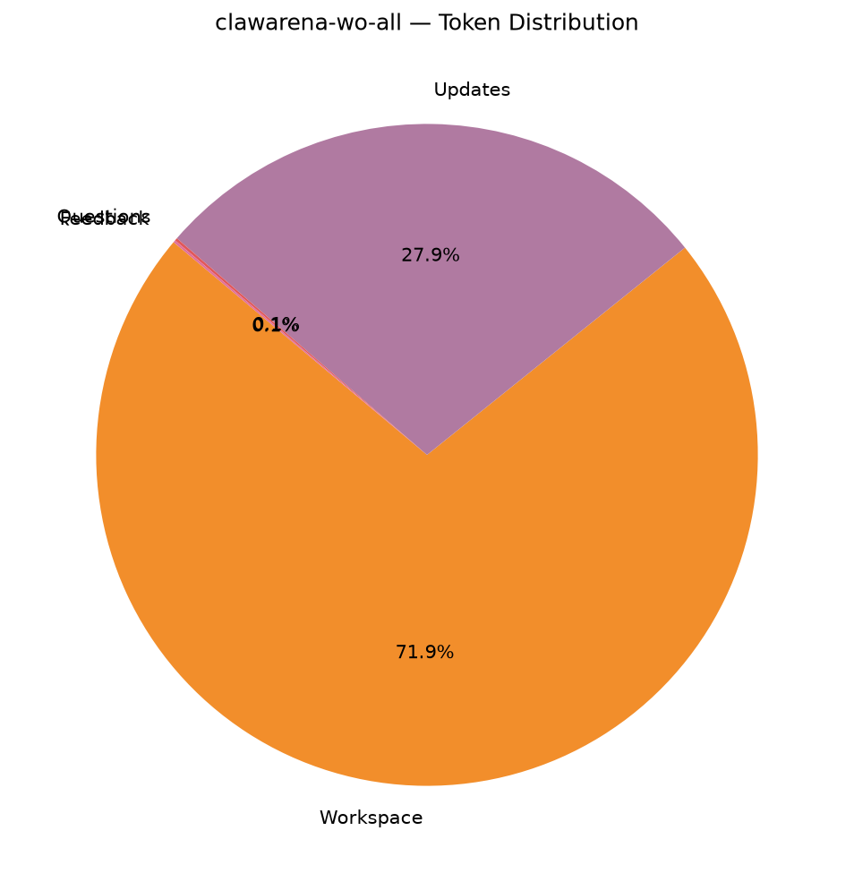

## 3. Question Statistics

### 3.1 Type Distribution

| Type | Count | % |
|------|------:|--:|
| `exec_check` | 258 | 100.0% |

### 3.2 exec_check Feature Coverage

| Feature | Rounds | Coverage |
|---------|-------:|---------:|
| expect_exit declared | 258 | 100.0% |
| expect_stdout set | 0 | 0.0% |
| regex matching | 0 | 0.0% |
| timeout set | 258 | 100.0% |
| uses ${scripts} | 258 | 100.0% |
| uses ${workspace} | 258 | 100.0% |

_Timeout (s) — mean 82.9, min 60.0, max 180.0._

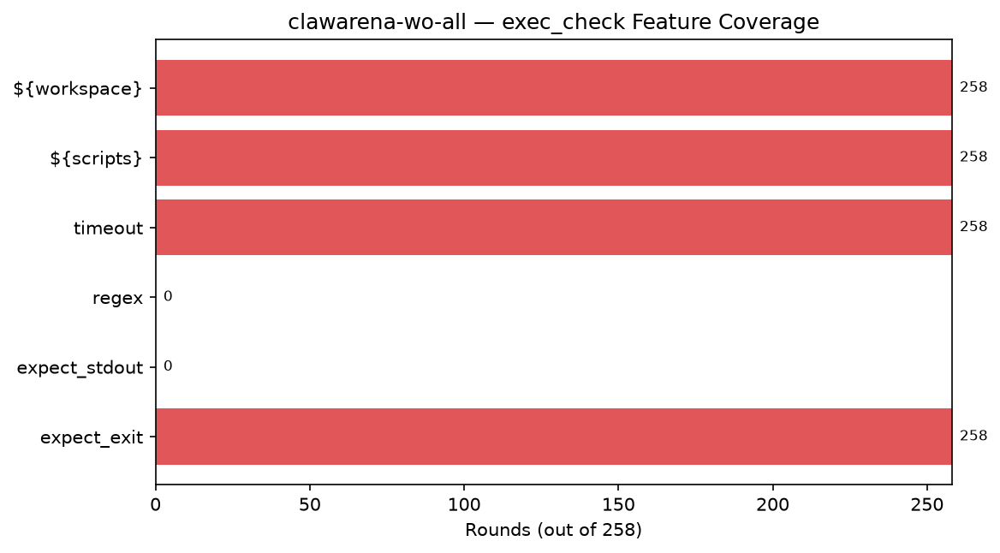

### 3.3 Question Token Stats

- **Mean:** 149.5, **Min:** 50, **Max:** 435

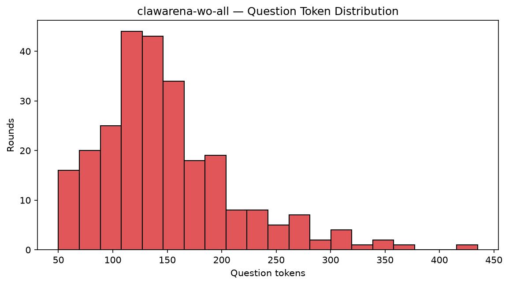

## 4. Update Statistics

### 4.1 Op Distribution

| op | Groups | % |
|----|------:|--:|
| `new` | 44 | 61.1% |
| `replace` | 28 | 38.9% |

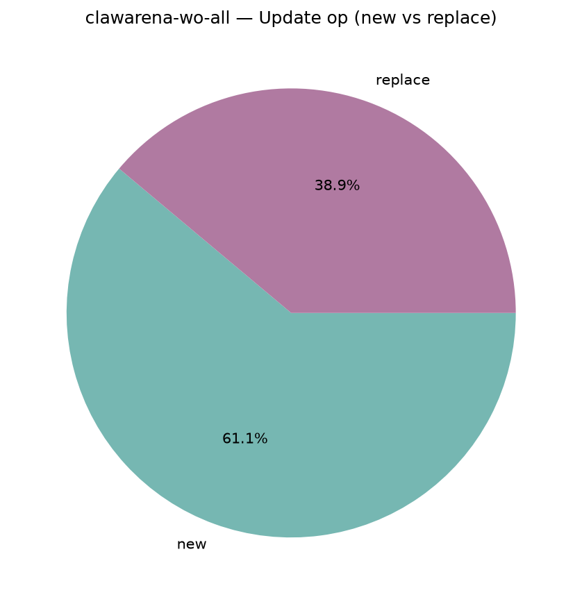

### 4.2 Files per Update

- **Mean:** 3.54, **Min:** 1, **Max:** 15
- **Total update files:** 255

## 5. Workspace Composition

### 5.1 By Modality

| Modality | Files | File % | Bytes | Tokens | Token % |
|----------|------:|------:|------:|------:|--------:|
| `text` | 1840 | 76.0% | 61.8 MiB | 18,462,122 | 88.8% |
| `image` | 188 | 7.8% | 13.0 MiB | 52,640 | 0.3% |
| `audio` | 29 | 1.2% | 78.6 MiB | 21,750 | 0.1% |
| `video` | 19 | 0.8% | 6.9 MiB | 42,560 | 0.2% |
| `document` | 62 | 2.6% | 2.4 MiB | 1,255,036 | 6.0% |
| `other` | 283 | 11.7% | 7.7 MiB | 964,772 | 4.6% |

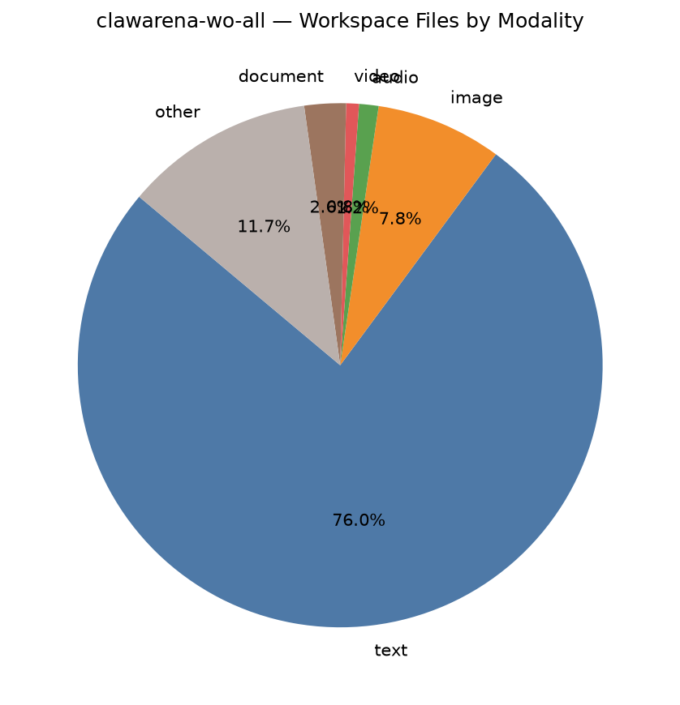

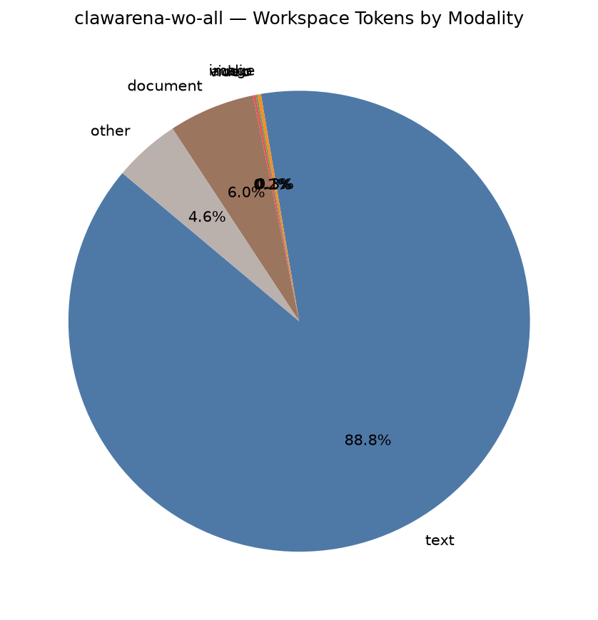

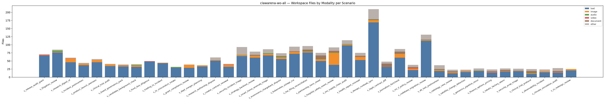

### 5.2 By Extension (Top 15 by bytes)

| Extension | Files | File % | Bytes | Byte % | Tokens | Token % |
|-----------|------:|------:|------:|------:|------:|--------:|
| `.wav` | 29 | 1.2% | 78.6 MiB | 46.1% | 21,750 | 0.1% |
| `.md` | 1141 | 47.1% | 39.5 MiB | 23.2% | 8,105,280 | 39.0% |
| `.png` | 188 | 7.8% | 13.0 MiB | 7.6% | 52,640 | 0.3% |
| `.log` | 35 | 1.4% | 11.7 MiB | 6.9% | 6,629,461 | 31.9% |
| `.mp4` | 19 | 0.8% | 6.9 MiB | 4.0% | 42,560 | 0.2% |
| `.parquet` | 11 | 0.5% | 4.5 MiB | 2.6% | 0 | 0.0% |
| `.py` | 162 | 6.7% | 2.6 MiB | 1.5% | 716,917 | 3.4% |
| `.txt` | 92 | 3.8% | 2.0 MiB | 1.2% | 625,338 | 3.0% |
| `.html` | 28 | 1.2% | 2.0 MiB | 1.2% | 398,293 | 1.9% |
| `.csv` | 66 | 2.7% | 1.8 MiB | 1.1% | 1,352,259 | 6.5% |
| `.ndjson` | 14 | 0.6% | 1.3 MiB | 0.7% | 644,257 | 3.1% |
| `.docx` | 31 | 1.3% | 1.3 MiB | 0.7% | 630,657 | 3.0% |
| `.pdf` | 25 | 1.0% | 1.1 MiB | 0.7% | 595,981 | 2.9% |
| `.json` | 50 | 2.1% | 579.4 KiB | 0.3% | 253,410 | 1.2% |
| `.eml` | 115 | 4.8% | 495.8 KiB | 0.3% | 102,344 | 0.5% |

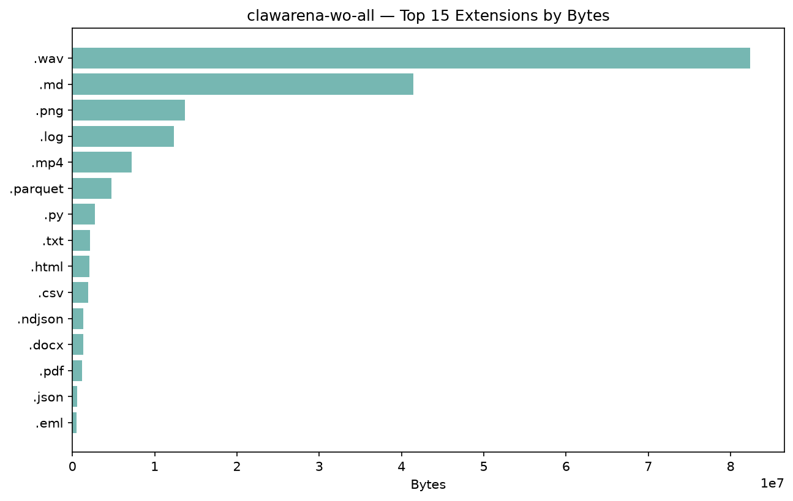

### 5.3 Largest Files (Top 15)

| Rank | Path | Modality | Bytes | Tokens |
|-----:|------|----------|------:|------:|
| 1 | `interviews/phone_interview.wav` | `audio` | 4.7 MiB | 750 |
| 2 | `audio_statements/complainant_statement_2026-05-02.wav` | `audio` | 4.5 MiB | 750 |
| 3 | `voice_memos/external_counsel_memo.wav` | `audio` | 4.4 MiB | 750 |
| 4 | `audio/hearing_2026-03-22.wav` | `audio` | 4.0 MiB | 750 |
| 5 | `reference_calls/ref_call_sam_okafor.wav` | `audio` | 3.9 MiB | 750 |
| 6 | `voice_memos/pitch_event_recording.wav` | `audio` | 3.9 MiB | 750 |
| 7 | `interviews/maintainer_interview.wav` | `audio` | 3.8 MiB | 750 |
| 8 | `reference_calls/ref_call_alex_drummond.wav` | `audio` | 3.8 MiB | 750 |
| 9 | `recordings/householder_nanny_call.wav` | `audio` | 3.4 MiB | 750 |
| 10 | `voice_memos/patient_voicemail.wav` | `audio` | 3.2 MiB | 750 |
| 11 | `voice_memos/researcher_voice_memo.wav` | `audio` | 3.0 MiB | 750 |
| 12 | `voice_memos/dba_lead_voicemail.wav` | `audio` | 3.0 MiB | 750 |
| 13 | `interviews/oncall_recording.wav` | `audio` | 2.9 MiB | 750 |
| 14 | `interviews/qs_briefing.wav` | `audio` | 2.8 MiB | 750 |
| 15 | `audio/architect_memo.wav` | `audio` | 2.7 MiB | 750 |

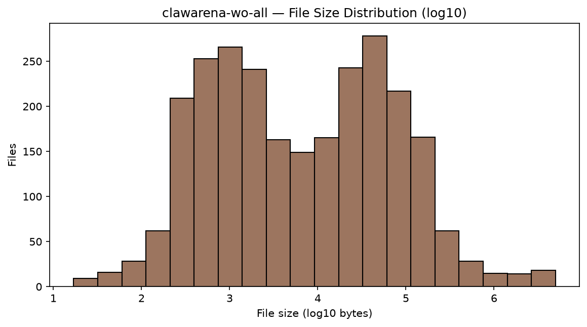

## 6. Multimodal Coverage

### 6.1 Per-Scenario Multimodal Files

| Scenario | image | audio | video | mm bytes | mm tokens |
|----------|------:|------:|------:|---------:|----------:|
| `s_release_audit_giant` | 1 | 0 | 2 | 1.6 MiB | 4,760 |
| `s_litigation_review` | 2 | 4 | 0 | 7.9 MiB | 3,560 |
| `s_research_digest_xl` | 11 | 0 | 1 | 1.9 MiB | 5,320 |
| `s_incident_postmortem` | 5 | 0 | 0 | 194.9 KiB | 1,400 |
| `s_product_launch_warroom` | 7 | 0 | 0 | 368.8 KiB | 1,960 |
| `s_clinical_trial_audit` | 5 | 0 | 0 | 311.6 KiB | 1,400 |
| `s_board_governance_pack` | 3 | 0 | 0 | 288.8 KiB | 840 |
| `s_candidate_background_check` | 4 | 2 | 0 | 7.8 MiB | 2,620 |
| `s_fund_due_diligence` | 0 | 0 | 1 | 196.2 KiB | 2,240 |
| `s_trading_tz_incident` | 1 | 0 | 0 | 72.5 KiB | 280 |
| `s_hr_misconduct_intake` | 0 | 2 | 0 | 6.1 MiB | 1,500 |
| `s_grant_compliance_review` | 9 | 0 | 0 | 492.6 KiB | 2,520 |
| `s_dept_merger_planning` | 3 | 0 | 0 | 158.7 KiB | 840 |
| `s_research_authorship_dispute` | 2 | 0 | 0 | 243.8 KiB | 560 |
| `s_creator_contract_renewal` | 6 | 0 | 1 | 1.1 MiB | 3,920 |
| `s_security_incident_triage` | 3 | 1 | 0 | 2.8 MiB | 1,590 |
| `s_strategy_backtest_review` | 6 | 1 | 1 | 3.4 MiB | 4,670 |
| `s_smart_home_anomaly_triage` | 5 | 2 | 0 | 6.1 MiB | 2,900 |
| `s_ecommerce_chargeback_dispute` | 5 | 2 | 0 | 4.3 MiB | 2,900 |
| `s_kubernetes_outage_rca` | 6 | 1 | 1 | 3.8 MiB | 4,670 |
| `s_tax_filing_reconciliation` | 3 | 1 | 0 | 2.8 MiB | 1,590 |
| `s_partnership_term_sheet` | 5 | 1 | 0 | 4.1 MiB | 2,150 |
| `s_hospital_safety_event_review` | 37 | 2 | 1 | 4.7 MiB | 14,100 |
| `s_oss_supply_chain_audit` | 3 | 1 | 0 | 4.2 MiB | 1,590 |
| `s_health_report_misread` | 9 | 1 | 1 | 6.1 MiB | 5,510 |
| `s_devops_runbook_sync` | 7 | 1 | 0 | 3.7 MiB | 2,710 |
| `s_legal_contract_diff` | 0 | 1 | 1 | 4.4 MiB | 2,990 |
| `s_journalism_factcheck` | 12 | 1 | 1 | 5.7 MiB | 6,350 |
| `s_ml_rl_policy_review` | 4 | 0 | 3 | 794.7 KiB | 7,840 |
| `s_codebase_migration_review` | 2 | 1 | 1 | 2.9 MiB | 3,550 |
| `s_ab_test_postmortem` | 3 | 1 | 1 | 1.2 MiB | 3,830 |
| `s_radiology_case_review` | 3 | 0 | 0 | 998.2 KiB | 840 |
| `s_satellite_change_detection` | 2 | 0 | 0 | 22.0 KiB | 560 |
| `s_genomics_pipeline_rerun` | 1 | 1 | 0 | 1.8 MiB | 1,030 |
| `s_finance_options_pricing` | 1 | 0 | 1 | 124.0 KiB | 2,520 |
| `s_robotic_factory_alarm` | 1 | 1 | 1 | 1.6 MiB | 3,270 |
| `s_security_pcap_triage` | 1 | 0 | 0 | 63.6 KiB | 280 |
| `s_clinical_trial_protocol` | 2 | 1 | 0 | 2.6 MiB | 1,310 |
| `s_observability_incident` | 3 | 0 | 0 | 169.7 KiB | 840 |
| `s_climate_simulation_audit` | 1 | 0 | 1 | 1.6 MiB | 2,520 |
| `s_ui_redesign_review` | 4 | 0 | 0 | 144.4 KiB | 1,120 |

### 6.2 Modality Totals

- **Audio files:** 29 (measured 29 via stdlib `wave`; total 3090.6s ≈ 51.5 min)
- **Video files:** 19 (cv2 unavailable or unreadable)

## 7. Per-Scenario Breakdown

| Scenario | Rounds | w/Upd | Upd Groups | Upd Files | WS Files | Accessible | Tokens |
|----------|-------:|------:|-----------:|----------:|---------:|-----------:|-------:|
| `s_release_audit_giant` | 6 | 1 | 1 | 10 | 70 | 6 | 343,240 |
| `s_litigation_review` | 6 | 1 | 2 | 12 | 85 | 14 | 170,745 |
| `s_research_digest_xl` | 6 | 1 | 2 | 14 | 60 | 6 | 46,022 |
| `s_incident_postmortem` | 6 | 1 | 1 | 6 | 44 | 9 | 1,018,387 |
| `s_product_launch_warroom` | 7 | 2 | 3 | 19 | 56 | 8 | 1,041,748 |
| `s_clinical_trial_audit` | 6 | 1 | 2 | 12 | 41 | 7 | 432,888 |
| `s_board_governance_pack` | 6 | 1 | 2 | 9 | 39 | 8 | 730,212 |
| `s_candidate_background_check` | 6 | 1 | 1 | 7 | 40 | 8 | 687,943 |
| `s_fund_due_diligence` | 6 | 1 | 2 | 9 | 50 | 11 | 409,791 |
| `s_trading_tz_incident` | 6 | 1 | 4 | 12 | 45 | 10 | 5,086,546 |
| `s_hr_misconduct_intake` | 6 | 1 | 1 | 10 | 32 | 7 | 173,489 |
| `s_grant_compliance_review` | 7 | 2 | 3 | 13 | 39 | 11 | 483,765 |
| `s_dept_merger_planning` | 7 | 1 | 2 | 9 | 37 | 15 | 601,262 |
| `s_research_authorship_dispute` | 6 | 1 | 2 | 9 | 61 | 9 | 514,071 |
| `s_creator_contract_renewal` | 6 | 1 | 1 | 15 | 41 | 7 | 416,703 |
| `s_security_incident_triage` | 6 | 1 | 2 | 5 | 93 | 15 | 1,325,809 |
| `s_strategy_backtest_review` | 6 | 1 | 2 | 4 | 79 | 16 | 781,827 |
| `s_smart_home_anomaly_triage` | 6 | 1 | 2 | 4 | 86 | 17 | 813,101 |
| `s_ecommerce_chargeback_dispute` | 6 | 1 | 2 | 4 | 74 | 19 | 1,069,203 |
| `s_kubernetes_outage_rca` | 6 | 1 | 2 | 5 | 94 | 16 | 715,001 |
| `s_tax_filing_reconciliation` | 6 | 1 | 2 | 5 | 96 | 25 | 665,065 |
| `s_partnership_term_sheet` | 6 | 1 | 2 | 5 | 75 | 8 | 550,980 |
| `s_hospital_safety_event_review` | 6 | 1 | 2 | 4 | 92 | 10 | 831,444 |
| `s_oss_supply_chain_audit` | 6 | 1 | 2 | 5 | 114 | 8 | 1,120,028 |
| `s_health_report_misread` | 6 | 1 | 2 | 5 | 75 | 17 | 709,194 |
| `s_devops_runbook_sync` | 6 | 1 | 2 | 5 | 210 | 28 | 553,573 |
| `s_legal_contract_diff` | 6 | 1 | 2 | 4 | 48 | 13 | 560,696 |
| `s_journalism_factcheck` | 6 | 1 | 2 | 5 | 87 | 14 | 880,473 |
| `s_ml_rl_policy_review` | 8 | 1 | 1 | 2 | 38 | 18 | 20,215 |
| `s_codebase_migration_review` | 10 | 2 | 2 | 4 | 131 | 27 | 323,238 |
| `s_ab_test_postmortem` | 6 | 1 | 1 | 2 | 37 | 16 | 324,321 |
| `s_radiology_case_review` | 6 | 1 | 1 | 2 | 23 | 12 | 266,846 |
| `s_satellite_change_detection` | 5 | 1 | 1 | 3 | 23 | 23 | 1,504,566 |
| `s_genomics_pipeline_rerun` | 6 | 1 | 2 | 2 | 27 | 22 | 27,114 |
| `s_finance_options_pricing` | 7 | 1 | 1 | 2 | 24 | 16 | 15,220 |
| `s_robotic_factory_alarm` | 7 | 1 | 1 | 2 | 27 | 19 | 821,280 |
| `s_security_pcap_triage` | 6 | 1 | 2 | 2 | 26 | 9 | 1,137,468 |
| `s_clinical_trial_protocol` | 6 | 1 | 1 | 2 | 25 | 13 | 1,067,053 |
| `s_observability_incident` | 7 | 1 | 1 | 2 | 24 | 23 | 20,103 |
| `s_climate_simulation_audit` | 7 | 1 | 1 | 1 | 28 | 10 | 243,708 |
| `s_ui_redesign_review` | 6 | 1 | 2 | 3 | 25 | 15 | 431,331 |

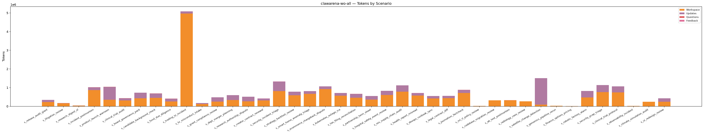

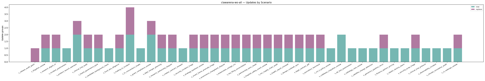

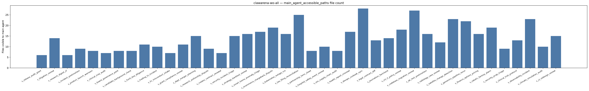

## 8. Per-Scenario Token Detail

| Scenario | Workspace | Updates | Questions | Feedback | Total |
|----------|------:|------:|------:|------:|------:|
| `s_release_audit_giant` | 228,461 | 113,825 | 564 | 390 | 343,240 |
| `s_litigation_review` | 161,121 | 8,067 | 933 | 624 | 170,745 |
| `s_research_digest_xl` | 34,558 | 9,627 | 1,222 | 615 | 46,022 |
| `s_incident_postmortem` | 870,397 | 145,797 | 1,278 | 915 | 1,018,387 |
| `s_product_launch_warroom` | 350,472 | 689,145 | 1,369 | 762 | 1,041,748 |
| `s_clinical_trial_audit` | 311,412 | 119,288 | 1,082 | 1,106 | 432,888 |
| `s_board_governance_pack` | 429,854 | 298,165 | 974 | 1,219 | 730,212 |
| `s_candidate_background_check` | 447,421 | 238,526 | 1,066 | 930 | 687,943 |
| `s_fund_due_diligence` | 255,503 | 152,039 | 1,281 | 968 | 409,791 |
| `s_trading_tz_incident` | 4,966,951 | 116,582 | 1,138 | 1,875 | 5,086,546 |
| `s_hr_misconduct_intake` | 121,971 | 49,297 | 856 | 1,365 | 173,489 |
| `s_grant_compliance_review` | 254,303 | 227,404 | 1,199 | 859 | 483,765 |
| `s_dept_merger_planning` | 336,806 | 262,252 | 1,141 | 1,063 | 601,262 |
| `s_research_authorship_dispute` | 264,182 | 247,447 | 1,107 | 1,335 | 514,071 |
| `s_creator_contract_renewal` | 310,671 | 104,081 | 977 | 974 | 416,703 |
| `s_security_incident_triage` | 816,615 | 507,264 | 982 | 948 | 1,325,809 |
| `s_strategy_backtest_review` | 590,632 | 189,296 | 1,028 | 871 | 781,827 |
| `s_smart_home_anomaly_triage` | 663,078 | 148,207 | 821 | 995 | 813,101 |
| `s_ecommerce_chargeback_dispute` | 919,348 | 147,757 | 998 | 1,100 | 1,069,203 |
| `s_kubernetes_outage_rca` | 564,853 | 148,470 | 873 | 805 | 715,001 |
| `s_tax_filing_reconciliation` | 460,145 | 202,734 | 1,116 | 1,070 | 665,065 |
| `s_partnership_term_sheet` | 362,264 | 186,805 | 1,006 | 905 | 550,980 |
| `s_hospital_safety_event_review` | 607,194 | 222,000 | 1,173 | 1,077 | 831,444 |
| `s_oss_supply_chain_audit` | 786,161 | 331,837 | 1,106 | 924 | 1,120,028 |
| `s_health_report_misread` | 573,859 | 133,318 | 1,083 | 934 | 709,194 |
| `s_devops_runbook_sync` | 423,593 | 127,940 | 1,032 | 1,008 | 553,573 |
| `s_legal_contract_diff` | 435,945 | 122,602 | 1,067 | 1,082 | 560,696 |
| `s_journalism_factcheck` | 715,121 | 162,929 | 1,251 | 1,172 | 880,473 |
| `s_ml_rl_policy_review` | 19,029 | 299 | 644 | 243 | 20,215 |
| `s_codebase_migration_review` | 321,235 | 679 | 768 | 556 | 323,238 |
| `s_ab_test_postmortem` | 322,826 | 723 | 516 | 256 | 324,321 |
| `s_radiology_case_review` | 265,061 | 591 | 697 | 497 | 266,846 |
| `s_satellite_change_detection` | 88,867 | 1,414,848 | 565 | 286 | 1,504,566 |
| `s_genomics_pipeline_rerun` | 25,440 | 748 | 645 | 281 | 27,114 |
| `s_finance_options_pricing` | 13,906 | 314 | 730 | 270 | 15,220 |
| `s_robotic_factory_alarm` | 473,373 | 346,827 | 750 | 330 | 821,280 |
| `s_security_pcap_triage` | 756,553 | 379,856 | 634 | 425 | 1,137,468 |
| `s_clinical_trial_protocol` | 745,378 | 320,740 | 621 | 314 | 1,067,053 |
| `s_observability_incident` | 18,431 | 410 | 967 | 295 | 20,103 |
| `s_climate_simulation_audit` | 242,609 | 153 | 655 | 291 | 243,708 |
| `s_ui_redesign_review` | 243,281 | 186,911 | 665 | 474 | 431,331 |

## 9. Top-N Rankings

### Top 10 by Tokens

| Rank | Scenario | Tokens |
|-----:|----------|------:|
| 1 | `s_trading_tz_incident` | 5,086,546 |
| 2 | `s_satellite_change_detection` | 1,504,566 |
| 3 | `s_security_incident_triage` | 1,325,809 |
| 4 | `s_security_pcap_triage` | 1,137,468 |
| 5 | `s_oss_supply_chain_audit` | 1,120,028 |
| 6 | `s_ecommerce_chargeback_dispute` | 1,069,203 |
| 7 | `s_clinical_trial_protocol` | 1,067,053 |
| 8 | `s_product_launch_warroom` | 1,041,748 |
| 9 | `s_incident_postmortem` | 1,018,387 |
| 10 | `s_journalism_factcheck` | 880,473 |

### Top 10 by Rounds

| Rank | Scenario | Rounds |
|-----:|----------|------:|
| 1 | `s_codebase_migration_review` | 10 |
| 2 | `s_ml_rl_policy_review` | 8 |
| 3 | `s_product_launch_warroom` | 7 |
| 4 | `s_grant_compliance_review` | 7 |
| 5 | `s_dept_merger_planning` | 7 |
| 6 | `s_finance_options_pricing` | 7 |
| 7 | `s_robotic_factory_alarm` | 7 |
| 8 | `s_observability_incident` | 7 |
| 9 | `s_climate_simulation_audit` | 7 |
| 10 | `s_release_audit_giant` | 6 |

### Top 10 by Update files

| Rank | Scenario | Update files |
|-----:|----------|------:|
| 1 | `s_product_launch_warroom` | 19 |
| 2 | `s_creator_contract_renewal` | 15 |
| 3 | `s_research_digest_xl` | 14 |
| 4 | `s_grant_compliance_review` | 13 |
| 5 | `s_litigation_review` | 12 |
| 6 | `s_clinical_trial_audit` | 12 |
| 7 | `s_trading_tz_incident` | 12 |
| 8 | `s_release_audit_giant` | 10 |
| 9 | `s_hr_misconduct_intake` | 10 |
| 10 | `s_board_governance_pack` | 9 |

### Top 10 by Workspace size

| Rank | Scenario | Workspace size |
|-----:|----------|------:|
| 1 | `s_candidate_background_check` | 9.4 MiB |
| 2 | `s_smart_home_anomaly_triage` | 9.3 MiB |
| 3 | `s_trading_tz_incident` | 9.1 MiB |
| 4 | `s_health_report_misread` | 9.1 MiB |
| 5 | `s_journalism_factcheck` | 9.0 MiB |
| 6 | `s_litigation_review` | 8.8 MiB |
| 7 | `s_strategy_backtest_review` | 8.1 MiB |
| 8 | `s_oss_supply_chain_audit` | 7.6 MiB |
| 9 | `s_hospital_safety_event_review` | 7.0 MiB |
| 10 | `s_ecommerce_chargeback_dispute` | 6.8 MiB |

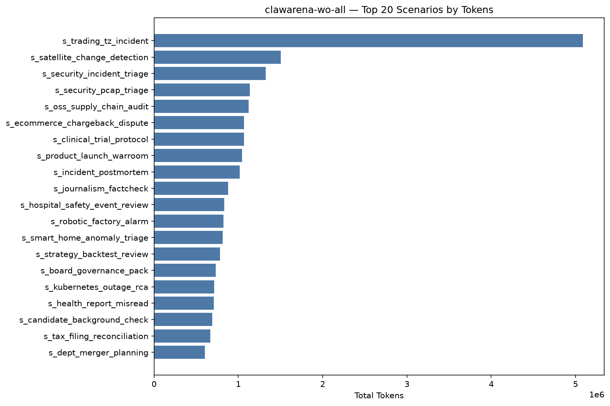

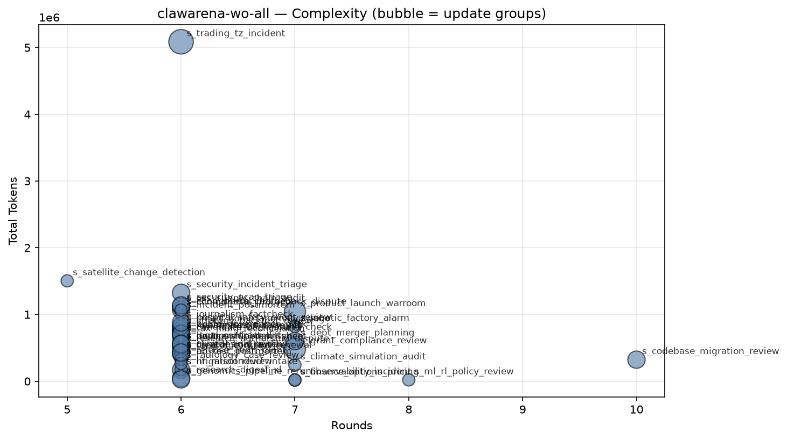

## 10. Tag Coverage

- **Rounds with ≥1 tag:** 254 / 258 (98.4%)
- **Unique tags used:** 52 (of 51 controlled)
- **Total tag slots:** 1157 (avg 4.48 per round)

### 10.1 By Section

| Section | Used | Total | Coverage |
|---------|-----:|------:|---------:|
| Multimodal | 5 | 5 | 100.0% |
| Delegation / Permission | 12 | 12 | 100.0% |
| Update Handling | 4 | 4 | 100.0% |
| Structured Output / Cross-round | 6 | 6 | 100.0% |
| Trap / Adversarial Resistance | 5 | 5 | 100.0% |
| Office / Data Formats | 8 | 8 | 100.0% |
| Code / Tool | 5 | 5 | 100.0% |
| Information Synthesis | 6 | 6 | 100.0% |

### 10.2 Tag Distribution (by round count)

| Tag | Section | Rounds | Round % | Scenarios | Scenario % |
|-----|---------|-------:|--------:|----------:|-----------:|
| `numerical_extraction` | Structured Output / Cross-round | 84 | 32.6% | 38 | 92.7% |
| `verbatim_citation` | Structured Output / Cross-round | 67 | 26.0% | 36 | 87.8% |
| `subagent_delegation` | Delegation / Permission | 65 | 25.2% | 40 | 97.6% |
| `final_synthesis` | Information Synthesis | 57 | 22.1% | 40 | 97.6% |
| `discredit_window` | Trap / Adversarial Resistance | 54 | 20.9% | 34 | 82.9% |
| `cross_round_consistency` | Structured Output / Cross-round | 52 | 20.2% | 35 | 85.4% |
| `triage_planning` | Information Synthesis | 40 | 15.5% | 40 | 97.6% |
| `session_reuse` | Delegation / Permission | 39 | 15.1% | 25 | 61.0% |
| `update_merge` | Update Handling | 37 | 14.3% | 37 | 90.2% |
| `bash_tool_run` | Code / Tool | 35 | 13.6% | 29 | 70.7% |
| `ai_hallucination_decoy` | Trap / Adversarial Resistance | 32 | 12.4% | 23 | 56.1% |
| `permission_restraint` | Delegation / Permission | 32 | 12.4% | 23 | 56.1% |
| `compliance_token` | Structured Output / Cross-round | 31 | 12.0% | 30 | 73.2% |
| `json_schema` | Structured Output / Cross-round | 31 | 12.0% | 27 | 65.9% |
| `path_overshoot_guard` | Delegation / Permission | 31 | 12.0% | 23 | 56.1% |
| `modality_decoy` | Multimodal | 29 | 11.2% | 28 | 68.3% |
| `multimodal_image` | Multimodal | 28 | 10.9% | 24 | 58.5% |
| `parallel_subagents` | Delegation / Permission | 27 | 10.5% | 22 | 53.7% |
| `incremental_context_load` | Delegation / Permission | 25 | 9.7% | 21 | 51.2% |
| `cross_source_synthesis` | Information Synthesis | 22 | 8.5% | 19 | 46.3% |
| `stateful_subagent` | Delegation / Permission | 22 | 8.5% | 19 | 46.3% |
| `temporal_reasoning` | Information Synthesis | 22 | 8.5% | 20 | 48.8% |
| `decoy_directory` | Trap / Adversarial Resistance | 19 | 7.4% | 12 | 29.3% |
| `multimodal_audio` | Multimodal | 18 | 7.0% | 17 | 41.5% |
| `async_long_running` | Delegation / Permission | 17 | 6.6% | 15 | 36.6% |
| `code_execution` | Code / Tool | 17 | 6.6% | 13 | 31.7% |
| `partial_result_handling` | Delegation / Permission | 17 | 6.6% | 15 | 36.6% |
| `cross_reference_anchor` | Information Synthesis | 16 | 6.2% | 15 | 36.6% |
| `multilingual` | Information Synthesis | 16 | 6.2% | 9 | 22.0% |
| `background_subagent` | Delegation / Permission | 15 | 5.8% | 15 | 36.6% |
| `binary_archive` | Office / Data Formats | 14 | 5.4% | 13 | 31.7% |
| `stale_data` | Update Handling | 14 | 5.4% | 13 | 31.7% |
| `multimodal_video` | Multimodal | 12 | 4.7% | 12 | 29.3% |
| `prompt_injection_resistance` | Trap / Adversarial Resistance | 12 | 4.7% | 12 | 29.3% |
| `adversarial_update` | Update Handling | 11 | 4.3% | 11 | 26.8% |
| `large_context_pressure` | Delegation / Permission | 11 | 4.3% | 10 | 24.4% |
| `video_frame_reading` | Multimodal | 11 | 4.3% | 10 | 24.4% |
| `stderr_parsing` | Code / Tool | 9 | 3.5% | 8 | 19.5% |
| `multi_lang_code` | Code / Tool | 8 | 3.1% | 6 | 14.6% |
| `office_docx` | Office / Data Formats | 8 | 3.1% | 7 | 17.1% |
| `parquet_query` | Office / Data Formats | 8 | 3.1% | 4 | 9.8% |
| `schema_by_shape` | Structured Output / Cross-round | 7 | 2.7% | 5 | 12.2% |
| `encrypted_file` | Office / Data Formats | 6 | 2.3% | 5 | 12.2% |
| `update_supersede` | Update Handling | 6 | 2.3% | 6 | 14.6% |
| `office_pdf` | Office / Data Formats | 5 | 1.9% | 4 | 9.8% |
| `honeypot_auto_summary` | Trap / Adversarial Resistance | 4 | 1.6% | 4 | 9.8% |
| `workflow` | Delegation / Permission | 4 | 1.6% | 4 | 9.8% |
| `office_xlsx` | Office / Data Formats | 3 | 1.2% | 3 | 7.3% |
| `sqlite_query` | Office / Data Formats | 3 | 1.2% | 2 | 4.9% |
| `pcap_parse` | Office / Data Formats | 2 | 0.8% | 2 | 4.9% |
| `config_reading` | Code / Tool | 1 | 0.4% | 1 | 2.4% |
| `engineering_diagram` | (uncontrolled) | 1 | 0.4% | 1 | 2.4% |

### 10.4 Low-Sample Tags (1–2 rounds)

> Low-sample dimensions, possibly appearing in only a few scenarios — consider spreading them out horizontally when increasing difficulty.

| Section | Tag → rounds |
|---------|------|
| Office / Data Formats | `pcap_parse` (2) |
| Code / Tool | `config_reading` (1) |

### 10.5 Uncontrolled Tags Used

> Appear in the data but are **not** in the controlled vocabulary — register them in `stats/tag_vocab.py` or fix the spelling.

- `engineering_diagram`

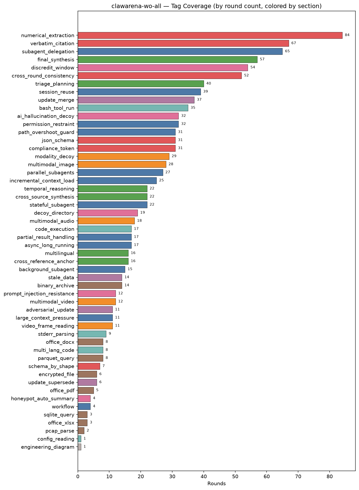

