# clawarena-team-demo — Stats Report

_Tokenizer: `qwen3`_

## 1. Overall Summary

- **Scenarios:** 5
- **Total rounds:** 31
- **Rounds with updates:** 6 (19.4%)
- **Total update groups:** 9 (61 files)
- **Total workspace size:** 16.5 MiB
- **Total tokens:** 2,620,142

## 2. Token Distribution

| Category | Tokens | % |
|----------|-------:|--:|
| Workspace | 1,645,009 | 62.8% |
| Updates | 966,461 | 36.9% |
| Questions | 5,366 | 0.2% |
| Feedback | 3,306 | 0.1% |
| **Total** | **2,620,142** | **100.0%** |

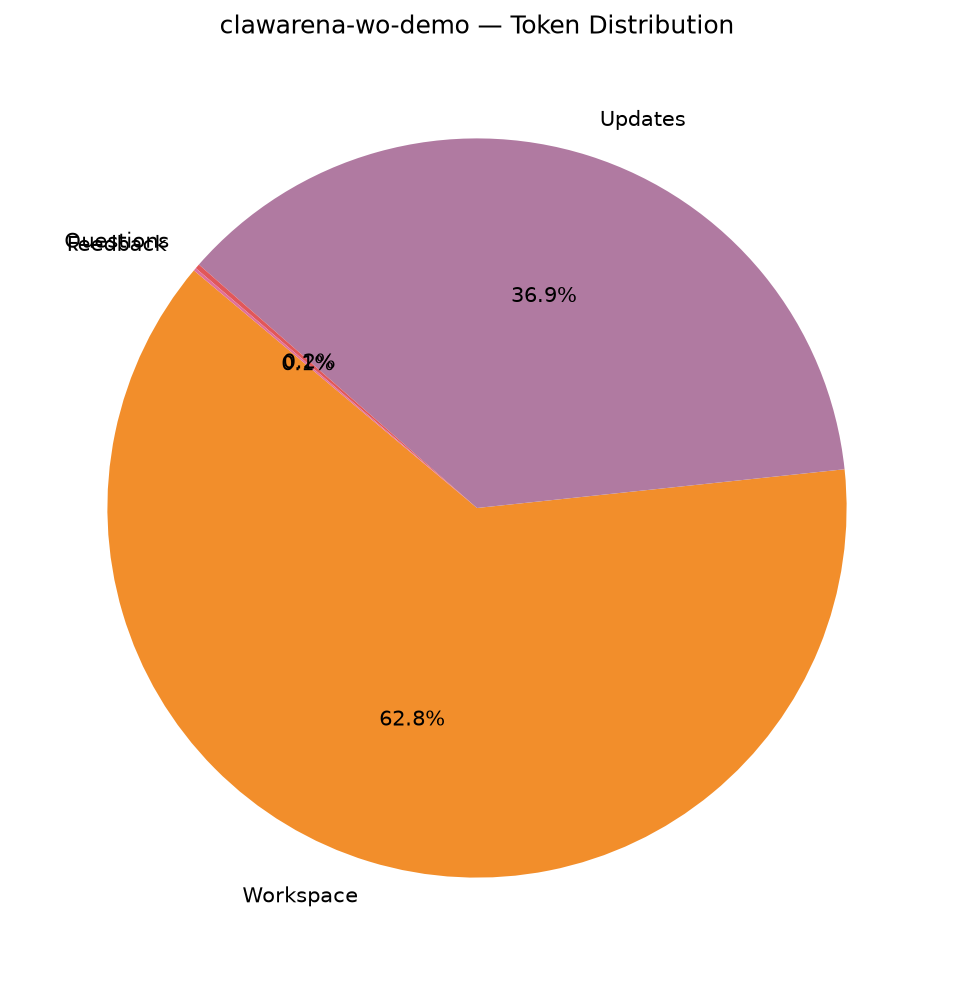

## 3. Question Statistics

### 3.1 Type Distribution

| Type | Count | % |
|------|------:|--:|
| `exec_check` | 31 | 100.0% |

### 3.2 exec_check Feature Coverage

| Feature | Rounds | Coverage |
|---------|-------:|---------:|
| expect_exit declared | 31 | 100.0% |
| expect_stdout set | 0 | 0.0% |
| regex matching | 0 | 0.0% |
| timeout set | 31 | 100.0% |
| uses ${scripts} | 31 | 100.0% |
| uses ${workspace} | 31 | 100.0% |

_Timeout (s) — mean 80.3, min 60.0, max 180.0._

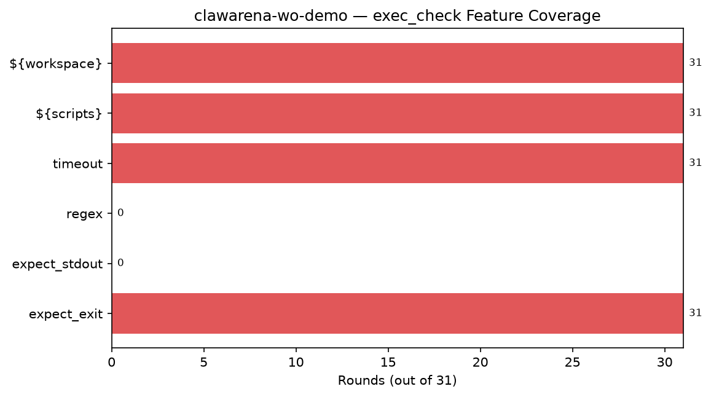

### 3.3 Question Token Stats

- **Mean:** 173.1, **Min:** 52, **Max:** 435

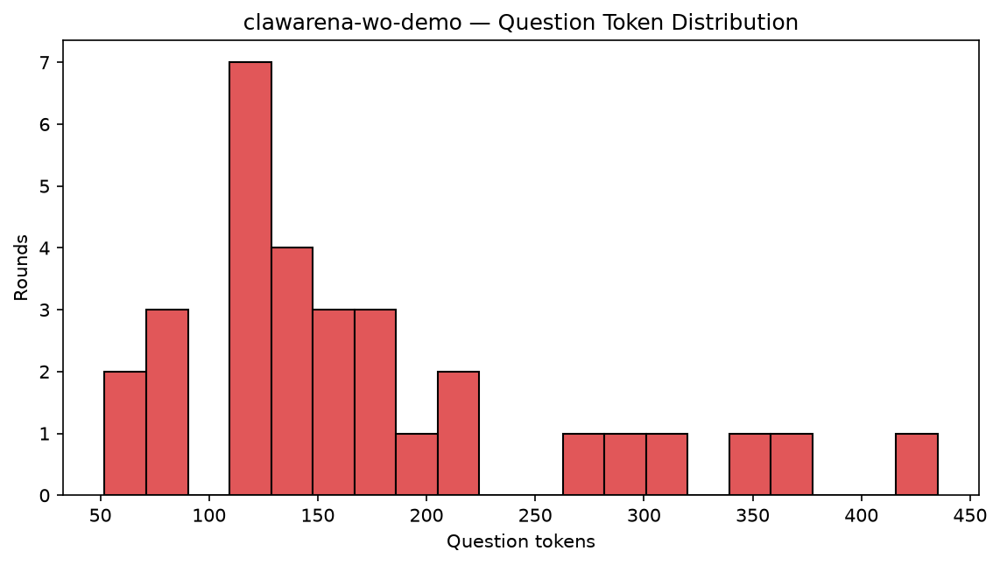

## 4. Update Statistics

### 4.1 Op Distribution

| op | Groups | % |
|----|------:|--:|
| `new` | 5 | 55.6% |
| `replace` | 4 | 44.4% |

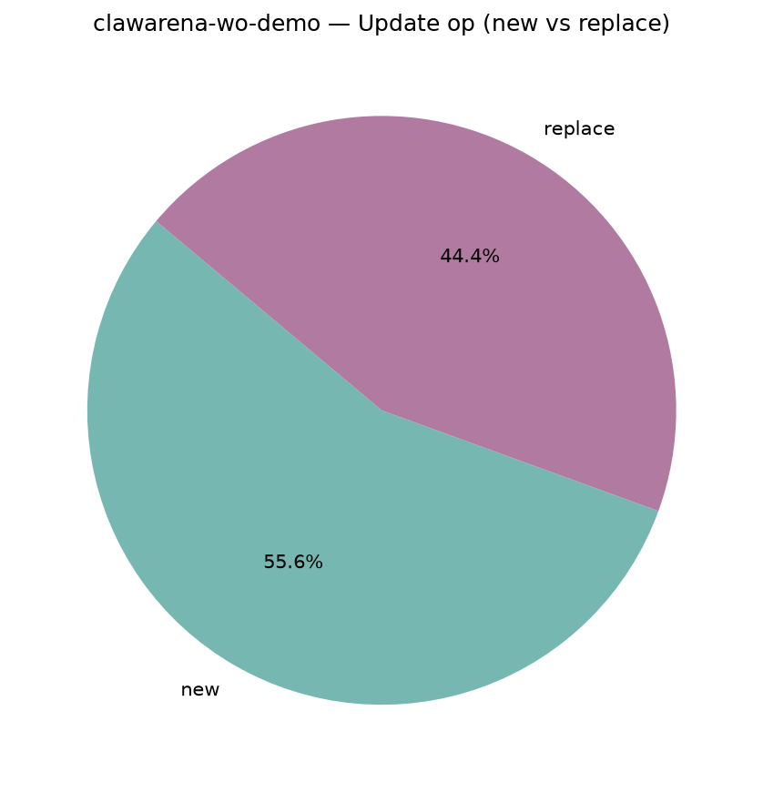

### 4.2 Files per Update

- **Mean:** 6.78, **Min:** 1, **Max:** 13
- **Total update files:** 61

## 5. Workspace Composition

### 5.1 By Modality

| Modality | Files | File % | Bytes | Tokens | Token % |
|----------|------:|------:|------:|------:|--------:|
| `text` | 272 | 86.3% | 4.6 MiB | 1,625,829 | 98.8% |
| `image` | 26 | 8.3% | 1.7 MiB | 7,280 | 0.4% |
| `audio` | 4 | 1.3% | 7.8 MiB | 3,000 | 0.2% |
| `video` | 3 | 1.0% | 2.5 MiB | 6,720 | 0.4% |
| `other` | 10 | 3.2% | 7.2 KiB | 2,180 | 0.1% |

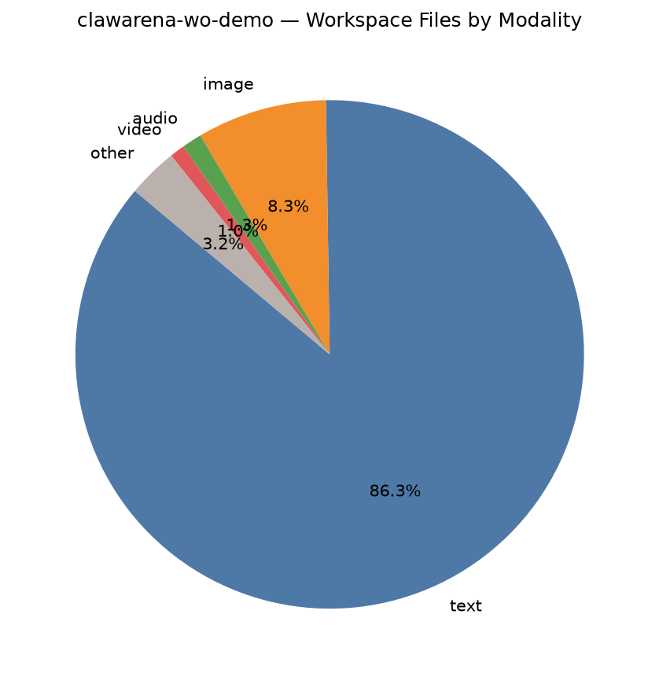

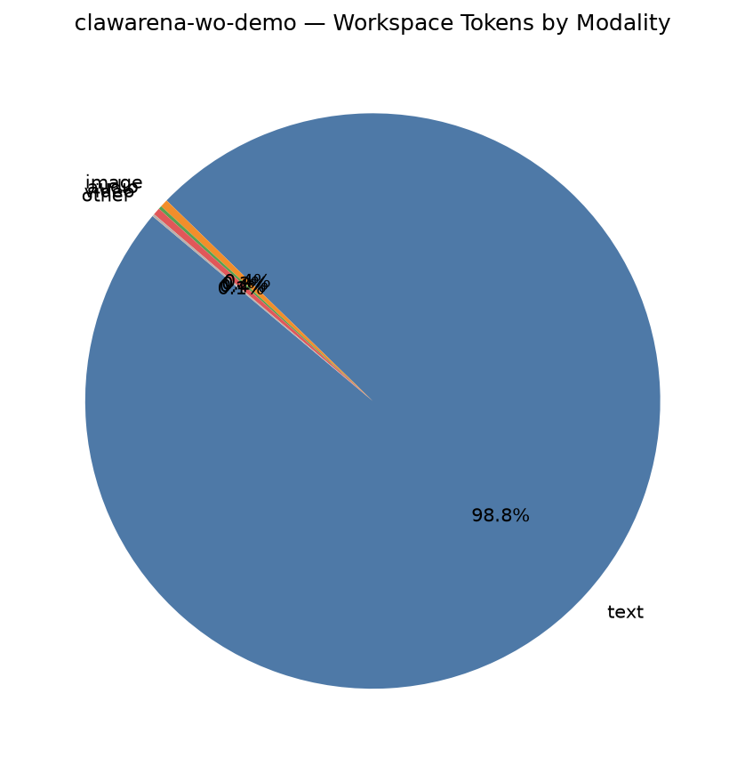

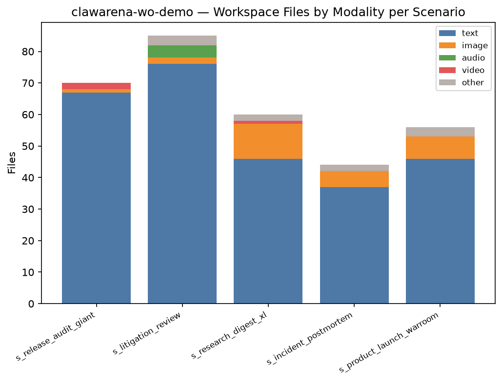

### 5.2 By Extension (Top 12 by bytes)

| Extension | Files | File % | Bytes | Byte % | Tokens | Token % |
|-----------|------:|------:|------:|------:|------:|--------:|
| `.wav` | 4 | 1.3% | 7.8 MiB | 46.9% | 3,000 | 0.2% |
| `.mp4` | 3 | 1.0% | 2.5 MiB | 15.1% | 6,720 | 0.4% |
| `.md` | 194 | 61.6% | 2.2 MiB | 13.4% | 579,023 | 35.2% |
| `.png` | 26 | 8.3% | 1.7 MiB | 10.0% | 7,280 | 0.4% |
| `.log` | 8 | 2.5% | 1.4 MiB | 8.2% | 753,588 | 45.8% |
| `.py` | 66 | 21.0% | 1.0 MiB | 6.2% | 291,460 | 17.7% |
| `.bib` | 2 | 0.6% | 5.3 KiB | 0.0% | 1,658 | 0.1% |
| `.sh` | 2 | 0.6% | 2.6 KiB | 0.0% | 774 | 0.0% |
| `.csv` | 1 | 0.3% | 2.3 KiB | 0.0% | 850 | 0.1% |
| `.eml` | 1 | 0.3% | 2.0 KiB | 0.0% | 522 | 0.0% |
| `.yaml` | 1 | 0.3% | 394 B | 0.0% | 134 | 0.0% |
| `(none)` | 7 | 2.2% | 0 B | 0.0% | 0 | 0.0% |

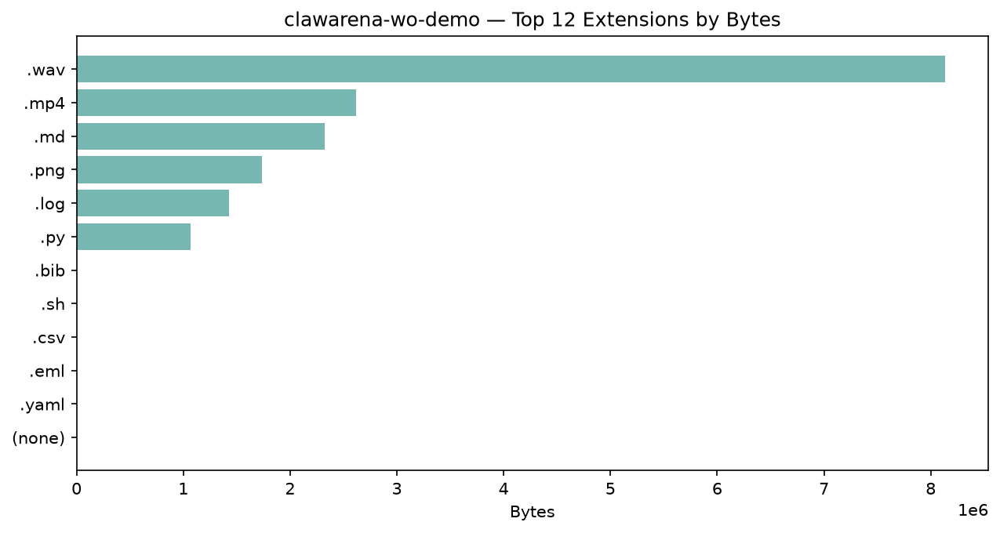

### 5.3 Largest Files (Top 15)

| Rank | Path | Modality | Bytes | Tokens |
|-----:|------|----------|------:|------:|
| 1 | `audio/hearing_2026-03-22.wav` | `audio` | 4.0 MiB | 750 |
| 2 | `videos/lecture_2026-04-10.mp4` | `video` | 1.3 MiB | 2,240 |
| 3 | `audio/training_recording_2026-01-08.wav` | `audio` | 1.3 MiB | 750 |
| 4 | `audio/voicemail_intake_2026-02-12.wav` | `audio` | 1.3 MiB | 750 |
| 5 | `audio/legacy_hearing_2025-11-04.wav` | `audio` | 1.2 MiB | 750 |
| 6 | `design/design_meeting_2026-04-12.mp4` | `video` | 1.1 MiB | 2,240 |
| 7 | `design/architecture_diagram.png` | `image` | 394.0 KiB | 280 |
| 8 | `regulatory_constraints_v2.md` | `text` | 208.4 KiB | 63,979 |
| 9 | `memo_06_final_redactions.md` | `text` | 205.0 KiB | 64,149 |
| 10 | `competitive_response_playbook_v2.md` | `text` | 204.7 KiB | 61,337 |
| 11 | `archive/handbook_v1.md` | `text` | 191.1 KiB | 30,265 |
| 12 | `comp_x_apex_cloud.md` | `text` | 181.7 KiB | 53,796 |
| 13 | `logs/user-profile_2026-05-12.log` | `text` | 178.4 KiB | 95,735 |
| 14 | `logs/notifications_2026-05-12.log` | `text` | 177.9 KiB | 93,339 |
| 15 | `memo_01_claims_substantiation.md` | `text` | 175.8 KiB | 60,761 |

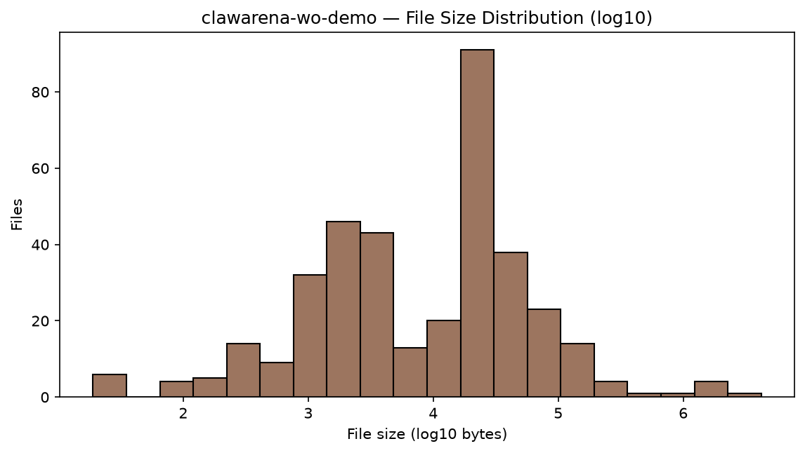

## 6. Multimodal Coverage

### 6.1 Per-Scenario Multimodal Files

| Scenario | image | audio | video | mm bytes | mm tokens |
|----------|------:|------:|------:|---------:|----------:|
| `s_release_audit_giant` | 1 | 0 | 2 | 1.6 MiB | 4,760 |
| `s_litigation_review` | 2 | 4 | 0 | 7.9 MiB | 3,560 |
| `s_research_digest_xl` | 11 | 0 | 1 | 1.9 MiB | 5,320 |
| `s_incident_postmortem` | 5 | 0 | 0 | 194.9 KiB | 1,400 |
| `s_product_launch_warroom` | 7 | 0 | 0 | 368.8 KiB | 1,960 |

### 6.2 Modality Totals

- **Audio files:** 4 (measured 4 via stdlib `wave`; total 254.1s ≈ 4.2 min)
- **Video files:** 3 (cv2 unavailable or unreadable)

## 7. Per-Scenario Breakdown

| Scenario | Rounds | w/Upd | Upd Groups | Upd Files | WS Files | Accessible | Tokens |
|----------|-------:|------:|-----------:|----------:|---------:|-----------:|-------:|
| `s_release_audit_giant` | 6 | 1 | 1 | 10 | 70 | 6 | 343,240 |
| `s_litigation_review` | 6 | 1 | 2 | 12 | 85 | 14 | 170,745 |
| `s_research_digest_xl` | 6 | 1 | 2 | 14 | 60 | 6 | 46,022 |
| `s_incident_postmortem` | 6 | 1 | 1 | 6 | 44 | 9 | 1,018,387 |
| `s_product_launch_warroom` | 7 | 2 | 3 | 19 | 56 | 8 | 1,041,748 |

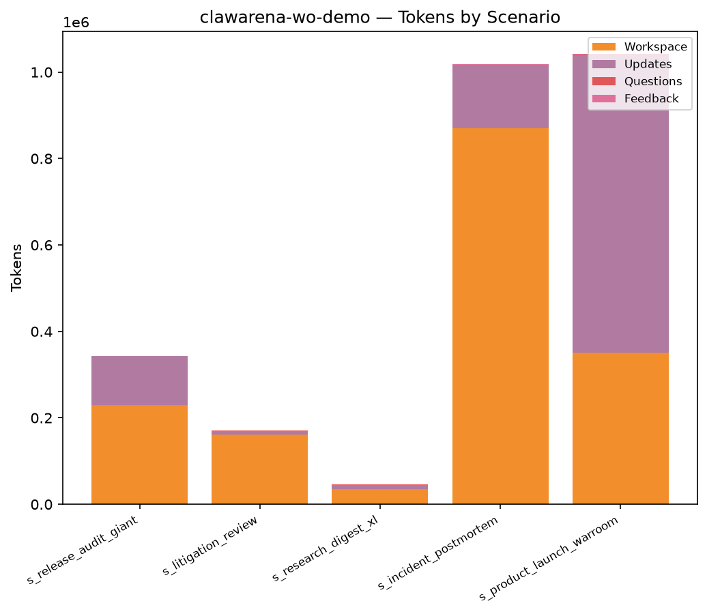

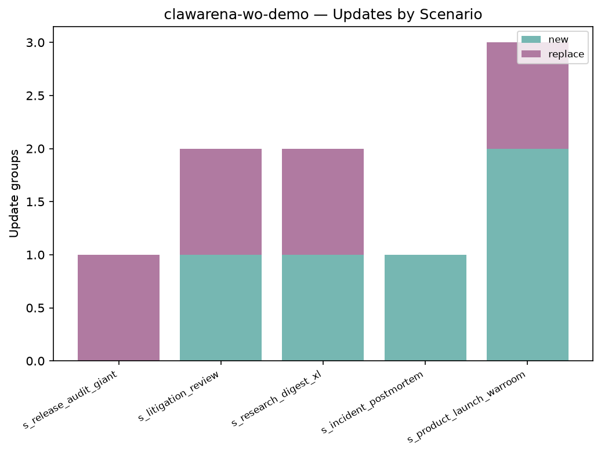

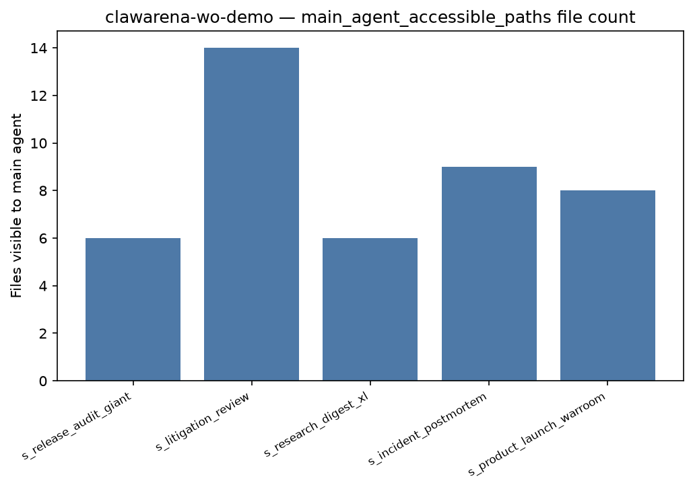

## 8. Per-Scenario Token Detail

| Scenario | Workspace | Updates | Questions | Feedback | Total |
|----------|------:|------:|------:|------:|------:|
| `s_release_audit_giant` | 228,461 | 113,825 | 564 | 390 | 343,240 |
| `s_litigation_review` | 161,121 | 8,067 | 933 | 624 | 170,745 |
| `s_research_digest_xl` | 34,558 | 9,627 | 1,222 | 615 | 46,022 |
| `s_incident_postmortem` | 870,397 | 145,797 | 1,278 | 915 | 1,018,387 |
| `s_product_launch_warroom` | 350,472 | 689,145 | 1,369 | 762 | 1,041,748 |

## 9. Top-N Rankings

### Top 5 by Tokens

| Rank | Scenario | Tokens |
|-----:|----------|------:|
| 1 | `s_product_launch_warroom` | 1,041,748 |
| 2 | `s_incident_postmortem` | 1,018,387 |
| 3 | `s_release_audit_giant` | 343,240 |
| 4 | `s_litigation_review` | 170,745 |
| 5 | `s_research_digest_xl` | 46,022 |

### Top 5 by Rounds

| Rank | Scenario | Rounds |
|-----:|----------|------:|
| 1 | `s_product_launch_warroom` | 7 |
| 2 | `s_release_audit_giant` | 6 |
| 3 | `s_litigation_review` | 6 |
| 4 | `s_research_digest_xl` | 6 |
| 5 | `s_incident_postmortem` | 6 |

### Top 5 by Update files

| Rank | Scenario | Update files |
|-----:|----------|------:|
| 1 | `s_product_launch_warroom` | 19 |
| 2 | `s_research_digest_xl` | 14 |
| 3 | `s_litigation_review` | 12 |
| 4 | `s_release_audit_giant` | 10 |
| 5 | `s_incident_postmortem` | 6 |

### Top 5 by Workspace size

| Rank | Scenario | Workspace size |
|-----:|----------|------:|
| 1 | `s_litigation_review` | 8.8 MiB |
| 2 | `s_release_audit_giant` | 2.4 MiB |
| 3 | `s_research_digest_xl` | 2.0 MiB |
| 4 | `s_incident_postmortem` | 2.0 MiB |
| 5 | `s_product_launch_warroom` | 1.4 MiB |

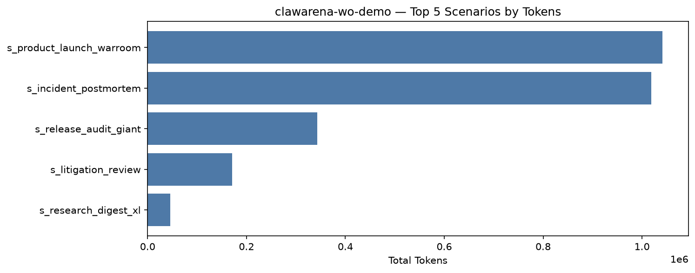

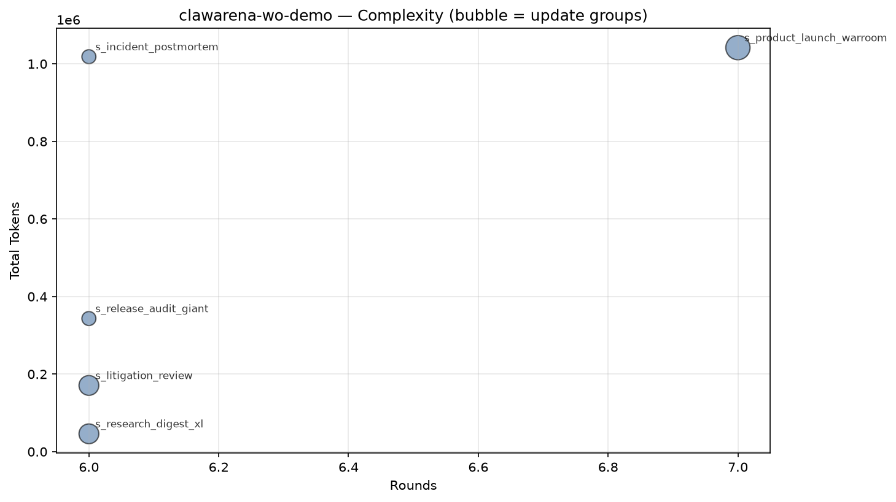

## 10. Tag Coverage

- **Rounds with ≥1 tag:** 27 / 31 (87.1%)
- **Unique tags used:** 34 (of 51 controlled)
- **Total tag slots:** 104 (avg 3.35 per round)

### 10.1 By Section

| Section | Used | Total | Coverage |
|---------|-----:|------:|---------:|
| Multimodal | 5 | 5 | 100.0% |
| Delegation / Permission | 12 | 12 | 100.0% |
| Update Handling | 2 | 4 | 50.0% |
| Structured Output / Cross-round | 5 | 6 | 83.3% |
| Trap / Adversarial Resistance | 3 | 5 | 60.0% |
| Office / Data Formats | 0 | 8 | 0.0% |
| Code / Tool | 1 | 5 | 20.0% |
| Information Synthesis | 5 | 6 | 83.3% |

### 10.2 Tag Distribution (by round count)

| Tag | Section | Rounds | Round % | Scenarios | Scenario % |
|-----|---------|-------:|--------:|----------:|-----------:|
| `numerical_extraction` | Structured Output / Cross-round | 8 | 25.8% | 4 | 80.0% |
| `subagent_delegation` | Delegation / Permission | 8 | 25.8% | 4 | 80.0% |
| `final_synthesis` | Information Synthesis | 7 | 22.6% | 4 | 80.0% |
| `cross_round_consistency` | Structured Output / Cross-round | 6 | 19.4% | 4 | 80.0% |
| `verbatim_citation` | Structured Output / Cross-round | 5 | 16.1% | 4 | 80.0% |
| `discredit_window` | Trap / Adversarial Resistance | 4 | 12.9% | 3 | 60.0% |
| `json_schema` | Structured Output / Cross-round | 4 | 12.9% | 3 | 60.0% |
| `large_context_pressure` | Delegation / Permission | 4 | 12.9% | 4 | 80.0% |
| `multimodal_image` | Multimodal | 4 | 12.9% | 4 | 80.0% |
| `partial_result_handling` | Delegation / Permission | 4 | 12.9% | 4 | 80.0% |
| `triage_planning` | Information Synthesis | 4 | 12.9% | 4 | 80.0% |
| `async_long_running` | Delegation / Permission | 3 | 9.7% | 3 | 60.0% |
| `background_subagent` | Delegation / Permission | 3 | 9.7% | 3 | 60.0% |
| `bash_tool_run` | Code / Tool | 3 | 9.7% | 3 | 60.0% |
| `compliance_token` | Structured Output / Cross-round | 3 | 9.7% | 3 | 60.0% |
| `cross_source_synthesis` | Information Synthesis | 3 | 9.7% | 2 | 40.0% |
| `modality_decoy` | Multimodal | 3 | 9.7% | 3 | 60.0% |
| `parallel_subagents` | Delegation / Permission | 3 | 9.7% | 2 | 40.0% |
| `update_merge` | Update Handling | 3 | 9.7% | 3 | 60.0% |
| `workflow` | Delegation / Permission | 3 | 9.7% | 3 | 60.0% |
| `honeypot_auto_summary` | Trap / Adversarial Resistance | 2 | 6.5% | 2 | 40.0% |
| `incremental_context_load` | Delegation / Permission | 2 | 6.5% | 2 | 40.0% |
| `session_reuse` | Delegation / Permission | 2 | 6.5% | 2 | 40.0% |
| `stateful_subagent` | Delegation / Permission | 2 | 6.5% | 2 | 40.0% |
| `update_supersede` | Update Handling | 2 | 6.5% | 2 | 40.0% |
| `cross_reference_anchor` | Information Synthesis | 1 | 3.2% | 1 | 20.0% |
| `decoy_directory` | Trap / Adversarial Resistance | 1 | 3.2% | 1 | 20.0% |
| `engineering_diagram` | (uncontrolled) | 1 | 3.2% | 1 | 20.0% |
| `multimodal_audio` | Multimodal | 1 | 3.2% | 1 | 20.0% |
| `multimodal_video` | Multimodal | 1 | 3.2% | 1 | 20.0% |
| `path_overshoot_guard` | Delegation / Permission | 1 | 3.2% | 1 | 20.0% |
| `permission_restraint` | Delegation / Permission | 1 | 3.2% | 1 | 20.0% |
| `temporal_reasoning` | Information Synthesis | 1 | 3.2% | 1 | 20.0% |
| `video_frame_reading` | Multimodal | 1 | 3.2% | 1 | 20.0% |

### 10.3 Uncovered Controlled Tags

> Registered in the vocabulary but hit by 0 rounds in this dataset — the next wave of scenario design can prioritize filling these in.

| Section | Tags |
|---------|------|
| Update Handling | `adversarial_update`, `stale_data` |
| Structured Output / Cross-round | `schema_by_shape` |
| Trap / Adversarial Resistance | `ai_hallucination_decoy`, `prompt_injection_resistance` |
| Office / Data Formats | `office_xlsx`, `office_docx`, `office_pdf`, `binary_archive`, `sqlite_query`, `parquet_query`, `pcap_parse`, `encrypted_file` |
| Code / Tool | `code_execution`, `stderr_parsing`, `multi_lang_code`, `config_reading` |
| Information Synthesis | `multilingual` |

### 10.4 Low-Sample Tags (1–2 rounds)

> Low-sample dimensions, possibly appearing in only a few scenarios — consider spreading them out horizontally when increasing difficulty.

| Section | Tag → rounds |
|---------|------|
| Multimodal | `multimodal_audio` (1), `multimodal_video` (1), `video_frame_reading` (1) |
| Delegation / Permission | `session_reuse` (2), `stateful_subagent` (2), `incremental_context_load` (2), `permission_restraint` (1), `path_overshoot_guard` (1) |
| Update Handling | `update_supersede` (2) |
| Trap / Adversarial Resistance | `honeypot_auto_summary` (2), `decoy_directory` (1) |
| Information Synthesis | `cross_reference_anchor` (1), `temporal_reasoning` (1) |

### 10.5 Uncontrolled Tags Used

> Appear in the data but are **not** in the controlled vocabulary — register them in `stats/tag_vocab.py` or fix the spelling.

- `engineering_diagram`

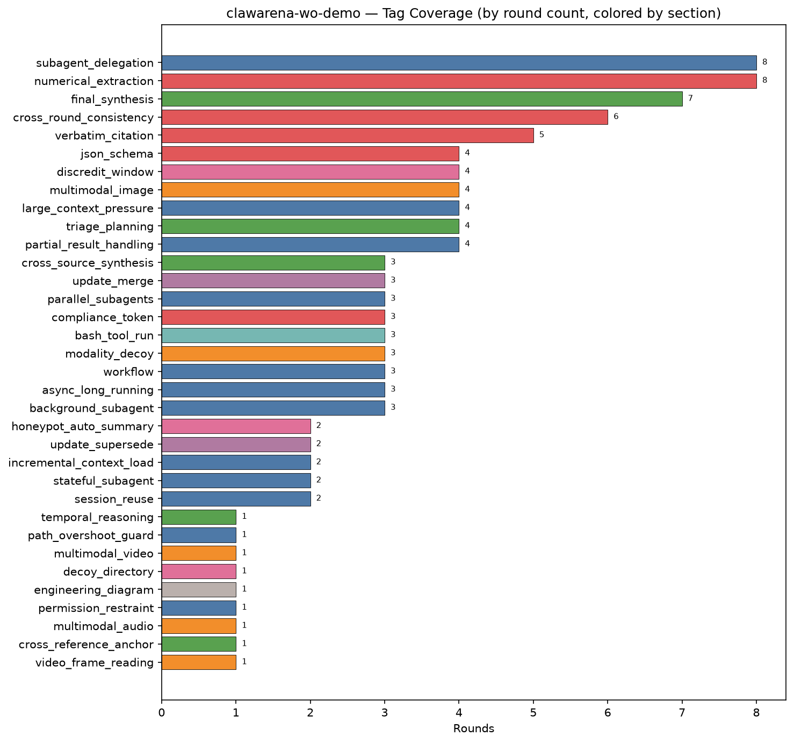

