# clawarena-team-wave1 — Stats Report

_Tokenizer: `qwen3`_

## 1. Overall Summary

- **Scenarios:** 10
- **Total rounds:** 62
- **Rounds with updates:** 11 (17.7%)
- **Total update groups:** 20 (105 files)
- **Total workspace size:** 39.3 MiB
- **Total tokens:** 9,536,670

## 2. Token Distribution

| Category | Tokens | % |
|----------|-------:|--:|
| Workspace | 7,699,074 | 80.7% |
| Updates | 1,815,081 | 19.0% |
| Questions | 10,821 | 0.1% |
| Feedback | 11,694 | 0.1% |
| **Total** | **9,536,670** | **100.0%** |

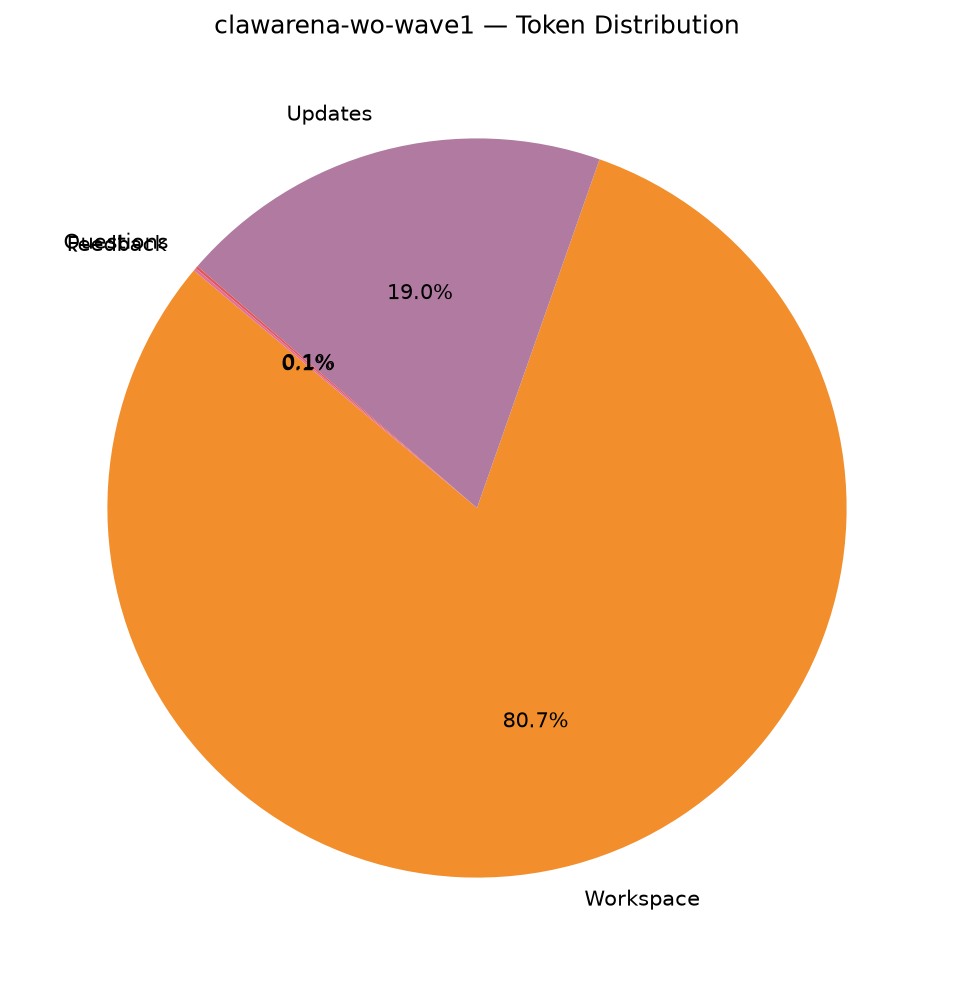

## 3. Question Statistics

### 3.1 Type Distribution

| Type | Count | % |
|------|------:|--:|
| `exec_check` | 62 | 100.0% |

### 3.2 exec_check Feature Coverage

| Feature | Rounds | Coverage |
|---------|-------:|---------:|
| expect_exit declared | 62 | 100.0% |
| expect_stdout set | 0 | 0.0% |
| regex matching | 0 | 0.0% |
| timeout set | 62 | 100.0% |
| uses ${scripts} | 62 | 100.0% |
| uses ${workspace} | 62 | 100.0% |

_Timeout (s) — mean 93.4, min 60.0, max 180.0._

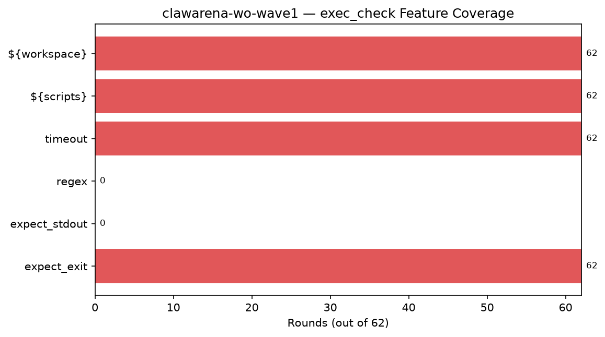

### 3.3 Question Token Stats

- **Mean:** 174.5, **Min:** 112, **Max:** 342

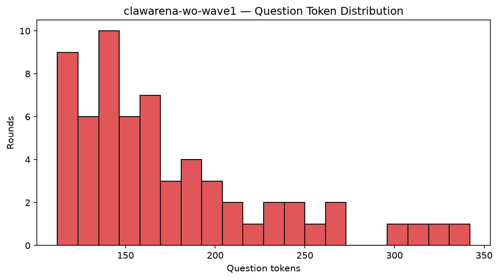

## 4. Update Statistics

### 4.1 Op Distribution

| op | Groups | % |
|----|------:|--:|
| `new` | 12 | 60.0% |
| `replace` | 8 | 40.0% |

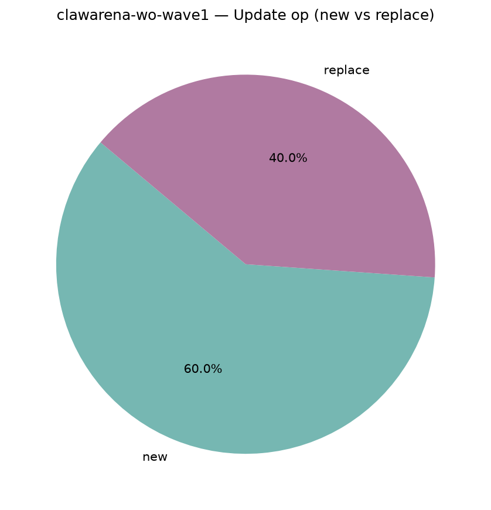

### 4.2 Files per Update

- **Mean:** 5.25, **Min:** 1, **Max:** 15
- **Total update files:** 105

## 5. Workspace Composition

### 5.1 By Modality

| Modality | Files | File % | Bytes | Tokens | Token % |
|----------|------:|------:|------:|------:|--------:|
| `text` | 364 | 85.6% | 22.5 MiB | 7,675,822 | 99.7% |
| `image` | 33 | 7.8% | 2.3 MiB | 9,240 | 0.1% |
| `audio` | 4 | 0.9% | 13.7 MiB | 3,000 | 0.0% |
| `video` | 2 | 0.5% | 697.8 KiB | 4,480 | 0.1% |
| `document` | 1 | 0.2% | 114.7 KiB | 0 | 0.0% |
| `other` | 21 | 4.9% | 26.1 KiB | 6,532 | 0.1% |

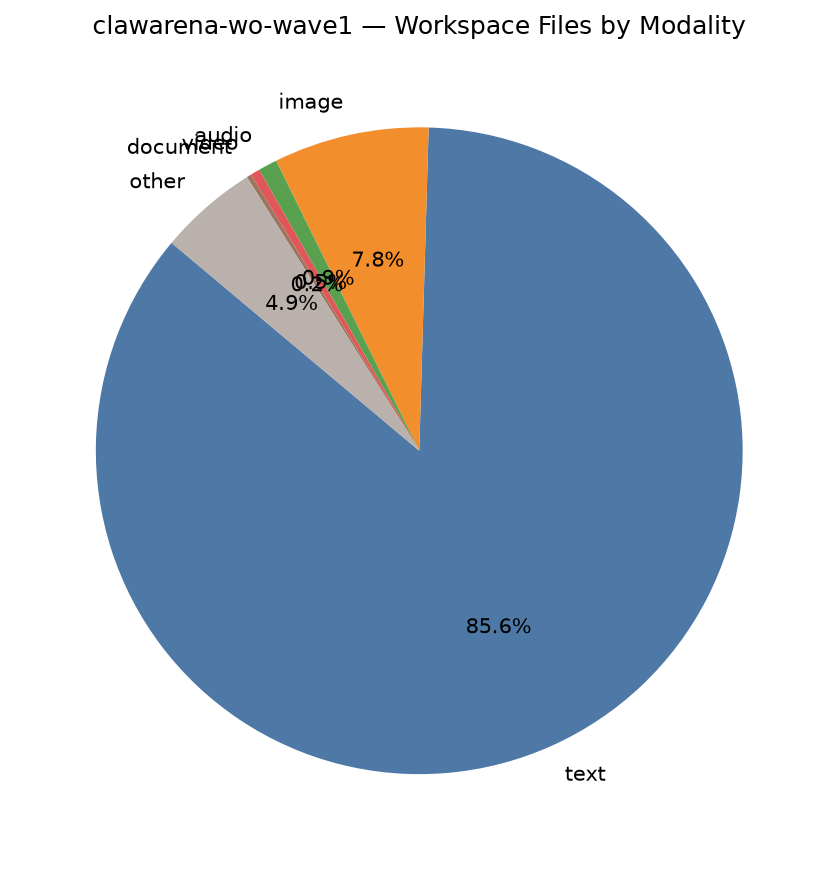

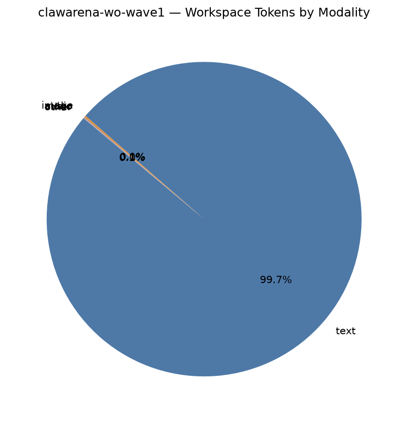

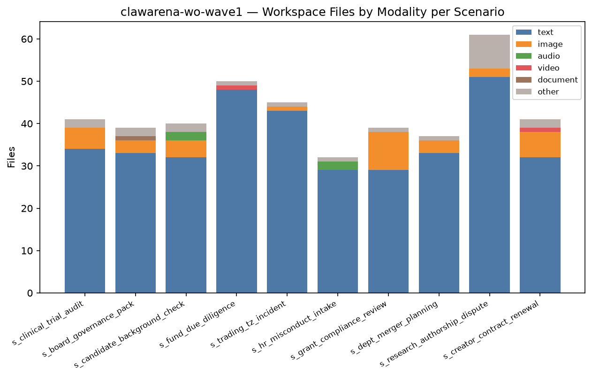

### 5.2 By Extension (Top 13 by bytes)

| Extension | Files | File % | Bytes | Byte % | Tokens | Token % |
|-----------|------:|------:|------:|------:|------:|--------:|
| `.wav` | 4 | 0.9% | 13.7 MiB | 34.9% | 3,000 | 0.0% |
| `.md` | 311 | 73.2% | 13.2 MiB | 33.5% | 2,359,469 | 30.6% |
| `.log` | 7 | 1.6% | 7.9 MiB | 20.2% | 4,476,454 | 58.1% |
| `.png` | 33 | 7.8% | 2.3 MiB | 5.9% | 9,240 | 0.1% |
| `.csv` | 22 | 5.2% | 759.7 KiB | 1.9% | 546,566 | 7.1% |
| `.mp4` | 2 | 0.5% | 697.8 KiB | 1.7% | 4,480 | 0.1% |
| `.txt` | 5 | 1.2% | 485.5 KiB | 1.2% | 253,549 | 3.3% |
| `.pdf` | 1 | 0.2% | 114.7 KiB | 0.3% | 0 | 0.0% |
| `.json` | 5 | 1.2% | 87.3 KiB | 0.2% | 32,873 | 0.4% |
| `.eml` | 10 | 2.4% | 26.1 KiB | 0.1% | 6,532 | 0.1% |
| `.py` | 10 | 2.4% | 12.3 KiB | 0.0% | 3,816 | 0.0% |
| `.sh` | 4 | 0.9% | 9.4 KiB | 0.0% | 3,095 | 0.0% |
| `(none)` | 11 | 2.6% | 0 B | 0.0% | 0 | 0.0% |

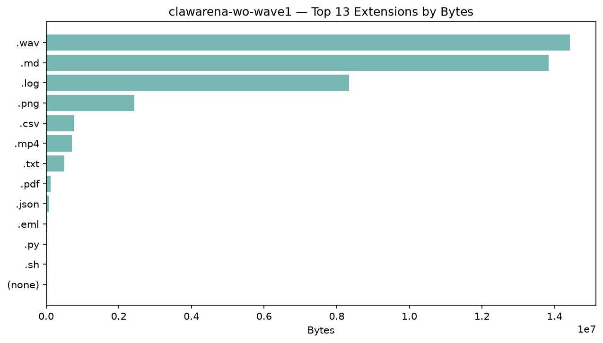

### 5.3 Largest Files (Top 15)

| Rank | Path | Modality | Bytes | Tokens |
|-----:|------|----------|------:|------:|
| 1 | `audio_statements/complainant_statement_2026-05-02.wav` | `audio` | 4.5 MiB | 750 |
| 2 | `reference_calls/ref_call_sam_okafor.wav` | `audio` | 3.9 MiB | 750 |
| 3 | `reference_calls/ref_call_alex_drummond.wav` | `audio` | 3.8 MiB | 750 |
| 4 | `matching_engine_logs/matching_2026-03-28_part1.log` | `text` | 1.6 MiB | 921,805 |
| 5 | `clearing_logs/clearing_2026-03-27_CET.log` | `text` | 1.6 MiB | 906,656 |
| 6 | `audio/hr_interview_addendum.wav` | `audio` | 1.6 MiB | 750 |
| 7 | `matching_engine_logs/matching_2026-03-27_part2.log` | `text` | 1.4 MiB | 802,116 |
| 8 | `matching_engine_logs/matching_2026-03-27_part1.log` | `text` | 1.4 MiB | 789,481 |
| 9 | `matching_engine_logs/matching_2026-03-28_part2.log` | `text` | 1.4 MiB | 765,376 |
| 10 | `vlog_archive/lin_vlog_20251108_mcn_meeting.mp4` | `video` | 501.6 KiB | 2,240 |
| 11 | `meridian_hr_manual_full.md` | `text` | 494.0 KiB | 92,242 |
| 12 | `irb_policy_framework_tri_university.md` | `text` | 468.5 KiB | 83,215 |
| 13 | `icd_directors_handbook_2025.md` | `text` | 457.8 KiB | 69,576 |
| 14 | `background_ref/icd_governance_guidelines_2025.md` | `text` | 434.7 KiB | 66,080 |
| 15 | `quarterly_reports/q4_2025_report.pdf.md` | `text` | 427.2 KiB | 67,030 |

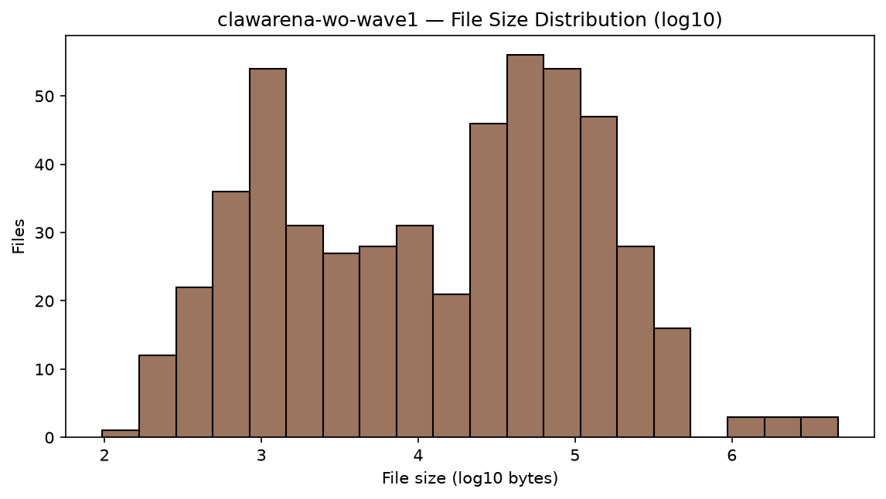

## 6. Multimodal Coverage

### 6.1 Per-Scenario Multimodal Files

| Scenario | image | audio | video | mm bytes | mm tokens |
|----------|------:|------:|------:|---------:|----------:|
| `s_clinical_trial_audit` | 5 | 0 | 0 | 311.6 KiB | 1,400 |
| `s_board_governance_pack` | 3 | 0 | 0 | 288.8 KiB | 840 |
| `s_candidate_background_check` | 4 | 2 | 0 | 7.8 MiB | 2,620 |
| `s_fund_due_diligence` | 0 | 0 | 1 | 196.2 KiB | 2,240 |
| `s_trading_tz_incident` | 1 | 0 | 0 | 72.5 KiB | 280 |
| `s_hr_misconduct_intake` | 0 | 2 | 0 | 6.1 MiB | 1,500 |
| `s_grant_compliance_review` | 9 | 0 | 0 | 492.6 KiB | 2,520 |
| `s_dept_merger_planning` | 3 | 0 | 0 | 158.7 KiB | 840 |
| `s_research_authorship_dispute` | 2 | 0 | 0 | 243.8 KiB | 560 |
| `s_creator_contract_renewal` | 6 | 0 | 1 | 1.1 MiB | 3,920 |

### 6.2 Modality Totals

- **Audio files:** 4 (measured 4 via stdlib `wave`; total 598.4s ≈ 10.0 min)
- **Video files:** 2 (cv2 unavailable or unreadable)

## 7. Per-Scenario Breakdown

| Scenario | Rounds | w/Upd | Upd Groups | Upd Files | WS Files | Accessible | Tokens |
|----------|-------:|------:|-----------:|----------:|---------:|-----------:|-------:|
| `s_clinical_trial_audit` | 6 | 1 | 2 | 12 | 41 | 7 | 432,888 |
| `s_board_governance_pack` | 6 | 1 | 2 | 9 | 39 | 8 | 730,212 |
| `s_candidate_background_check` | 6 | 1 | 1 | 7 | 40 | 8 | 687,943 |
| `s_fund_due_diligence` | 6 | 1 | 2 | 9 | 50 | 11 | 409,791 |
| `s_trading_tz_incident` | 6 | 1 | 4 | 12 | 45 | 10 | 5,086,546 |
| `s_hr_misconduct_intake` | 6 | 1 | 1 | 10 | 32 | 7 | 173,489 |
| `s_grant_compliance_review` | 7 | 2 | 3 | 13 | 39 | 11 | 483,765 |
| `s_dept_merger_planning` | 7 | 1 | 2 | 9 | 37 | 15 | 601,262 |
| `s_research_authorship_dispute` | 6 | 1 | 2 | 9 | 61 | 9 | 514,071 |
| `s_creator_contract_renewal` | 6 | 1 | 1 | 15 | 41 | 7 | 416,703 |

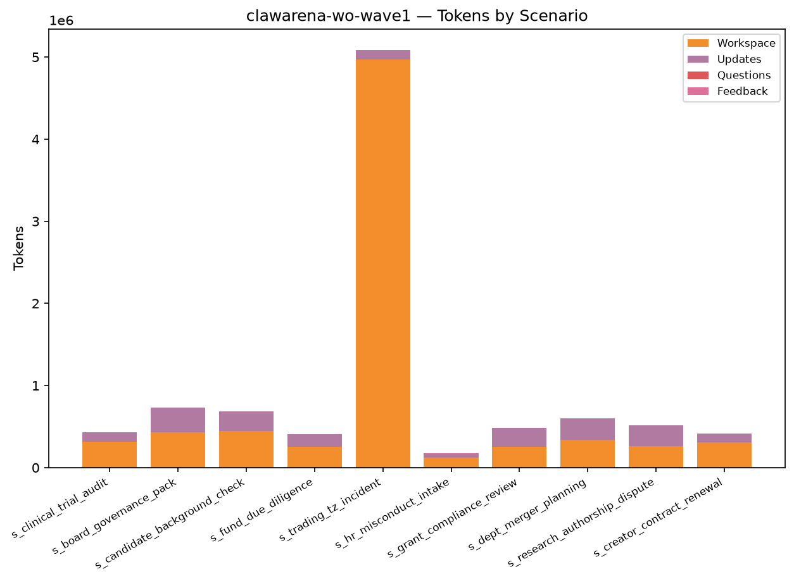

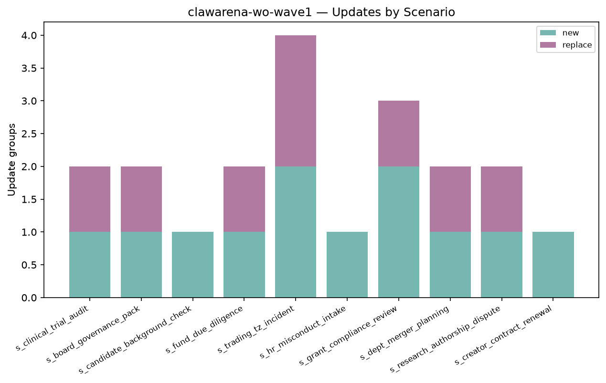

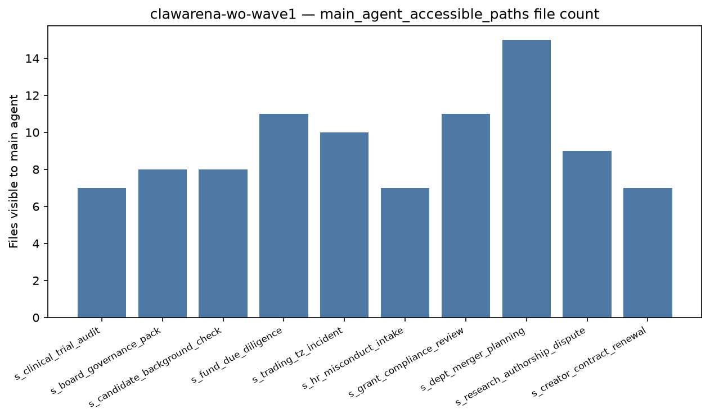

## 8. Per-Scenario Token Detail

| Scenario | Workspace | Updates | Questions | Feedback | Total |
|----------|------:|------:|------:|------:|------:|
| `s_clinical_trial_audit` | 311,412 | 119,288 | 1,082 | 1,106 | 432,888 |
| `s_board_governance_pack` | 429,854 | 298,165 | 974 | 1,219 | 730,212 |
| `s_candidate_background_check` | 447,421 | 238,526 | 1,066 | 930 | 687,943 |
| `s_fund_due_diligence` | 255,503 | 152,039 | 1,281 | 968 | 409,791 |
| `s_trading_tz_incident` | 4,966,951 | 116,582 | 1,138 | 1,875 | 5,086,546 |
| `s_hr_misconduct_intake` | 121,971 | 49,297 | 856 | 1,365 | 173,489 |
| `s_grant_compliance_review` | 254,303 | 227,404 | 1,199 | 859 | 483,765 |
| `s_dept_merger_planning` | 336,806 | 262,252 | 1,141 | 1,063 | 601,262 |
| `s_research_authorship_dispute` | 264,182 | 247,447 | 1,107 | 1,335 | 514,071 |
| `s_creator_contract_renewal` | 310,671 | 104,081 | 977 | 974 | 416,703 |

## 9. Top-N Rankings

### Top 10 by Tokens

| Rank | Scenario | Tokens |
|-----:|----------|------:|
| 1 | `s_trading_tz_incident` | 5,086,546 |
| 2 | `s_board_governance_pack` | 730,212 |
| 3 | `s_candidate_background_check` | 687,943 |
| 4 | `s_dept_merger_planning` | 601,262 |
| 5 | `s_research_authorship_dispute` | 514,071 |
| 6 | `s_grant_compliance_review` | 483,765 |
| 7 | `s_clinical_trial_audit` | 432,888 |
| 8 | `s_creator_contract_renewal` | 416,703 |
| 9 | `s_fund_due_diligence` | 409,791 |
| 10 | `s_hr_misconduct_intake` | 173,489 |

### Top 10 by Rounds

| Rank | Scenario | Rounds |
|-----:|----------|------:|
| 1 | `s_grant_compliance_review` | 7 |
| 2 | `s_dept_merger_planning` | 7 |
| 3 | `s_clinical_trial_audit` | 6 |
| 4 | `s_board_governance_pack` | 6 |
| 5 | `s_candidate_background_check` | 6 |
| 6 | `s_fund_due_diligence` | 6 |
| 7 | `s_trading_tz_incident` | 6 |
| 8 | `s_hr_misconduct_intake` | 6 |
| 9 | `s_research_authorship_dispute` | 6 |
| 10 | `s_creator_contract_renewal` | 6 |

### Top 10 by Update files

| Rank | Scenario | Update files |
|-----:|----------|------:|
| 1 | `s_creator_contract_renewal` | 15 |
| 2 | `s_grant_compliance_review` | 13 |
| 3 | `s_clinical_trial_audit` | 12 |
| 4 | `s_trading_tz_incident` | 12 |
| 5 | `s_hr_misconduct_intake` | 10 |
| 6 | `s_board_governance_pack` | 9 |
| 7 | `s_fund_due_diligence` | 9 |
| 8 | `s_dept_merger_planning` | 9 |
| 9 | `s_research_authorship_dispute` | 9 |
| 10 | `s_candidate_background_check` | 7 |

### Top 10 by Workspace size

| Rank | Scenario | Workspace size |
|-----:|----------|------:|
| 1 | `s_candidate_background_check` | 9.4 MiB |
| 2 | `s_trading_tz_incident` | 9.1 MiB |
| 3 | `s_hr_misconduct_intake` | 6.6 MiB |
| 4 | `s_board_governance_pack` | 3.1 MiB |
| 5 | `s_creator_contract_renewal` | 2.9 MiB |
| 6 | `s_dept_merger_planning` | 1.8 MiB |
| 7 | `s_clinical_trial_audit` | 1.8 MiB |
| 8 | `s_grant_compliance_review` | 1.7 MiB |
| 9 | `s_research_authorship_dispute` | 1.4 MiB |
| 10 | `s_fund_due_diligence` | 1.4 MiB |

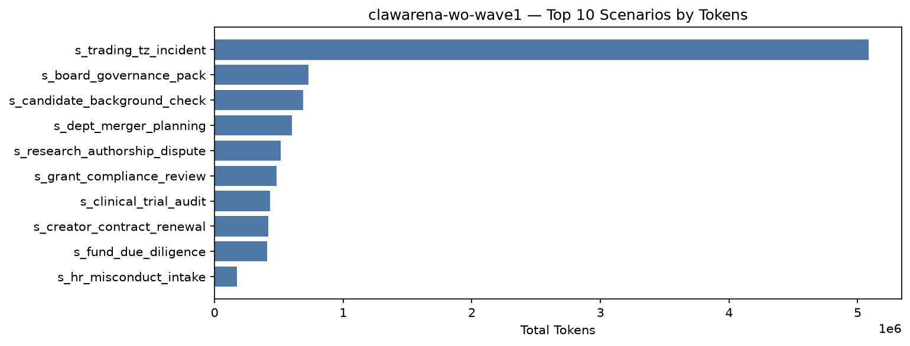

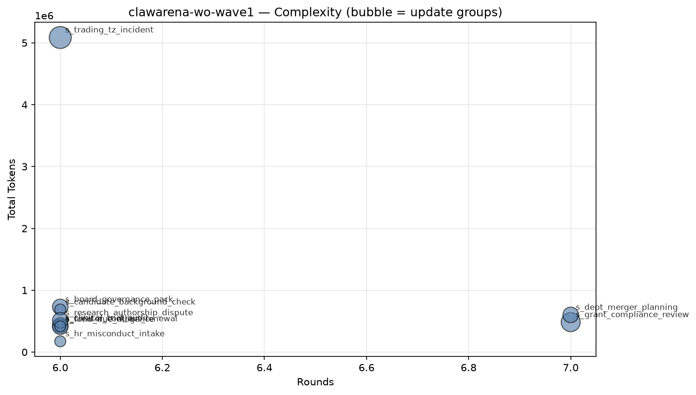

## 10. Tag Coverage

- **Rounds with ≥1 tag:** 62 / 62 (100.0%)
- **Unique tags used:** 33 (of 51 controlled)
- **Total tag slots:** 258 (avg 4.16 per round)

### 10.1 By Section

| Section | Used | Total | Coverage |
|---------|-----:|------:|---------:|
| Multimodal | 5 | 5 | 100.0% |
| Delegation / Permission | 11 | 12 | 91.7% |
| Update Handling | 2 | 4 | 50.0% |
| Structured Output / Cross-round | 5 | 6 | 83.3% |
| Trap / Adversarial Resistance | 3 | 5 | 60.0% |
| Office / Data Formats | 0 | 8 | 0.0% |
| Code / Tool | 2 | 5 | 40.0% |
| Information Synthesis | 5 | 6 | 83.3% |

### 10.2 Tag Distribution (by round count)

| Tag | Section | Rounds | Round % | Scenarios | Scenario % |
|-----|---------|-------:|--------:|----------:|-----------:|
| `subagent_delegation` | Delegation / Permission | 23 | 37.1% | 10 | 100.0% |
| `cross_round_consistency` | Structured Output / Cross-round | 22 | 35.5% | 10 | 100.0% |
| `numerical_extraction` | Structured Output / Cross-round | 19 | 30.6% | 9 | 90.0% |
| `discredit_window` | Trap / Adversarial Resistance | 16 | 25.8% | 8 | 80.0% |
| `final_synthesis` | Information Synthesis | 16 | 25.8% | 10 | 100.0% |
| `decoy_directory` | Trap / Adversarial Resistance | 14 | 22.6% | 8 | 80.0% |
| `verbatim_citation` | Structured Output / Cross-round | 14 | 22.6% | 7 | 70.0% |
| `bash_tool_run` | Code / Tool | 11 | 17.7% | 10 | 100.0% |
| `compliance_token` | Structured Output / Cross-round | 11 | 17.7% | 10 | 100.0% |
| `json_schema` | Structured Output / Cross-round | 11 | 17.7% | 10 | 100.0% |
| `triage_planning` | Information Synthesis | 10 | 16.1% | 10 | 100.0% |
| `multimodal_image` | Multimodal | 9 | 14.5% | 7 | 70.0% |
| `permission_restraint` | Delegation / Permission | 9 | 14.5% | 8 | 80.0% |
| `update_merge` | Update Handling | 9 | 14.5% | 9 | 90.0% |
| `cross_source_synthesis` | Information Synthesis | 8 | 12.9% | 8 | 80.0% |
| `session_reuse` | Delegation / Permission | 5 | 8.1% | 5 | 50.0% |
| `stateful_subagent` | Delegation / Permission | 5 | 8.1% | 5 | 50.0% |
| `temporal_reasoning` | Information Synthesis | 5 | 8.1% | 4 | 40.0% |
| `async_long_running` | Delegation / Permission | 4 | 6.5% | 4 | 40.0% |
| `background_subagent` | Delegation / Permission | 4 | 6.5% | 4 | 40.0% |
| `incremental_context_load` | Delegation / Permission | 4 | 6.5% | 4 | 40.0% |
| `parallel_subagents` | Delegation / Permission | 4 | 6.5% | 4 | 40.0% |
| `path_overshoot_guard` | Delegation / Permission | 4 | 6.5% | 4 | 40.0% |
| `update_supersede` | Update Handling | 4 | 6.5% | 4 | 40.0% |
| `modality_decoy` | Multimodal | 3 | 4.8% | 3 | 30.0% |
| `multimodal_audio` | Multimodal | 3 | 4.8% | 2 | 20.0% |
| `partial_result_handling` | Delegation / Permission | 3 | 4.8% | 3 | 30.0% |
| `large_context_pressure` | Delegation / Permission | 2 | 3.2% | 2 | 20.0% |
| `multimodal_video` | Multimodal | 2 | 3.2% | 2 | 20.0% |
| `code_execution` | Code / Tool | 1 | 1.6% | 1 | 10.0% |
| `cross_reference_anchor` | Information Synthesis | 1 | 1.6% | 1 | 10.0% |
| `honeypot_auto_summary` | Trap / Adversarial Resistance | 1 | 1.6% | 1 | 10.0% |
| `video_frame_reading` | Multimodal | 1 | 1.6% | 1 | 10.0% |

### 10.3 Uncovered Controlled Tags

> Registered in the vocabulary but hit by 0 rounds in this dataset — the next wave of scenario design can prioritize filling these in.

| Section | Tags |
|---------|------|
| Delegation / Permission | `workflow` |
| Update Handling | `adversarial_update`, `stale_data` |
| Structured Output / Cross-round | `schema_by_shape` |
| Trap / Adversarial Resistance | `ai_hallucination_decoy`, `prompt_injection_resistance` |
| Office / Data Formats | `office_xlsx`, `office_docx`, `office_pdf`, `binary_archive`, `sqlite_query`, `parquet_query`, `pcap_parse`, `encrypted_file` |
| Code / Tool | `stderr_parsing`, `multi_lang_code`, `config_reading` |
| Information Synthesis | `multilingual` |

### 10.4 Low-Sample Tags (1–2 rounds)

> Low-sample dimensions, possibly appearing in only a few scenarios — consider spreading them out horizontally when increasing difficulty.

| Section | Tag → rounds |
|---------|------|
| Multimodal | `multimodal_video` (2), `video_frame_reading` (1) |
| Delegation / Permission | `large_context_pressure` (2) |
| Trap / Adversarial Resistance | `honeypot_auto_summary` (1) |
| Code / Tool | `code_execution` (1) |
| Information Synthesis | `cross_reference_anchor` (1) |

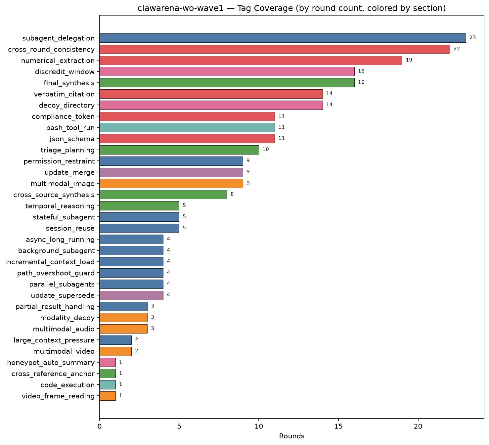

