# clawarena-team-wave3 — Stats Report

_Tokenizer: `qwen3`_

## 1. Overall Summary

- **Scenarios:** 13
- **Total rounds:** 78
- **Rounds with updates:** 13 (16.7%)
- **Total update groups:** 26 (60 files)
- **Total workspace size:** 91.0 MiB
- **Total tokens:** 10,576,394

## 2. Token Distribution

| Category | Tokens | % |
|----------|-------:|--:|
| Workspace | 7,918,808 | 74.9% |
| Updates | 2,631,159 | 24.9% |
| Questions | 13,536 | 0.1% |
| Feedback | 12,891 | 0.1% |
| **Total** | **10,576,394** | **100.0%** |

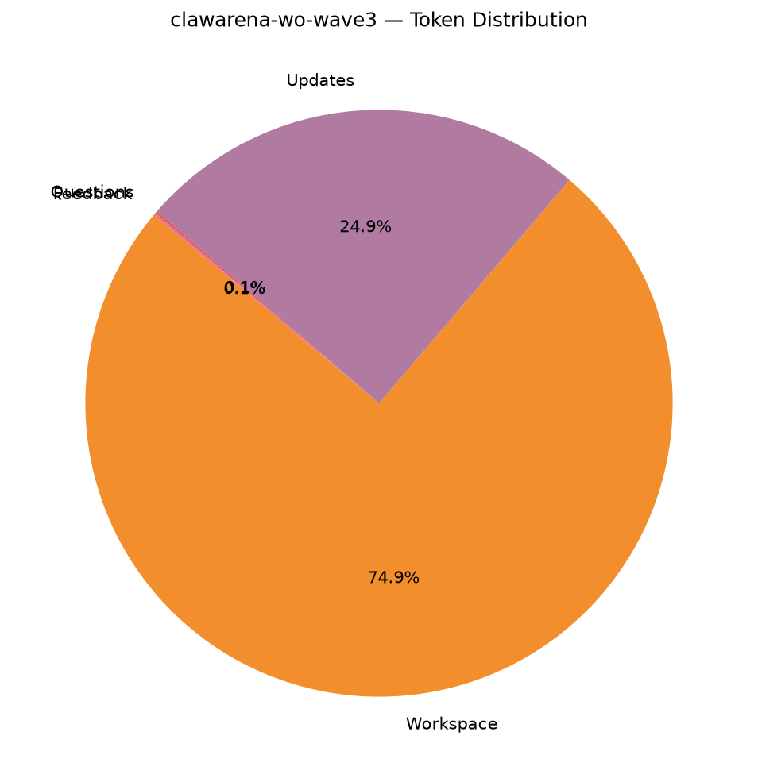

## 3. Question Statistics

### 3.1 Type Distribution

| Type | Count | % |
|------|------:|--:|
| `exec_check` | 78 | 100.0% |

### 3.2 exec_check Feature Coverage

| Feature | Rounds | Coverage |
|---------|-------:|---------:|
| expect_exit declared | 78 | 100.0% |
| expect_stdout set | 0 | 0.0% |
| regex matching | 0 | 0.0% |
| timeout set | 78 | 100.0% |
| uses ${scripts} | 78 | 100.0% |
| uses ${workspace} | 78 | 100.0% |

_Timeout (s) — mean 93.1, min 60.0, max 180.0._

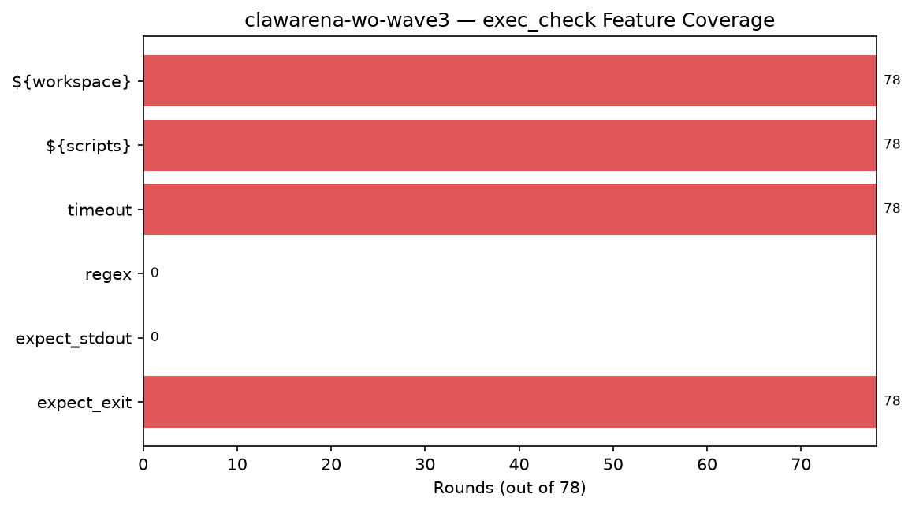

### 3.3 Question Token Stats

- **Mean:** 173.5, **Min:** 97, **Max:** 303

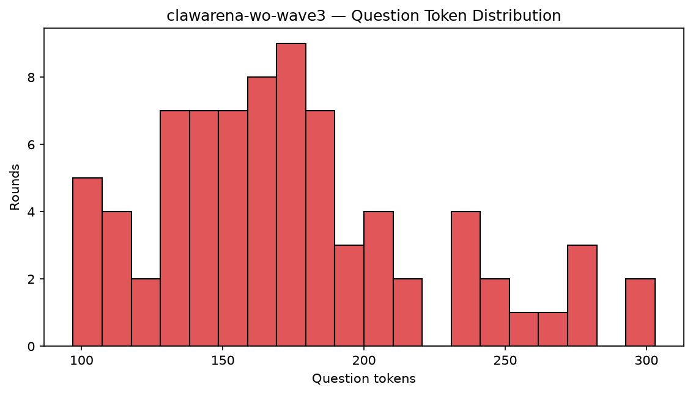

## 4. Update Statistics

### 4.1 Op Distribution

| op | Groups | % |
|----|------:|--:|
| `new` | 13 | 50.0% |
| `replace` | 13 | 50.0% |

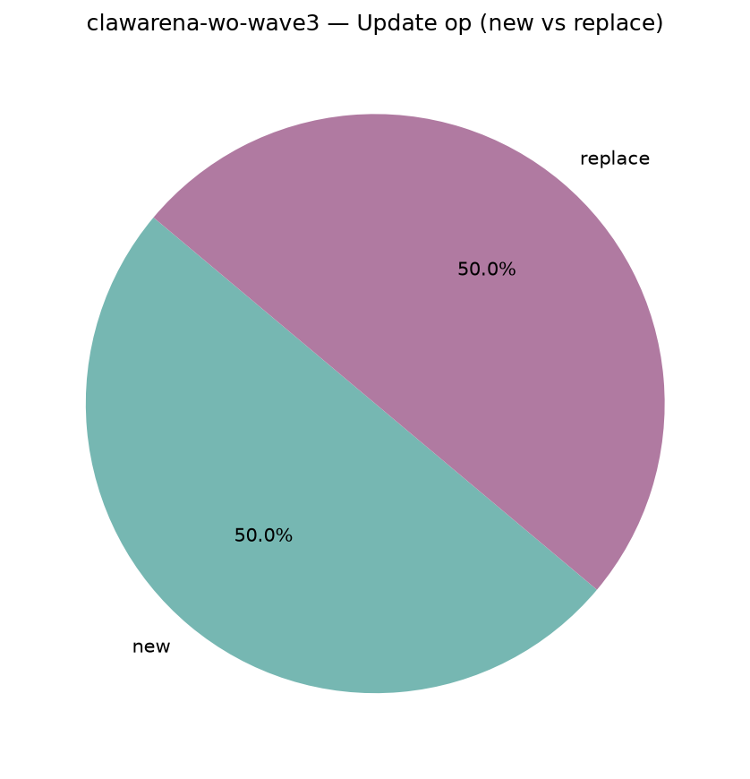

### 4.2 Files per Update

- **Mean:** 2.31, **Min:** 2, **Max:** 3
- **Total update files:** 60

## 5. Workspace Composition

### 5.1 By Modality

| Modality | Files | File % | Bytes | Tokens | Token % |
|----------|------:|------:|------:|------:|--------:|
| `text` | 895 | 73.2% | 28.8 MiB | 6,571,368 | 83.0% |
| `image` | 101 | 8.3% | 6.9 MiB | 28,280 | 0.4% |
| `audio` | 16 | 1.3% | 47.8 MiB | 12,000 | 0.2% |
| `video` | 6 | 0.5% | 1.2 MiB | 13,440 | 0.2% |
| `document` | 40 | 3.3% | 1.2 MiB | 345,319 | 4.4% |
| `other` | 165 | 13.5% | 5.1 MiB | 948,401 | 12.0% |

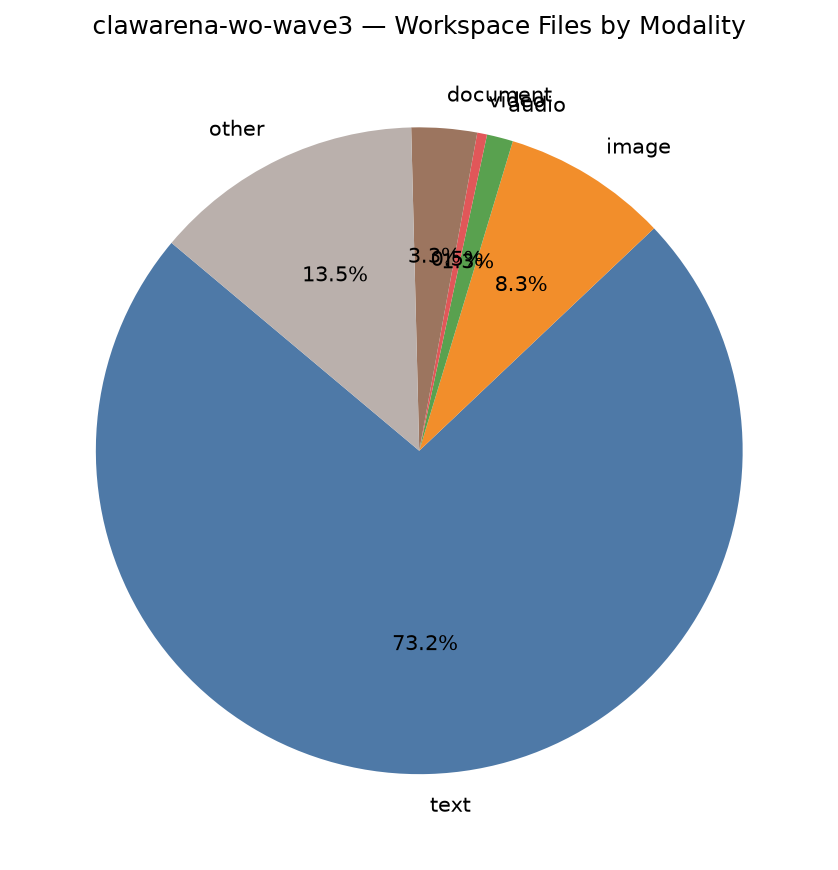

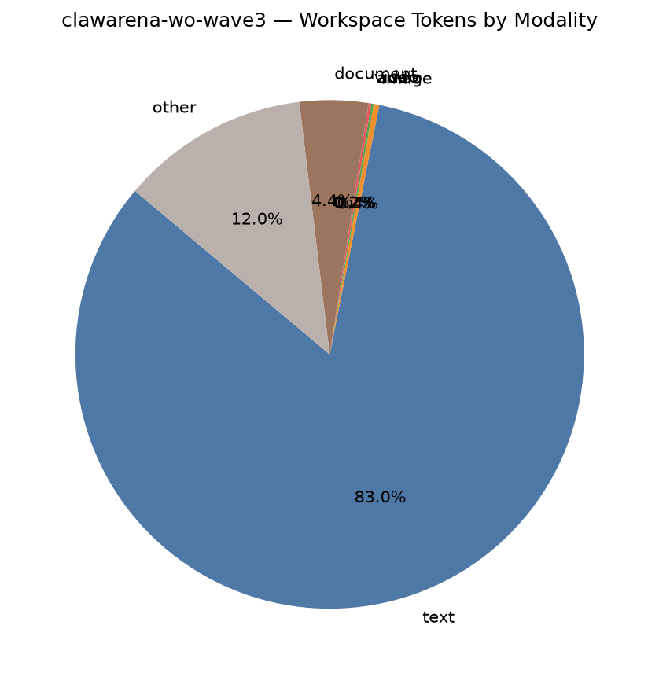

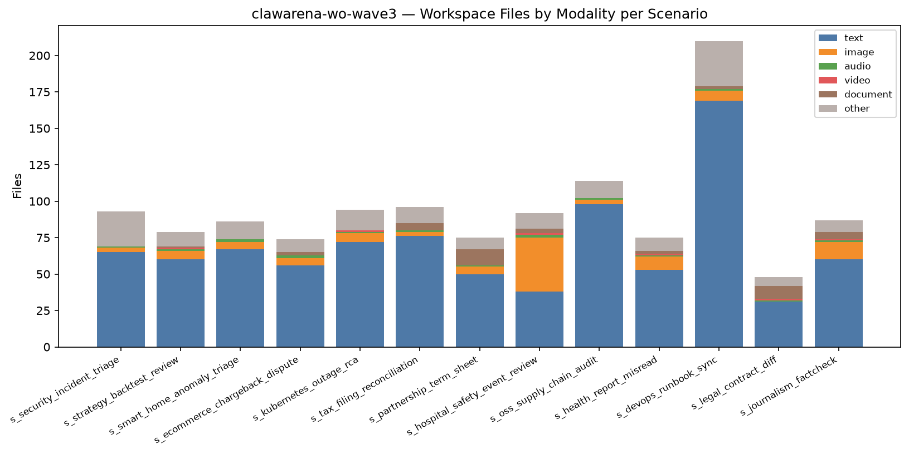

### 5.2 By Extension (Top 15 by bytes)

| Extension | Files | File % | Bytes | Byte % | Tokens | Token % |
|-----------|------:|------:|------:|------:|------:|--------:|
| `.wav` | 16 | 1.3% | 47.8 MiB | 52.6% | 12,000 | 0.2% |
| `.md` | 518 | 42.4% | 22.3 MiB | 24.5% | 4,484,419 | 56.6% |
| `.png` | 101 | 8.3% | 6.9 MiB | 7.6% | 28,280 | 0.4% |
| `.html` | 26 | 2.1% | 2.0 MiB | 2.2% | 397,749 | 5.0% |
| `.parquet` | 1 | 0.1% | 2.0 MiB | 2.2% | 0 | 0.0% |
| `.ndjson` | 14 | 1.1% | 1.3 MiB | 1.4% | 644,257 | 8.1% |
| `.mp4` | 6 | 0.5% | 1.2 MiB | 1.3% | 13,440 | 0.2% |
| `.docx` | 22 | 1.8% | 917.2 KiB | 1.0% | 265,931 | 3.4% |
| `.txt` | 67 | 5.5% | 912.6 KiB | 1.0% | 193,720 | 2.4% |
| `.csv` | 23 | 1.9% | 730.6 KiB | 0.8% | 552,854 | 7.0% |
| `.log` | 14 | 1.1% | 642.3 KiB | 0.7% | 291,909 | 3.7% |
| `.py` | 27 | 2.2% | 608.7 KiB | 0.7% | 140,016 | 1.8% |
| `.eml` | 102 | 8.3% | 465.9 KiB | 0.5% | 94,748 | 1.2% |
| `.json` | 36 | 2.9% | 388.8 KiB | 0.4% | 183,919 | 2.3% |
| `.zip` | 4 | 0.3% | 357.4 KiB | 0.4% | 0 | 0.0% |

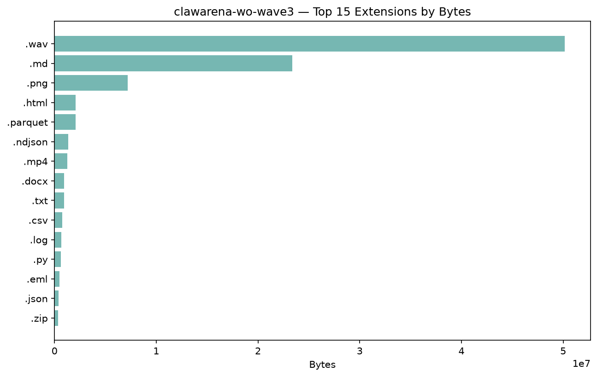

### 5.3 Largest Files (Top 15)

| Rank | Path | Modality | Bytes | Tokens |
|-----:|------|----------|------:|------:|
| 1 | `interviews/phone_interview.wav` | `audio` | 4.7 MiB | 750 |
| 2 | `voice_memos/external_counsel_memo.wav` | `audio` | 4.4 MiB | 750 |
| 3 | `voice_memos/pitch_event_recording.wav` | `audio` | 3.9 MiB | 750 |
| 4 | `interviews/maintainer_interview.wav` | `audio` | 3.8 MiB | 750 |
| 5 | `recordings/householder_nanny_call.wav` | `audio` | 3.4 MiB | 750 |
| 6 | `voice_memos/patient_voicemail.wav` | `audio` | 3.2 MiB | 750 |
| 7 | `voice_memos/researcher_voice_memo.wav` | `audio` | 3.0 MiB | 750 |
| 8 | `voice_memos/dba_lead_voicemail.wav` | `audio` | 3.0 MiB | 750 |
| 9 | `interviews/oncall_recording.wav` | `audio` | 2.9 MiB | 750 |
| 10 | `interviews/qs_briefing.wav` | `audio` | 2.8 MiB | 750 |
| 11 | `voice_memos/oncall_call.wav` | `audio` | 2.6 MiB | 750 |
| 12 | `voice_memos/client_voice.wav` | `audio` | 2.6 MiB | 750 |
| 13 | `recordings/speaker_auto_recording.wav` | `audio` | 2.5 MiB | 750 |
| 14 | `voice_memos/customer_voicemail.wav` | `audio` | 2.2 MiB | 750 |
| 15 | `market_data.parquet` | `other` | 2.0 MiB | 0 |

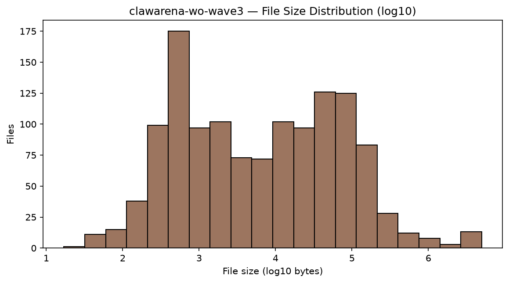

## 6. Multimodal Coverage

### 6.1 Per-Scenario Multimodal Files

| Scenario | image | audio | video | mm bytes | mm tokens |
|----------|------:|------:|------:|---------:|----------:|
| `s_security_incident_triage` | 3 | 1 | 0 | 2.8 MiB | 1,590 |
| `s_strategy_backtest_review` | 6 | 1 | 1 | 3.4 MiB | 4,670 |
| `s_smart_home_anomaly_triage` | 5 | 2 | 0 | 6.1 MiB | 2,900 |
| `s_ecommerce_chargeback_dispute` | 5 | 2 | 0 | 4.3 MiB | 2,900 |
| `s_kubernetes_outage_rca` | 6 | 1 | 1 | 3.8 MiB | 4,670 |
| `s_tax_filing_reconciliation` | 3 | 1 | 0 | 2.8 MiB | 1,590 |
| `s_partnership_term_sheet` | 5 | 1 | 0 | 4.1 MiB | 2,150 |
| `s_hospital_safety_event_review` | 37 | 2 | 1 | 4.7 MiB | 14,100 |
| `s_oss_supply_chain_audit` | 3 | 1 | 0 | 4.2 MiB | 1,590 |
| `s_health_report_misread` | 9 | 1 | 1 | 6.1 MiB | 5,510 |
| `s_devops_runbook_sync` | 7 | 1 | 0 | 3.7 MiB | 2,710 |
| `s_legal_contract_diff` | 0 | 1 | 1 | 4.4 MiB | 2,990 |
| `s_journalism_factcheck` | 12 | 1 | 1 | 5.7 MiB | 6,350 |

### 6.2 Modality Totals

- **Audio files:** 16 (measured 16 via stdlib `wave`; total 1935.5s ≈ 32.3 min)
- **Video files:** 6 (cv2 unavailable or unreadable)

## 7. Per-Scenario Breakdown

| Scenario | Rounds | w/Upd | Upd Groups | Upd Files | WS Files | Accessible | Tokens |
|----------|-------:|------:|-----------:|----------:|---------:|-----------:|-------:|
| `s_security_incident_triage` | 6 | 1 | 2 | 5 | 93 | 15 | 1,325,809 |
| `s_strategy_backtest_review` | 6 | 1 | 2 | 4 | 79 | 16 | 781,827 |
| `s_smart_home_anomaly_triage` | 6 | 1 | 2 | 4 | 86 | 17 | 813,101 |
| `s_ecommerce_chargeback_dispute` | 6 | 1 | 2 | 4 | 74 | 19 | 1,069,203 |
| `s_kubernetes_outage_rca` | 6 | 1 | 2 | 5 | 94 | 16 | 715,001 |
| `s_tax_filing_reconciliation` | 6 | 1 | 2 | 5 | 96 | 25 | 665,065 |
| `s_partnership_term_sheet` | 6 | 1 | 2 | 5 | 75 | 8 | 550,980 |
| `s_hospital_safety_event_review` | 6 | 1 | 2 | 4 | 92 | 10 | 831,444 |
| `s_oss_supply_chain_audit` | 6 | 1 | 2 | 5 | 114 | 8 | 1,120,028 |
| `s_health_report_misread` | 6 | 1 | 2 | 5 | 75 | 17 | 709,194 |
| `s_devops_runbook_sync` | 6 | 1 | 2 | 5 | 210 | 28 | 553,573 |
| `s_legal_contract_diff` | 6 | 1 | 2 | 4 | 48 | 13 | 560,696 |
| `s_journalism_factcheck` | 6 | 1 | 2 | 5 | 87 | 14 | 880,473 |

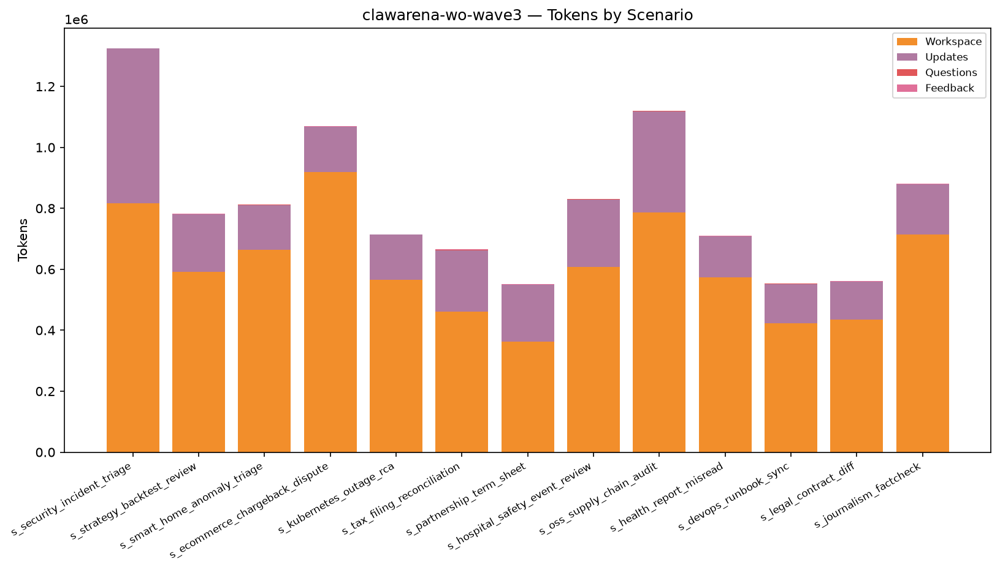

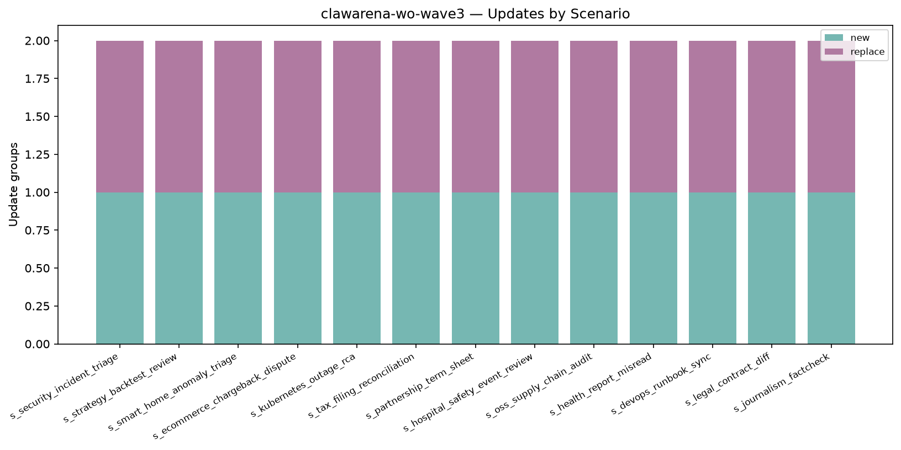

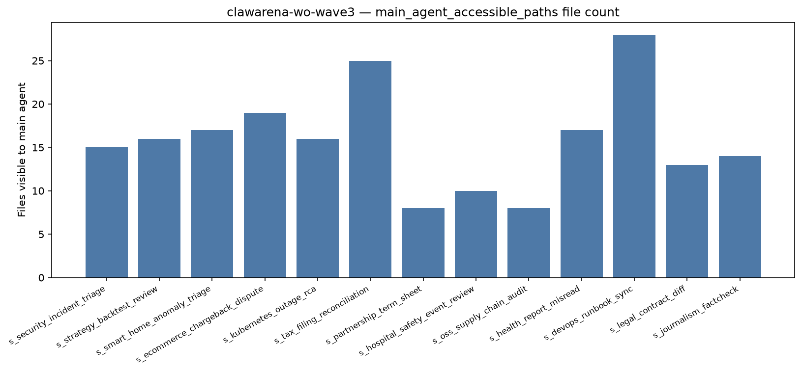

## 8. Per-Scenario Token Detail

| Scenario | Workspace | Updates | Questions | Feedback | Total |
|----------|------:|------:|------:|------:|------:|
| `s_security_incident_triage` | 816,615 | 507,264 | 982 | 948 | 1,325,809 |
| `s_strategy_backtest_review` | 590,632 | 189,296 | 1,028 | 871 | 781,827 |
| `s_smart_home_anomaly_triage` | 663,078 | 148,207 | 821 | 995 | 813,101 |
| `s_ecommerce_chargeback_dispute` | 919,348 | 147,757 | 998 | 1,100 | 1,069,203 |
| `s_kubernetes_outage_rca` | 564,853 | 148,470 | 873 | 805 | 715,001 |
| `s_tax_filing_reconciliation` | 460,145 | 202,734 | 1,116 | 1,070 | 665,065 |
| `s_partnership_term_sheet` | 362,264 | 186,805 | 1,006 | 905 | 550,980 |
| `s_hospital_safety_event_review` | 607,194 | 222,000 | 1,173 | 1,077 | 831,444 |
| `s_oss_supply_chain_audit` | 786,161 | 331,837 | 1,106 | 924 | 1,120,028 |
| `s_health_report_misread` | 573,859 | 133,318 | 1,083 | 934 | 709,194 |
| `s_devops_runbook_sync` | 423,593 | 127,940 | 1,032 | 1,008 | 553,573 |
| `s_legal_contract_diff` | 435,945 | 122,602 | 1,067 | 1,082 | 560,696 |
| `s_journalism_factcheck` | 715,121 | 162,929 | 1,251 | 1,172 | 880,473 |

## 9. Top-N Rankings

### Top 10 by Tokens

| Rank | Scenario | Tokens |
|-----:|----------|------:|
| 1 | `s_security_incident_triage` | 1,325,809 |
| 2 | `s_oss_supply_chain_audit` | 1,120,028 |
| 3 | `s_ecommerce_chargeback_dispute` | 1,069,203 |
| 4 | `s_journalism_factcheck` | 880,473 |
| 5 | `s_hospital_safety_event_review` | 831,444 |
| 6 | `s_smart_home_anomaly_triage` | 813,101 |
| 7 | `s_strategy_backtest_review` | 781,827 |
| 8 | `s_kubernetes_outage_rca` | 715,001 |
| 9 | `s_health_report_misread` | 709,194 |
| 10 | `s_tax_filing_reconciliation` | 665,065 |

### Top 10 by Rounds

| Rank | Scenario | Rounds |
|-----:|----------|------:|
| 1 | `s_security_incident_triage` | 6 |
| 2 | `s_strategy_backtest_review` | 6 |
| 3 | `s_smart_home_anomaly_triage` | 6 |
| 4 | `s_ecommerce_chargeback_dispute` | 6 |
| 5 | `s_kubernetes_outage_rca` | 6 |
| 6 | `s_tax_filing_reconciliation` | 6 |
| 7 | `s_partnership_term_sheet` | 6 |
| 8 | `s_hospital_safety_event_review` | 6 |
| 9 | `s_oss_supply_chain_audit` | 6 |
| 10 | `s_health_report_misread` | 6 |

### Top 10 by Update files

| Rank | Scenario | Update files |
|-----:|----------|------:|
| 1 | `s_security_incident_triage` | 5 |
| 2 | `s_kubernetes_outage_rca` | 5 |
| 3 | `s_tax_filing_reconciliation` | 5 |
| 4 | `s_partnership_term_sheet` | 5 |
| 5 | `s_oss_supply_chain_audit` | 5 |
| 6 | `s_health_report_misread` | 5 |
| 7 | `s_devops_runbook_sync` | 5 |
| 8 | `s_journalism_factcheck` | 5 |
| 9 | `s_strategy_backtest_review` | 4 |
| 10 | `s_smart_home_anomaly_triage` | 4 |

### Top 10 by Workspace size

| Rank | Scenario | Workspace size |
|-----:|----------|------:|
| 1 | `s_smart_home_anomaly_triage` | 9.3 MiB |
| 2 | `s_health_report_misread` | 9.1 MiB |
| 3 | `s_journalism_factcheck` | 9.0 MiB |
| 4 | `s_strategy_backtest_review` | 8.1 MiB |
| 5 | `s_oss_supply_chain_audit` | 7.6 MiB |
| 6 | `s_hospital_safety_event_review` | 7.0 MiB |
| 7 | `s_ecommerce_chargeback_dispute` | 6.8 MiB |
| 8 | `s_legal_contract_diff` | 6.7 MiB |
| 9 | `s_kubernetes_outage_rca` | 6.0 MiB |
| 10 | `s_partnership_term_sheet` | 5.6 MiB |

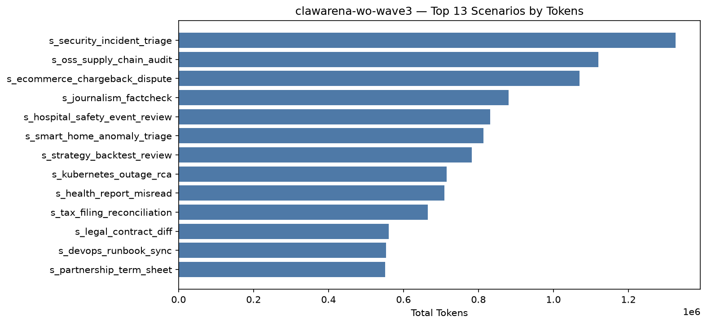

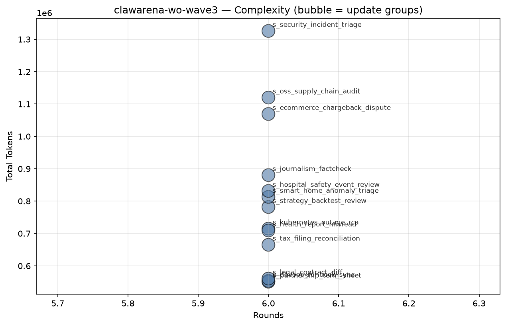

## 10. Tag Coverage

- **Rounds with ≥1 tag:** 78 / 78 (100.0%)
- **Unique tags used:** 47 (of 51 controlled)
- **Total tag slots:** 446 (avg 5.72 per round)

### 10.1 By Section

| Section | Used | Total | Coverage |
|---------|-----:|------:|---------:|
| Multimodal | 5 | 5 | 100.0% |
| Delegation / Permission | 10 | 12 | 83.3% |
| Update Handling | 3 | 4 | 75.0% |
| Structured Output / Cross-round | 6 | 6 | 100.0% |
| Trap / Adversarial Resistance | 4 | 5 | 80.0% |
| Office / Data Formats | 8 | 8 | 100.0% |
| Code / Tool | 5 | 5 | 100.0% |
| Information Synthesis | 6 | 6 | 100.0% |

### 10.2 Tag Distribution (by round count)

| Tag | Section | Rounds | Round % | Scenarios | Scenario % |
|-----|---------|-------:|--------:|----------:|-----------:|
| `numerical_extraction` | Structured Output / Cross-round | 37 | 47.4% | 13 | 100.0% |
| `verbatim_citation` | Structured Output / Cross-round | 26 | 33.3% | 13 | 100.0% |
| `discredit_window` | Trap / Adversarial Resistance | 22 | 28.2% | 13 | 100.0% |
| `final_synthesis` | Information Synthesis | 20 | 25.6% | 13 | 100.0% |
| `ai_hallucination_decoy` | Trap / Adversarial Resistance | 19 | 24.4% | 13 | 100.0% |
| `path_overshoot_guard` | Delegation / Permission | 18 | 23.1% | 13 | 100.0% |
| `parallel_subagents` | Delegation / Permission | 16 | 20.5% | 12 | 92.3% |
| `subagent_delegation` | Delegation / Permission | 16 | 20.5% | 13 | 100.0% |
| `cross_round_consistency` | Structured Output / Cross-round | 14 | 17.9% | 13 | 100.0% |
| `modality_decoy` | Multimodal | 14 | 17.9% | 13 | 100.0% |
| `binary_archive` | Office / Data Formats | 13 | 16.7% | 12 | 92.3% |
| `multimodal_audio` | Multimodal | 13 | 16.7% | 13 | 100.0% |
| `session_reuse` | Delegation / Permission | 13 | 16.7% | 9 | 69.2% |
| `triage_planning` | Information Synthesis | 13 | 16.7% | 13 | 100.0% |
| `update_merge` | Update Handling | 13 | 16.7% | 13 | 100.0% |
| `adversarial_update` | Update Handling | 11 | 14.1% | 11 | 84.6% |
| `permission_restraint` | Delegation / Permission | 11 | 14.1% | 8 | 61.5% |
| `prompt_injection_resistance` | Trap / Adversarial Resistance | 11 | 14.1% | 11 | 84.6% |
| `temporal_reasoning` | Information Synthesis | 11 | 14.1% | 11 | 84.6% |
| `code_execution` | Code / Tool | 10 | 12.8% | 6 | 46.2% |
| `cross_reference_anchor` | Information Synthesis | 10 | 12.8% | 10 | 76.9% |
| `multilingual` | Information Synthesis | 10 | 12.8% | 5 | 38.5% |
| `multimodal_image` | Multimodal | 10 | 12.8% | 9 | 69.2% |
| `stale_data` | Update Handling | 10 | 12.8% | 10 | 76.9% |
| `bash_tool_run` | Code / Tool | 7 | 9.0% | 7 | 53.8% |
| `cross_source_synthesis` | Information Synthesis | 6 | 7.7% | 5 | 38.5% |
| `incremental_context_load` | Delegation / Permission | 6 | 7.7% | 6 | 46.2% |
| `multimodal_video` | Multimodal | 6 | 7.7% | 6 | 46.2% |
| `stateful_subagent` | Delegation / Permission | 6 | 7.7% | 6 | 46.2% |
| `video_frame_reading` | Multimodal | 6 | 7.7% | 5 | 38.5% |
| `compliance_token` | Structured Output / Cross-round | 5 | 6.4% | 5 | 38.5% |
| `stderr_parsing` | Code / Tool | 5 | 6.4% | 4 | 30.8% |
| `async_long_running` | Delegation / Permission | 4 | 5.1% | 4 | 30.8% |
| `background_subagent` | Delegation / Permission | 4 | 5.1% | 4 | 30.8% |
| `decoy_directory` | Trap / Adversarial Resistance | 4 | 5.1% | 3 | 23.1% |
| `encrypted_file` | Office / Data Formats | 4 | 5.1% | 3 | 23.1% |
| `multi_lang_code` | Code / Tool | 4 | 5.1% | 4 | 30.8% |
| `partial_result_handling` | Delegation / Permission | 4 | 5.1% | 4 | 30.8% |
| `office_pdf` | Office / Data Formats | 3 | 3.8% | 2 | 15.4% |
| `office_xlsx` | Office / Data Formats | 3 | 3.8% | 3 | 23.1% |
| `office_docx` | Office / Data Formats | 2 | 2.6% | 2 | 15.4% |
| `config_reading` | Code / Tool | 1 | 1.3% | 1 | 7.7% |
| `json_schema` | Structured Output / Cross-round | 1 | 1.3% | 1 | 7.7% |
| `parquet_query` | Office / Data Formats | 1 | 1.3% | 1 | 7.7% |
| `pcap_parse` | Office / Data Formats | 1 | 1.3% | 1 | 7.7% |
| `schema_by_shape` | Structured Output / Cross-round | 1 | 1.3% | 1 | 7.7% |
| `sqlite_query` | Office / Data Formats | 1 | 1.3% | 1 | 7.7% |

### 10.3 Uncovered Controlled Tags

> Registered in the vocabulary but hit by 0 rounds in this dataset — the next wave of scenario design can prioritize filling these in.

| Section | Tags |
|---------|------|
| Delegation / Permission | `workflow`, `large_context_pressure` |
| Update Handling | `update_supersede` |
| Trap / Adversarial Resistance | `honeypot_auto_summary` |

### 10.4 Low-Sample Tags (1–2 rounds)

> Low-sample dimensions, possibly appearing in only a few scenarios — consider spreading them out horizontally when increasing difficulty.

| Section | Tag → rounds |
|---------|------|
| Structured Output / Cross-round | `json_schema` (1), `schema_by_shape` (1) |
| Office / Data Formats | `office_docx` (2), `sqlite_query` (1), `parquet_query` (1), `pcap_parse` (1) |
| Code / Tool | `config_reading` (1) |

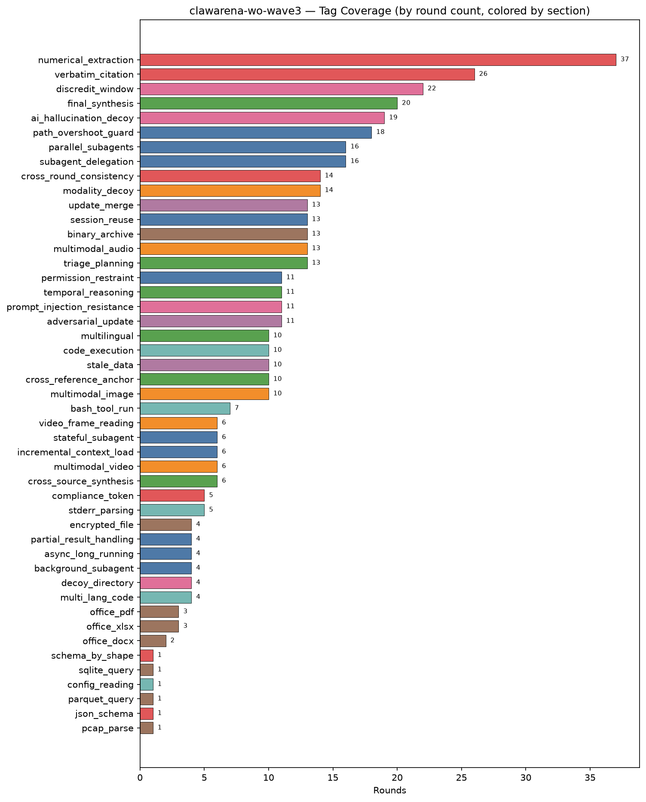

