# clawarena-team-wave4 — Stats Report

_Tokenizer: `qwen3`_

## 1. Overall Summary

- **Scenarios:** 13
- **Total rounds:** 87
- **Rounds with updates:** 14 (16.1%)
- **Total update groups:** 17 (29 files)
- **Total workspace size:** 23.5 MiB
- **Total tokens:** 6,202,463

## 2. Token Distribution

| Category | Tokens | % |
|----------|-------:|--:|
| Workspace | 3,535,989 | 57.0% |
| Updates | 2,653,099 | 42.8% |
| Questions | 8,857 | 0.1% |
| Feedback | 4,518 | 0.1% |
| **Total** | **6,202,463** | **100.0%** |

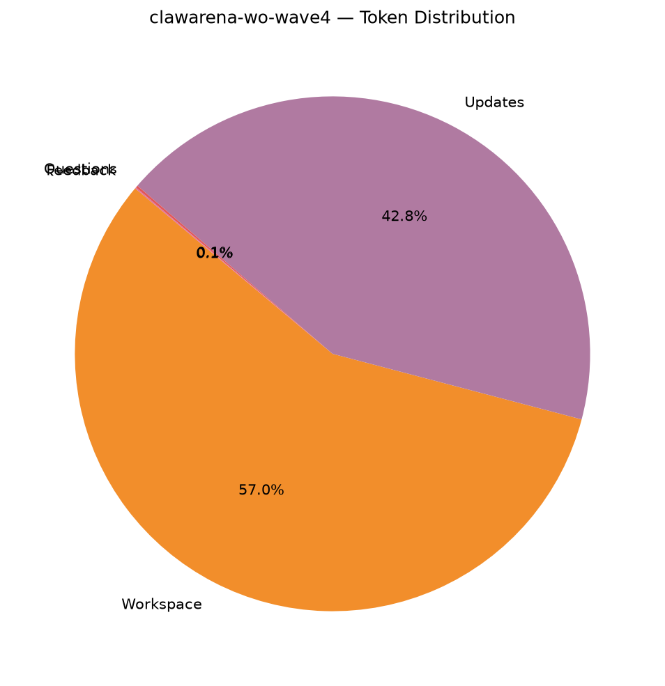

## 3. Question Statistics

### 3.1 Type Distribution

| Type | Count | % |
|------|------:|--:|
| `exec_check` | 87 | 100.0% |

### 3.2 exec_check Feature Coverage

| Feature | Rounds | Coverage |
|---------|-------:|---------:|
| expect_exit declared | 87 | 100.0% |
| expect_stdout set | 0 | 0.0% |
| regex matching | 0 | 0.0% |
| timeout set | 87 | 100.0% |
| uses ${scripts} | 87 | 100.0% |
| uses ${workspace} | 87 | 100.0% |

_Timeout (s) — mean 67.2, min 60.0, max 120.0._

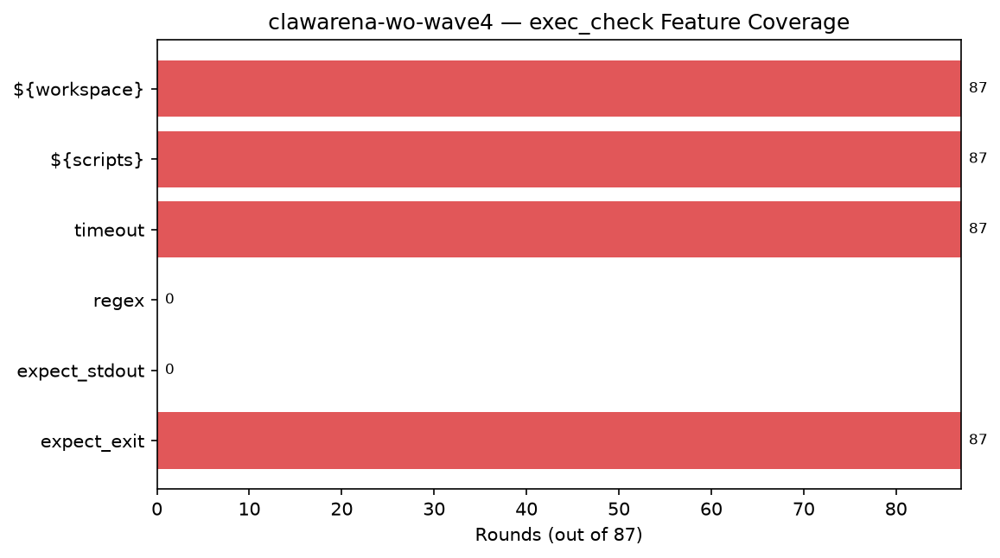

### 3.3 Question Token Stats

- **Mean:** 101.8, **Min:** 50, **Max:** 223

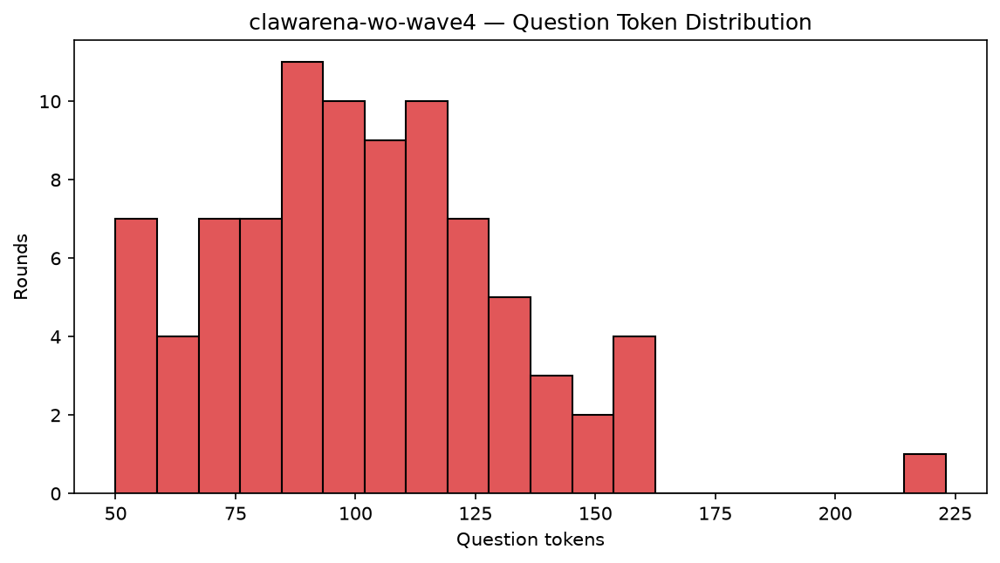

## 4. Update Statistics

### 4.1 Op Distribution

| op | Groups | % |
|----|------:|--:|
| `new` | 14 | 82.4% |
| `replace` | 3 | 17.6% |

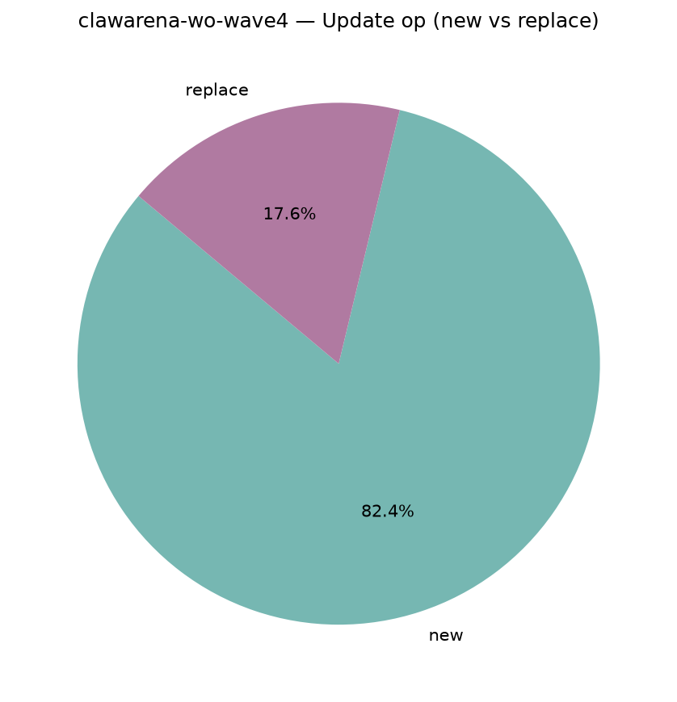

### 4.2 Files per Update

- **Mean:** 1.71, **Min:** 1, **Max:** 3
- **Total update files:** 29

## 5. Workspace Composition

### 5.1 By Modality

| Modality | Files | File % | Bytes | Tokens | Token % |
|----------|------:|------:|------:|------:|--------:|
| `text` | 309 | 67.5% | 5.9 MiB | 2,589,103 | 73.2% |
| `image` | 28 | 6.1% | 2.2 MiB | 7,840 | 0.2% |
| `audio` | 5 | 1.1% | 9.2 MiB | 3,750 | 0.1% |
| `video` | 8 | 1.7% | 2.5 MiB | 17,920 | 0.5% |
| `document` | 21 | 4.6% | 1.1 MiB | 909,717 | 25.7% |
| `other` | 87 | 19.0% | 2.6 MiB | 7,659 | 0.2% |

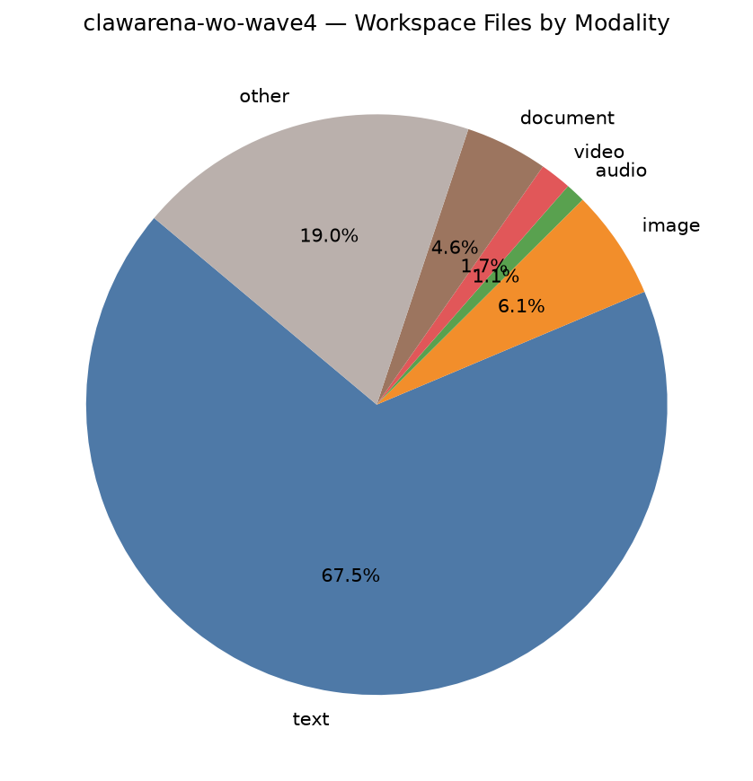

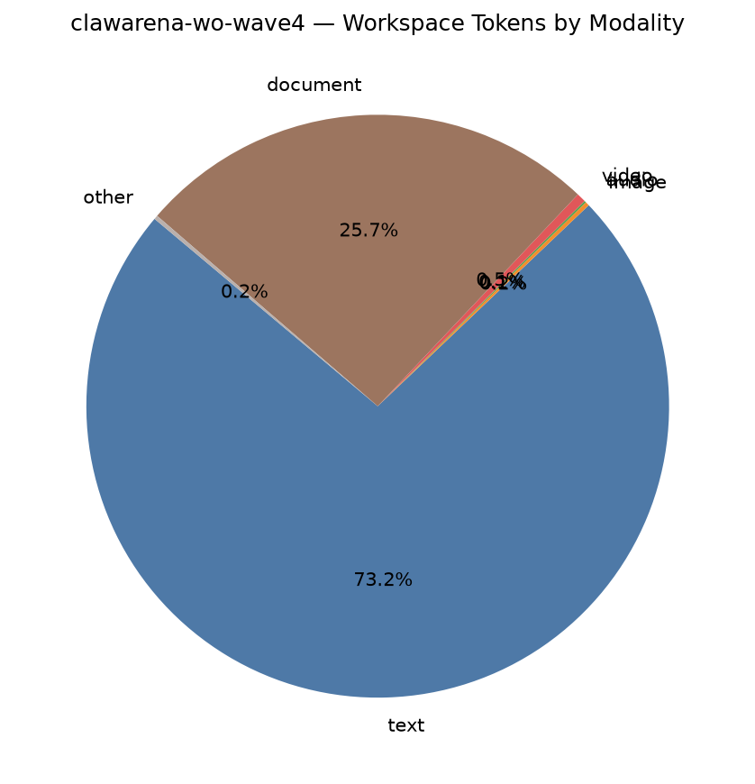

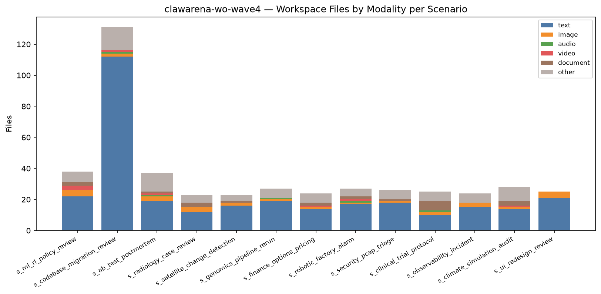

### 5.2 By Extension (Top 15 by bytes)

| Extension | Files | File % | Bytes | Byte % | Tokens | Token % |
|-----------|------:|------:|------:|------:|------:|--------:|
| `.wav` | 5 | 1.1% | 9.2 MiB | 39.3% | 3,750 | 0.1% |
| `.parquet` | 10 | 2.2% | 2.5 MiB | 10.8% | 0 | 0.0% |
| `.mp4` | 8 | 1.7% | 2.5 MiB | 10.6% | 17,920 | 0.5% |
| `.png` | 28 | 6.1% | 2.2 MiB | 9.2% | 7,840 | 0.2% |
| `.md` | 118 | 25.8% | 1.8 MiB | 7.8% | 682,369 | 19.3% |
| `.log` | 6 | 1.3% | 1.8 MiB | 7.7% | 1,107,510 | 31.3% |
| `.py` | 59 | 12.9% | 1003.9 KiB | 4.2% | 281,625 | 8.0% |
| `.pdf` | 10 | 2.2% | 745.7 KiB | 3.1% | 543,764 | 15.4% |
| `.txt` | 20 | 4.4% | 688.3 KiB | 2.9% | 178,069 | 5.0% |
| `.csv` | 20 | 4.4% | 374.3 KiB | 1.6% | 251,989 | 7.1% |
| `.docx` | 9 | 2.0% | 364.8 KiB | 1.5% | 364,726 | 10.3% |
| `.go` | 16 | 3.5% | 105.7 KiB | 0.4% | 32,154 | 0.9% |
| `.json` | 9 | 2.0% | 103.3 KiB | 0.4% | 36,618 | 1.0% |
| `.sqlite` | 1 | 0.2% | 24.0 KiB | 0.1% | 0 | 0.0% |
| `.yaml` | 12 | 2.6% | 17.5 KiB | 0.1% | 5,428 | 0.2% |

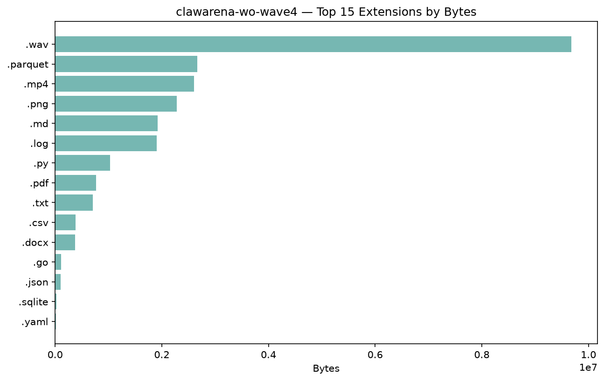

### 5.3 Largest Files (Top 15)

| Rank | Path | Modality | Bytes | Tokens |
|-----:|------|----------|------:|------:|
| 1 | `audio/architect_memo.wav` | `audio` | 2.7 MiB | 750 |
| 2 | `audio/irb_chair_memo.wav` | `audio` | 2.5 MiB | 750 |
| 3 | `data/market_snapshot.parquet` | `other` | 2.5 MiB | 0 |
| 4 | `audio/lab_director_voicemail.wav` | `audio` | 1.7 MiB | 750 |
| 5 | `visualizations/spi_heatmap_anim.mp4` | `video` | 1.5 MiB | 2,240 |
| 6 | `imagery_analysis_supplement.txt` | `text` | 1.4 MiB | 1,166,974 |
| 7 | `audio/ops_voicemail_02h.wav` | `audio` | 1.3 MiB | 750 |
| 8 | `analytics/exec_voicemail.wav` | `audio` | 1.1 MiB | 750 |
| 9 | `shift_roster_export.csv` | `text` | 673.3 KiB | 346,579 |
| 10 | `analysis/pixel_diff_report.md` | `text` | 623.3 KiB | 205,650 |
| 11 | `threat_intel_supplement.md` | `text` | 621.7 KiB | 379,679 |
| 12 | `data/internal_logs/full_event_stream.log` | `text` | 561.8 KiB | 286,618 |
| 13 | `papers/prior_v4_paper.pdf` | `document` | 552.1 KiB | 159,047 |
| 14 | `a11y_fix_spec.md` | `text` | 481.8 KiB | 186,408 |
| 15 | `archive/historical_studies.md` | `text` | 448.2 KiB | 147,772 |

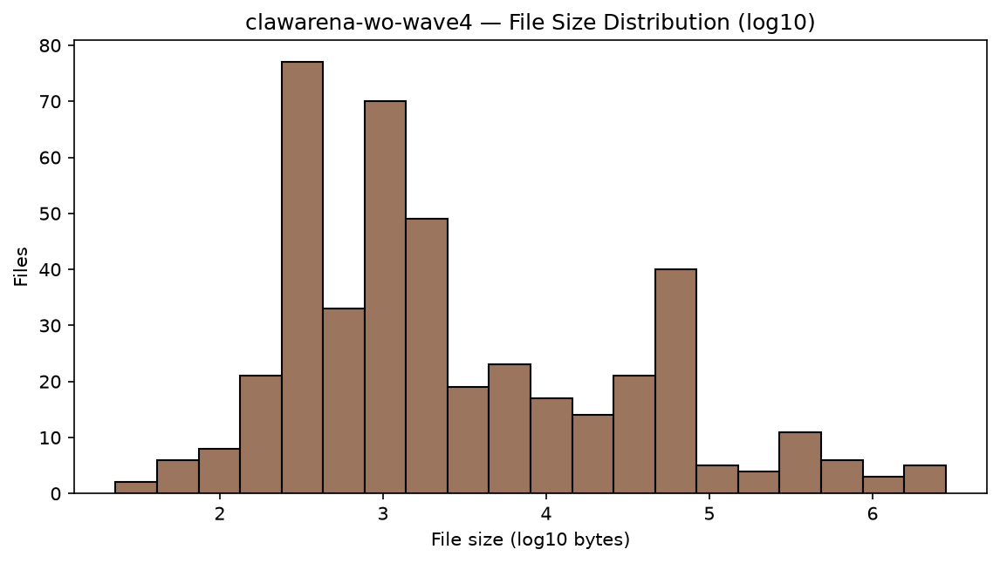

## 6. Multimodal Coverage

### 6.1 Per-Scenario Multimodal Files

| Scenario | image | audio | video | mm bytes | mm tokens |
|----------|------:|------:|------:|---------:|----------:|
| `s_ml_rl_policy_review` | 4 | 0 | 3 | 794.7 KiB | 7,840 |
| `s_codebase_migration_review` | 2 | 1 | 1 | 2.9 MiB | 3,550 |
| `s_ab_test_postmortem` | 3 | 1 | 1 | 1.2 MiB | 3,830 |
| `s_radiology_case_review` | 3 | 0 | 0 | 998.2 KiB | 840 |
| `s_satellite_change_detection` | 2 | 0 | 0 | 22.0 KiB | 560 |
| `s_genomics_pipeline_rerun` | 1 | 1 | 0 | 1.8 MiB | 1,030 |
| `s_finance_options_pricing` | 1 | 0 | 1 | 124.0 KiB | 2,520 |
| `s_robotic_factory_alarm` | 1 | 1 | 1 | 1.6 MiB | 3,270 |
| `s_security_pcap_triage` | 1 | 0 | 0 | 63.6 KiB | 280 |
| `s_clinical_trial_protocol` | 2 | 1 | 0 | 2.6 MiB | 1,310 |
| `s_observability_incident` | 3 | 0 | 0 | 169.7 KiB | 840 |
| `s_climate_simulation_audit` | 1 | 0 | 1 | 1.6 MiB | 2,520 |
| `s_ui_redesign_review` | 4 | 0 | 0 | 144.4 KiB | 1,120 |

### 6.2 Modality Totals

- **Audio files:** 5 (measured 5 via stdlib `wave`; total 302.6s ≈ 5.0 min)
- **Video files:** 8 (cv2 unavailable or unreadable)

## 7. Per-Scenario Breakdown

| Scenario | Rounds | w/Upd | Upd Groups | Upd Files | WS Files | Accessible | Tokens |
|----------|-------:|------:|-----------:|----------:|---------:|-----------:|-------:|
| `s_ml_rl_policy_review` | 8 | 1 | 1 | 2 | 38 | 18 | 20,215 |
| `s_codebase_migration_review` | 10 | 2 | 2 | 4 | 131 | 27 | 323,238 |
| `s_ab_test_postmortem` | 6 | 1 | 1 | 2 | 37 | 16 | 324,321 |
| `s_radiology_case_review` | 6 | 1 | 1 | 2 | 23 | 12 | 266,846 |
| `s_satellite_change_detection` | 5 | 1 | 1 | 3 | 23 | 23 | 1,504,566 |
| `s_genomics_pipeline_rerun` | 6 | 1 | 2 | 2 | 27 | 22 | 27,114 |
| `s_finance_options_pricing` | 7 | 1 | 1 | 2 | 24 | 16 | 15,220 |
| `s_robotic_factory_alarm` | 7 | 1 | 1 | 2 | 27 | 19 | 821,280 |
| `s_security_pcap_triage` | 6 | 1 | 2 | 2 | 26 | 9 | 1,137,468 |
| `s_clinical_trial_protocol` | 6 | 1 | 1 | 2 | 25 | 13 | 1,067,053 |
| `s_observability_incident` | 7 | 1 | 1 | 2 | 24 | 23 | 20,103 |
| `s_climate_simulation_audit` | 7 | 1 | 1 | 1 | 28 | 10 | 243,708 |
| `s_ui_redesign_review` | 6 | 1 | 2 | 3 | 25 | 15 | 431,331 |

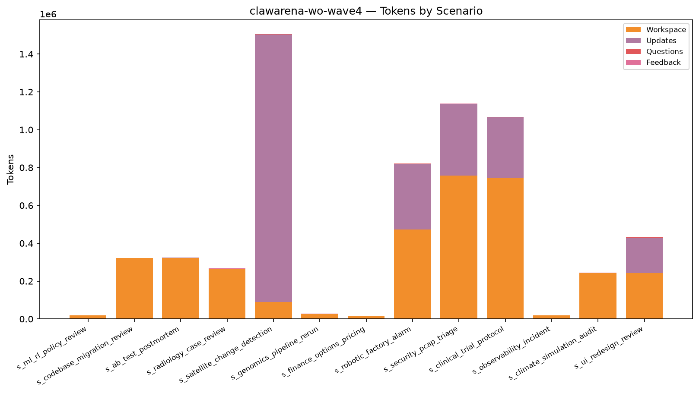

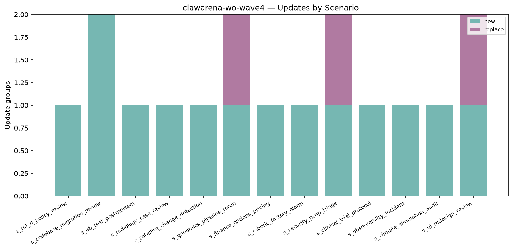

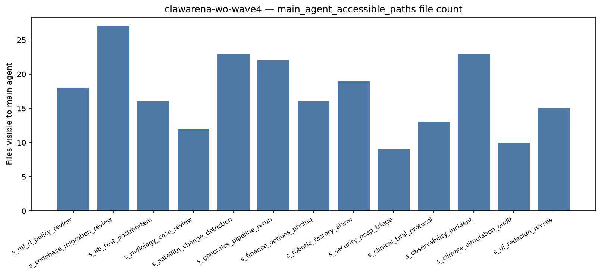

## 8. Per-Scenario Token Detail

| Scenario | Workspace | Updates | Questions | Feedback | Total |
|----------|------:|------:|------:|------:|------:|
| `s_ml_rl_policy_review` | 19,029 | 299 | 644 | 243 | 20,215 |
| `s_codebase_migration_review` | 321,235 | 679 | 768 | 556 | 323,238 |
| `s_ab_test_postmortem` | 322,826 | 723 | 516 | 256 | 324,321 |
| `s_radiology_case_review` | 265,061 | 591 | 697 | 497 | 266,846 |
| `s_satellite_change_detection` | 88,867 | 1,414,848 | 565 | 286 | 1,504,566 |
| `s_genomics_pipeline_rerun` | 25,440 | 748 | 645 | 281 | 27,114 |
| `s_finance_options_pricing` | 13,906 | 314 | 730 | 270 | 15,220 |
| `s_robotic_factory_alarm` | 473,373 | 346,827 | 750 | 330 | 821,280 |
| `s_security_pcap_triage` | 756,553 | 379,856 | 634 | 425 | 1,137,468 |
| `s_clinical_trial_protocol` | 745,378 | 320,740 | 621 | 314 | 1,067,053 |
| `s_observability_incident` | 18,431 | 410 | 967 | 295 | 20,103 |
| `s_climate_simulation_audit` | 242,609 | 153 | 655 | 291 | 243,708 |
| `s_ui_redesign_review` | 243,281 | 186,911 | 665 | 474 | 431,331 |

## 9. Top-N Rankings

### Top 10 by Tokens

| Rank | Scenario | Tokens |
|-----:|----------|------:|
| 1 | `s_satellite_change_detection` | 1,504,566 |
| 2 | `s_security_pcap_triage` | 1,137,468 |
| 3 | `s_clinical_trial_protocol` | 1,067,053 |
| 4 | `s_robotic_factory_alarm` | 821,280 |
| 5 | `s_ui_redesign_review` | 431,331 |
| 6 | `s_ab_test_postmortem` | 324,321 |
| 7 | `s_codebase_migration_review` | 323,238 |
| 8 | `s_radiology_case_review` | 266,846 |
| 9 | `s_climate_simulation_audit` | 243,708 |
| 10 | `s_genomics_pipeline_rerun` | 27,114 |

### Top 10 by Rounds

| Rank | Scenario | Rounds |
|-----:|----------|------:|
| 1 | `s_codebase_migration_review` | 10 |
| 2 | `s_ml_rl_policy_review` | 8 |
| 3 | `s_finance_options_pricing` | 7 |
| 4 | `s_robotic_factory_alarm` | 7 |
| 5 | `s_observability_incident` | 7 |
| 6 | `s_climate_simulation_audit` | 7 |
| 7 | `s_ab_test_postmortem` | 6 |
| 8 | `s_radiology_case_review` | 6 |
| 9 | `s_genomics_pipeline_rerun` | 6 |
| 10 | `s_security_pcap_triage` | 6 |

### Top 10 by Update files

| Rank | Scenario | Update files |
|-----:|----------|------:|
| 1 | `s_codebase_migration_review` | 4 |
| 2 | `s_satellite_change_detection` | 3 |
| 3 | `s_ui_redesign_review` | 3 |
| 4 | `s_ml_rl_policy_review` | 2 |
| 5 | `s_ab_test_postmortem` | 2 |
| 6 | `s_radiology_case_review` | 2 |
| 7 | `s_genomics_pipeline_rerun` | 2 |
| 8 | `s_finance_options_pricing` | 2 |
| 9 | `s_robotic_factory_alarm` | 2 |
| 10 | `s_security_pcap_triage` | 2 |

### Top 10 by Workspace size

| Rank | Scenario | Workspace size |
|-----:|----------|------:|
| 1 | `s_codebase_migration_review` | 4.0 MiB |
| 2 | `s_clinical_trial_protocol` | 2.9 MiB |
| 3 | `s_finance_options_pricing` | 2.6 MiB |
| 4 | `s_climate_simulation_audit` | 2.6 MiB |
| 5 | `s_robotic_factory_alarm` | 2.4 MiB |
| 6 | `s_ab_test_postmortem` | 1.9 MiB |
| 7 | `s_genomics_pipeline_rerun` | 1.8 MiB |
| 8 | `s_radiology_case_review` | 1.7 MiB |
| 9 | `s_security_pcap_triage` | 1.3 MiB |
| 10 | `s_ml_rl_policy_review` | 864.7 KiB |

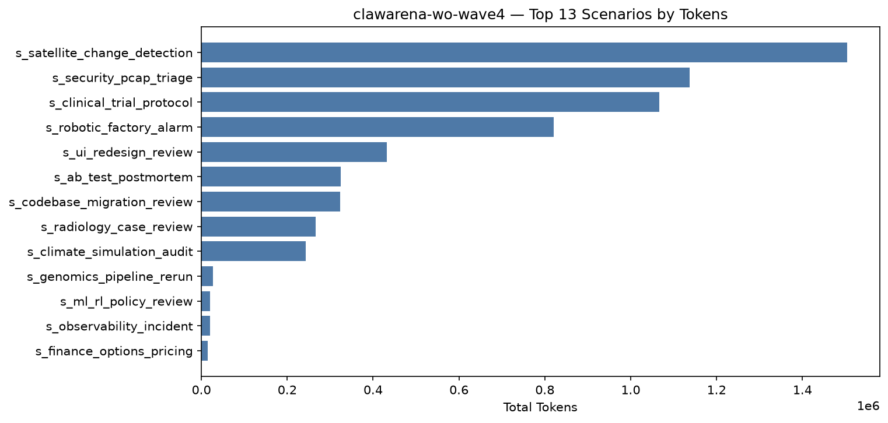

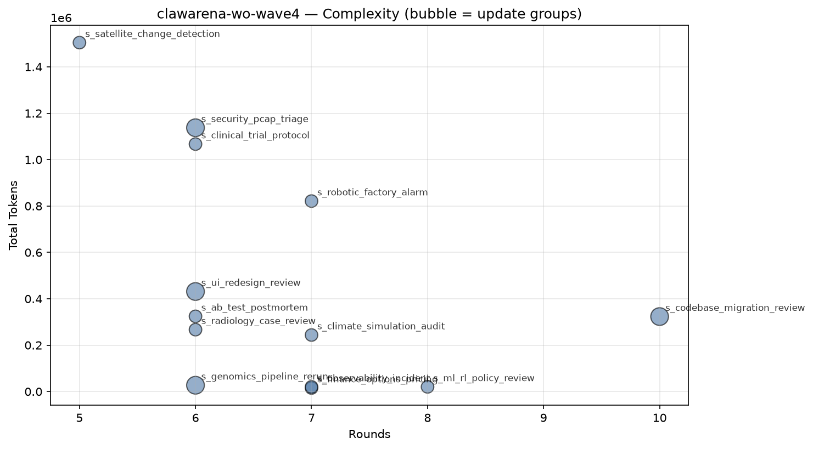

## 10. Tag Coverage

- **Rounds with ≥1 tag:** 87 / 87 (100.0%)
- **Unique tags used:** 46 (of 51 controlled)
- **Total tag slots:** 349 (avg 4.01 per round)

### 10.1 By Section

| Section | Used | Total | Coverage |
|---------|-----:|------:|---------:|
| Multimodal | 5 | 5 | 100.0% |
| Delegation / Permission | 12 | 12 | 100.0% |
| Update Handling | 2 | 4 | 50.0% |
| Structured Output / Cross-round | 6 | 6 | 100.0% |
| Trap / Adversarial Resistance | 4 | 5 | 80.0% |
| Office / Data Formats | 7 | 8 | 87.5% |
| Code / Tool | 4 | 5 | 80.0% |
| Information Synthesis | 6 | 6 | 100.0% |

### 10.2 Tag Distribution (by round count)

| Tag | Section | Rounds | Round % | Scenarios | Scenario % |
|-----|---------|-------:|--------:|----------:|-----------:|
| `verbatim_citation` | Structured Output / Cross-round | 22 | 25.3% | 12 | 92.3% |
| `numerical_extraction` | Structured Output / Cross-round | 20 | 23.0% | 12 | 92.3% |
| `session_reuse` | Delegation / Permission | 19 | 21.8% | 9 | 69.2% |
| `subagent_delegation` | Delegation / Permission | 18 | 20.7% | 13 | 100.0% |
| `json_schema` | Structured Output / Cross-round | 15 | 17.2% | 13 | 100.0% |
| `bash_tool_run` | Code / Tool | 14 | 16.1% | 9 | 69.2% |
| `final_synthesis` | Information Synthesis | 14 | 16.1% | 13 | 100.0% |
| `ai_hallucination_decoy` | Trap / Adversarial Resistance | 13 | 14.9% | 10 | 76.9% |
| `incremental_context_load` | Delegation / Permission | 13 | 14.9% | 9 | 69.2% |
| `triage_planning` | Information Synthesis | 13 | 14.9% | 13 | 100.0% |
| `compliance_token` | Structured Output / Cross-round | 12 | 13.8% | 12 | 92.3% |
| `discredit_window` | Trap / Adversarial Resistance | 12 | 13.8% | 10 | 76.9% |
| `update_merge` | Update Handling | 12 | 13.8% | 12 | 92.3% |
| `permission_restraint` | Delegation / Permission | 11 | 12.6% | 6 | 46.2% |
| `cross_round_consistency` | Structured Output / Cross-round | 10 | 11.5% | 8 | 61.5% |
| `modality_decoy` | Multimodal | 9 | 10.3% | 9 | 69.2% |
| `stateful_subagent` | Delegation / Permission | 9 | 10.3% | 6 | 46.2% |
| `path_overshoot_guard` | Delegation / Permission | 8 | 9.2% | 5 | 38.5% |
| `parquet_query` | Office / Data Formats | 7 | 8.0% | 3 | 23.1% |
| `async_long_running` | Delegation / Permission | 6 | 6.9% | 4 | 30.8% |
| `code_execution` | Code / Tool | 6 | 6.9% | 6 | 46.2% |
| `multilingual` | Information Synthesis | 6 | 6.9% | 4 | 30.8% |
| `office_docx` | Office / Data Formats | 6 | 6.9% | 5 | 38.5% |
| `partial_result_handling` | Delegation / Permission | 6 | 6.9% | 4 | 30.8% |
| `schema_by_shape` | Structured Output / Cross-round | 6 | 6.9% | 4 | 30.8% |
| `cross_source_synthesis` | Information Synthesis | 5 | 5.7% | 4 | 30.8% |
| `large_context_pressure` | Delegation / Permission | 5 | 5.7% | 4 | 30.8% |
| `multimodal_image` | Multimodal | 5 | 5.7% | 4 | 30.8% |
| `temporal_reasoning` | Information Synthesis | 5 | 5.7% | 4 | 30.8% |
| `background_subagent` | Delegation / Permission | 4 | 4.6% | 4 | 30.8% |
| `cross_reference_anchor` | Information Synthesis | 4 | 4.6% | 3 | 23.1% |
| `multi_lang_code` | Code / Tool | 4 | 4.6% | 2 | 15.4% |
| `parallel_subagents` | Delegation / Permission | 4 | 4.6% | 4 | 30.8% |
| `stale_data` | Update Handling | 4 | 4.6% | 3 | 23.1% |
| `stderr_parsing` | Code / Tool | 4 | 4.6% | 4 | 30.8% |
| `multimodal_video` | Multimodal | 3 | 3.4% | 3 | 23.1% |
| `video_frame_reading` | Multimodal | 3 | 3.4% | 3 | 23.1% |
| `encrypted_file` | Office / Data Formats | 2 | 2.3% | 2 | 15.4% |
| `office_pdf` | Office / Data Formats | 2 | 2.3% | 2 | 15.4% |
| `sqlite_query` | Office / Data Formats | 2 | 2.3% | 1 | 7.7% |
| `binary_archive` | Office / Data Formats | 1 | 1.1% | 1 | 7.7% |
| `honeypot_auto_summary` | Trap / Adversarial Resistance | 1 | 1.1% | 1 | 7.7% |
| `multimodal_audio` | Multimodal | 1 | 1.1% | 1 | 7.7% |
| `pcap_parse` | Office / Data Formats | 1 | 1.1% | 1 | 7.7% |
| `prompt_injection_resistance` | Trap / Adversarial Resistance | 1 | 1.1% | 1 | 7.7% |
| `workflow` | Delegation / Permission | 1 | 1.1% | 1 | 7.7% |

### 10.3 Uncovered Controlled Tags

> Registered in the vocabulary but hit by 0 rounds in this dataset — the next wave of scenario design can prioritize filling these in.

| Section | Tags |
|---------|------|
| Update Handling | `update_supersede`, `adversarial_update` |
| Trap / Adversarial Resistance | `decoy_directory` |
| Office / Data Formats | `office_xlsx` |
| Code / Tool | `config_reading` |

### 10.4 Low-Sample Tags (1–2 rounds)

> Low-sample dimensions, possibly appearing in only a few scenarios — consider spreading them out horizontally when increasing difficulty.

| Section | Tag → rounds |
|---------|------|
| Multimodal | `multimodal_audio` (1) |
| Delegation / Permission | `workflow` (1) |
| Trap / Adversarial Resistance | `honeypot_auto_summary` (1), `prompt_injection_resistance` (1) |
| Office / Data Formats | `office_pdf` (2), `binary_archive` (1), `sqlite_query` (2), `pcap_parse` (1), `encrypted_file` (2) |

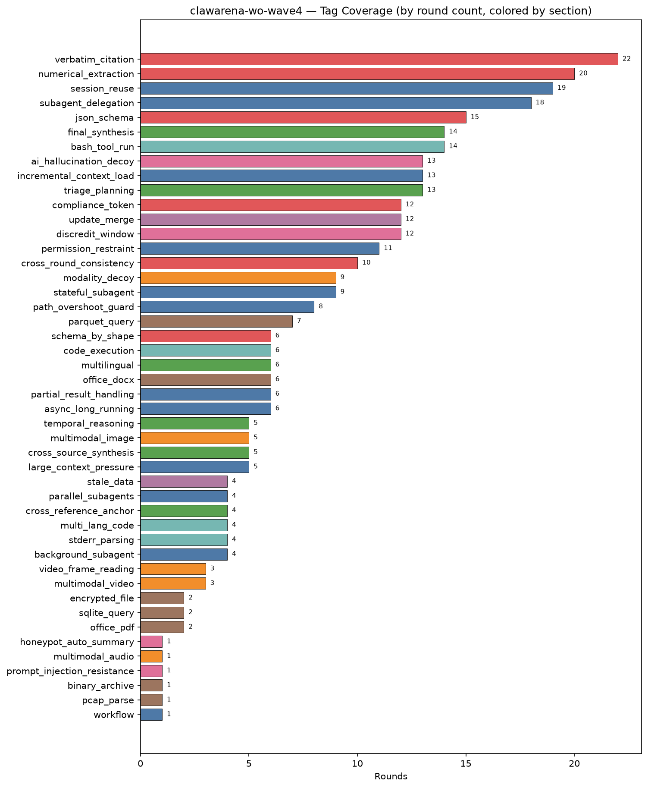

