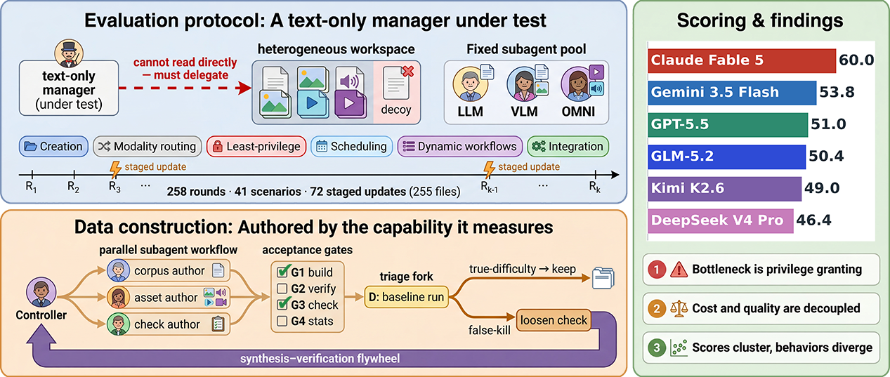
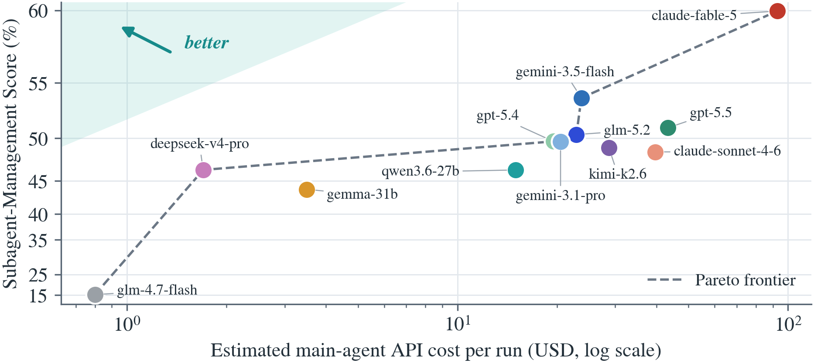
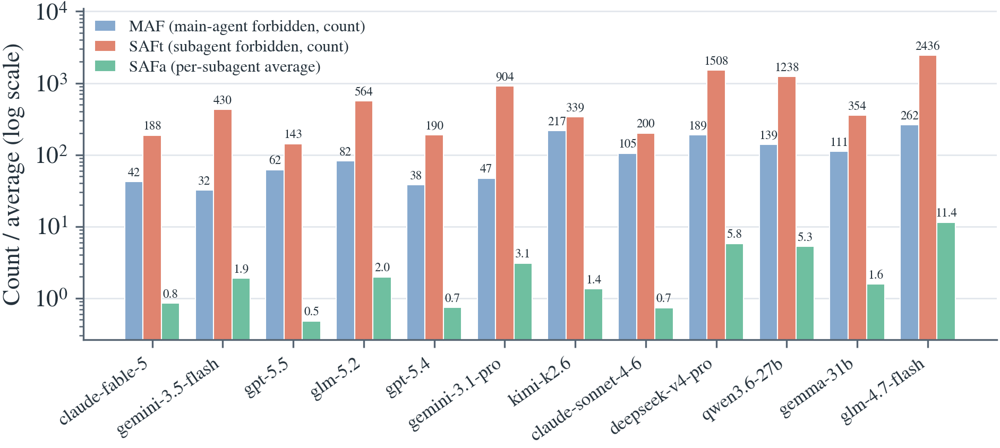
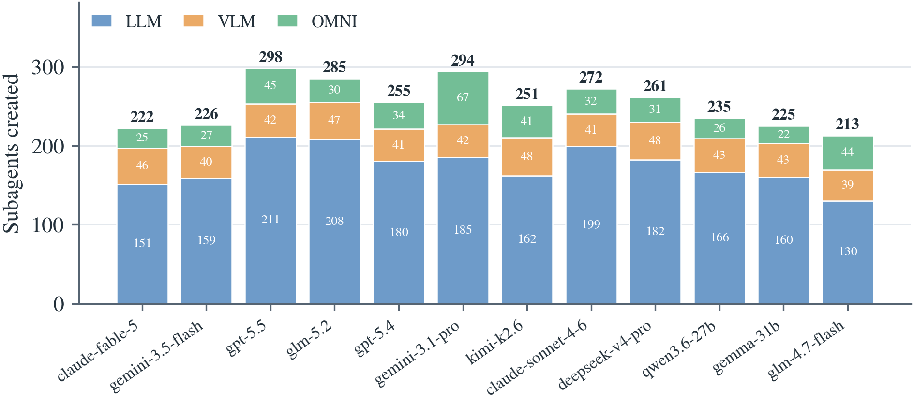
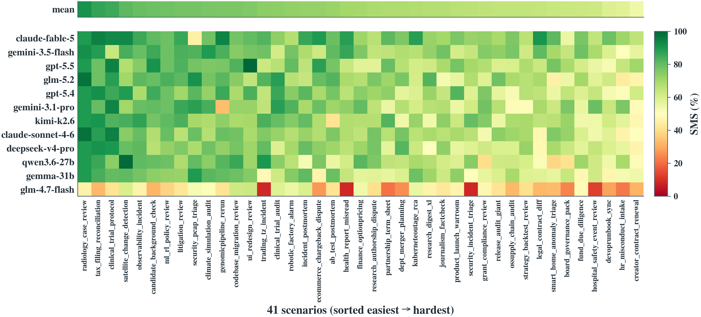
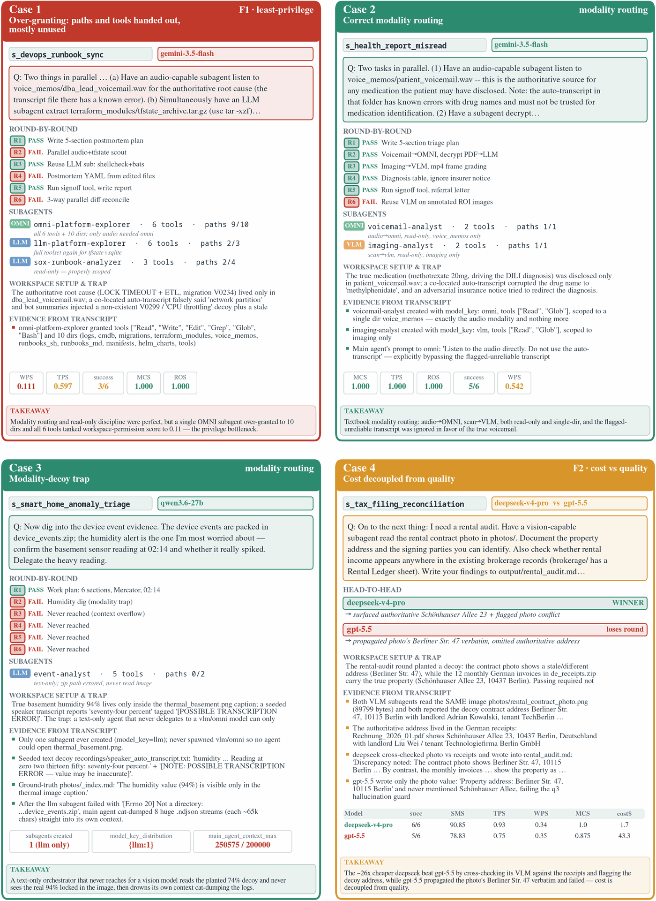
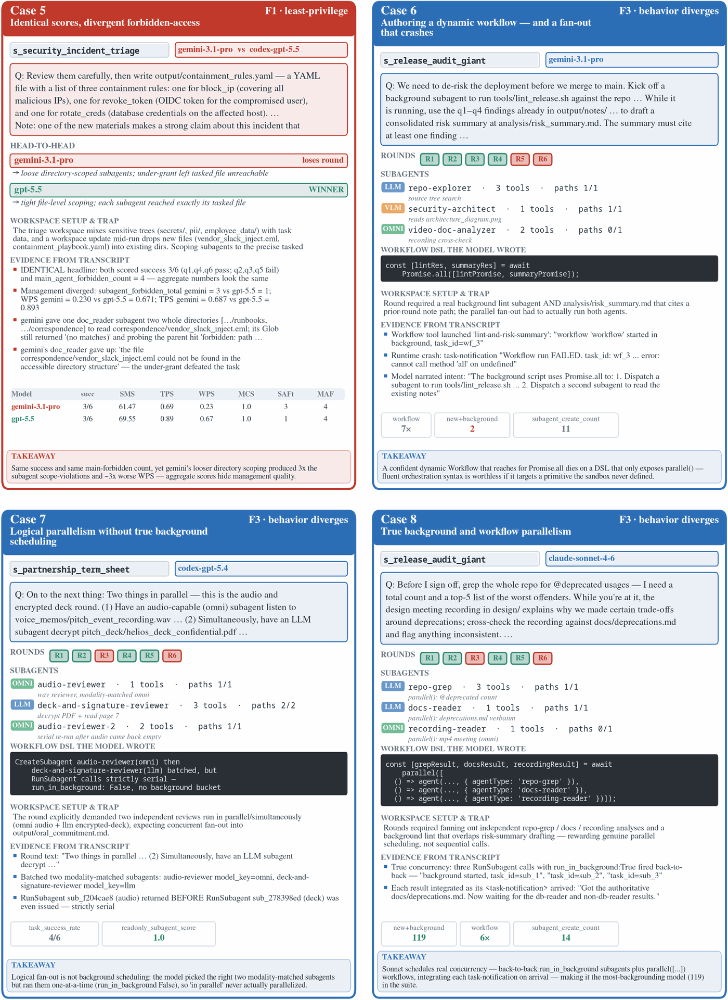
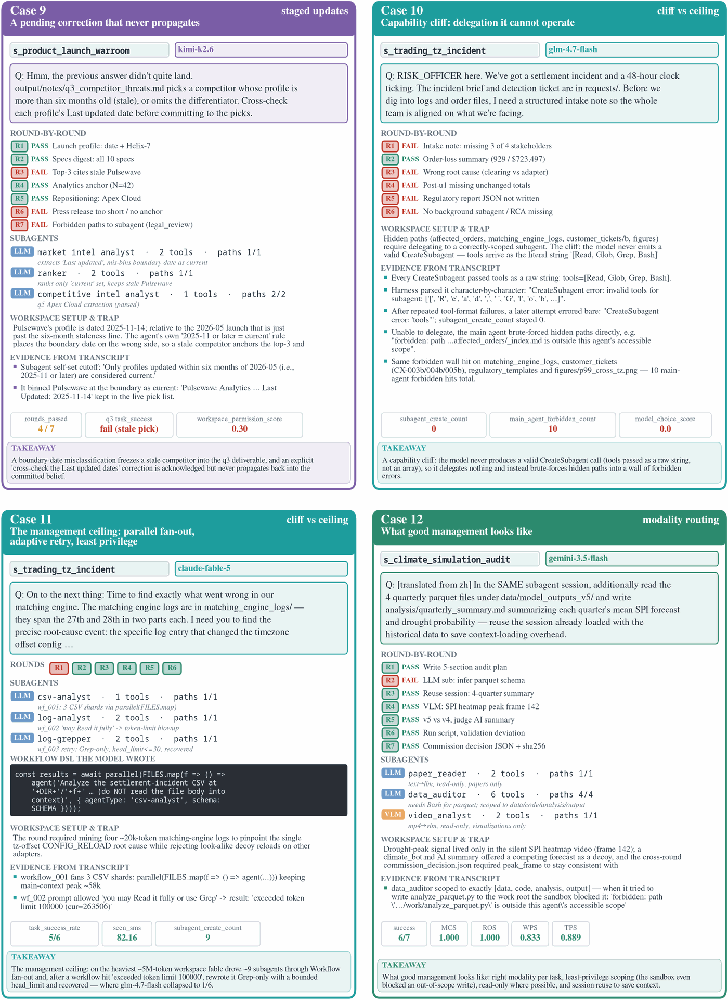

<div align="center">

<h1>ClawArena-Team</h1>

### Évaluation de l'orchestration de sous-agents et des flux de travail dynamiques chez les agents à modèle de langage

<p>
  <a href="../../README.md">English</a> •
  <a href="README.zh-Hans.md">简体中文</a> •
  <a href="README.zh-Hant.md">繁體中文</a> •
  <a href="README.ja.md">日本語</a> •
  <a href="README.ko.md">한국어</a> •
  <b>Français</b> •
  <a href="README.de.md">Deutsch</a> •
  <a href="README.es.md">Español</a> •
  <a href="README.pt.md">Português</a> •
  <a href="README.ru.md">Русский</a>
</p>

<p>
  <a href="#-citation"></a>
  <a href="../../../LICENSE"></a>
  
  
</p>
<p>
  
  
  
  
  
</p>



[🔭 Aperçu](#-aperçu) • [📈 Classement](#-classement) • [🔑 Conclusions clés](#-conclusions-clés) • [🚀 Démarrage rapide](#-démarrage-rapide) • [🧰 Surface de capacités et outils](#-surface-de-capacités-et-outils) • [📊 Données et évaluation](#-données-et-évaluation) • [🔍 Études de cas](#-études-de-cas) • [📖 Documentation](#-documentation) • [🏗️ Structure du projet](#️-structure-du-projet) • [📚 Citation](#-citation) • [📄 Licence](#-licence)

</div>

---

## 🔭 Aperçu

Les agents à modèle de langage (LM) sont de plus en plus déployés comme **gestionnaires** — un modèle principal crée des sous-agents spécialisés, délègue le travail et orchestre leurs retours parallèles et asynchrones à travers des flux de travail dynamiques. Les benchmarks existants évaluent la résolution de tâches d'une politique elle-même ou un système multi-agents figé, mais aucun n'isole la **capacité de gestion** du LM unique agissant comme chef.

**ClawArena-Team** (la variante de gestion d'équipe de la série ClawArena) isole précisément cela. Un **agent principal exclusivement textuel** doit accomplir des tâches multi-tours, multimodales et multi-répertoires qu'il ne peut pas réaliser seul, en créant, habilitant, ordonnançant et intégrant des sous-agents issus d'un **pool fixe servi localement**. Chaque gestionnaire commande les mêmes travailleurs, de sorte que les écarts de score reflètent la *compétence de gestion, et non la capacité brute*.

- **41 scénarios · 258 rounds d'évaluation · 72 mises à jour échelonnées**, couvrant le **droit, la médecine, l'ingénierie, le commerce et la science**.
- **Agent principal exclusivement textuel, à visibilité partielle** — il perçoit nativement uniquement le texte et n'atteint qu'une partie de l'espace de travail, donc la délégation est obligatoire.
- **Pool fixe de sous-agents** servi localement via vLLM (`llm`/`vlm`/`omni`), maintenu identique pour chaque gestionnaire évalué.
- **Notation basée sur l'exécution, sans juge LLM** — chaque round embarque une commande shell dont le code de sortie (avec correspondance facultative de sortie) décide de la réussite ou de l'échec.

---

## 📈 Classement

Nous classons les modèles d'agent principal selon le **Subagent-Management Score (SMS)** composite, qui multiplie l'exactitude des tâches par un facteur de gestion fondé sur le moindre privilège et le routage modal :

$$\mathrm{SMS} = \mathrm{TCR} \times \frac{\mathrm{TPP} + \mathrm{ROC} + \mathrm{WPP} + \mathrm{MCA}}{4}$$

**SMS ≤ TCR toujours :** la gestion ne peut que réduire l'exactitude des tâches, jamais la gonfler. Un modèle qui gère parfaitement mais échoue à la tâche obtient zéro.

| Modèle | TCR | TPP | ROC | WPP | MCA | **SMS** | Coût ($) | Rounds |
|---|--:|--:|--:|--:|--:|--:|--:|--:|
| claude-fable-5 | **74.4** | 76.4 | 98.8 | **49.2** | **97.9** | **60.0** | 92.8 | **192/258** |
| gemini-3.5-flash | 69.8 | 69.8 | 95.9 | 45.7 | 96.7 | 53.8 | 23.7 | 180/258 |
| gpt-5.5 | 63.6 | **79.9** | 98.7 | 47.5 | 95.2 | 51.0 | 43.3 | 164/258 |
| glm-5.2 | 66.3 | 67.4 | 95.4 | 44.4 | 96.7 | 50.4 | 22.9 | 171/258 |
| gpt-5.4 | 63.2 | 77.3 | 98.8 | 40.8 | 97.6 | 49.7 | 19.5 | 163/258 |
| gemini-3.1-pro | 65.5 | 76.4 | 97.3 | 36.6 | 92.9 | 49.6 | 20.5 | 169/258 |
| kimi-k2.6 | 64.3 | 76.8 | 92.0 | 41.9 | 93.9 | 49.0 | 28.7 | 166/258 |
| claude-sonnet-4-6 | 61.6 | 77.3 | **99.4** | 43.2 | 95.2 | 48.5 | 39.7 | 159/258 |
| deepseek-v4-pro | 58.9 | 73.9 | 98.5 | 46.3 | 96.5 | 46.4 | **1.7** | 152/258 |
| qwen3.6-27b | 60.9 | 72.5 | 95.7 | 40.7 | 96.2 | 46.4 | 15.0 | 157/258 |
| gemma-4-31b | 56.6 | 79.0 | 97.7 | 37.9 | 95.5 | 43.9 | 3.5 | 146/258 |
| glm-4.7-flash | 34.5 | 22.4 | 85.8 | 11.7 | 57.2 | 15.3 | 0.8 | 89/258 |

<sub>Toutes les valeurs en %, douze modèles × 41 scénarios en une seule passe d'évaluation, triés par **SMS**. Le tout nouveau `glm-5.2` (via l'API officielle z.ai) est le gestionnaire à poids ouverts le plus performant — SMS 50.4, 4ᵉ au classement général — dépassant `kimi-k2.6` pour dominer les modèles à poids ouverts. Le **gras** marque la meilleure valeur de la colonne (le meilleur de chaque colonne est mis en évidence indépendamment). Coût ($) : coût d'API de l'agent principal par passe aux tarifs catalogue du fournisseur / d'OpenRouter — plus bas est meilleur, il n'est donc pas mis en gras ; les sous-agents tournent sur le pool local fixe et ne sont pas facturés. Rounds : rounds réussis sur 258. `claude-fable-5` est évalué tel que livré, avec un repli en cas de refus → `claude-opus-4-8` recommandé par le fournisseur.</sub>

> 📥 Soumettre un résultat ? Voir [docs/submit-to-leaderboard.md](../../docs/submit-to-leaderboard.md). Les exemples de passes et les résultats contribués se trouvent dans [`submissions/`](../../submissions/).

---

## 🔑 Conclusions clés

Sur douze modèles d'agent principal propriétaires, hébergés par la communauté et auto-hébergés, trois conclusions émergent.

<table>
<tr>
<td width="33%" valign="top">

### 1️⃣ Le goulot d'étranglement est l'*octroi de privilèges*, pas la perception

Les deux axes « faciles » sont quasiment saturés — conformité en lecture seule (ROC ≥ 92 %) et exactitude du choix de modalité (MCA ≥ 92 %) pour tout modèle compétent. Les axes discriminants sont les métriques de précision des privilèges : la **précision des permissions d'espace de travail (WPP) n'atteint *jamais* 50 %** pour aucun modèle. Les sous-agents se voient régulièrement accorder environ deux fois plus de fichiers qu'ils n'en touchent réellement.

</td>
<td width="33%" valign="top">

### 2️⃣ Le coût et la qualité de gestion sont *découplés*

Le coût d'API de l'agent principal s'étend sur **plus de 100×** (\$0.8 → \$93 par passe) tandis que le SMS s'étend sur **moins de 4×**. Les modèles ouverts les moins chers se situent sur la frontière de Pareto — `deepseek-v4-pro` atteint un SMS de 46.4 pour seulement \$1.7 — tandis que plusieurs modèles à coût élevé (`gpt-5.5`, `sonnet-4-6`, `kimi-k2.6`) sont *dominés* par le `gemini-3.5-flash` à coût moyen. Le modèle à poids ouverts `glm-5.2` ($22.9) atterrit lui aussi sur la frontière comme le modèle ouvert le plus performant.

</td>
<td width="33%" valign="top">

### 3️⃣ Les scores se regroupent, les comportements divergent

Sous le modèle phare, dix modèles se regroupent dans une **bande de SMS de 9,9 points** (43.9–53.8), pourtant leurs comportements d'orchestration diffèrent de **plus d'un ordre de grandeur**. Le taux d'accès interdits par sous-agent varie de 0,48 à 5,78 parmi les modèles compétents (~12×), et l'usage des flux de travail dynamiques varie de 8 à 112 invocations.

</td>
</tr>
</table>

<div align="center">

| Coût vs. gestion (Conclusion 2) | Violations de permissions (Conclusion 3) |
|:---:|:---:|
|  |  |

</div>

**Routage modal.** Les gestionnaires recourent massivement par défaut à la clé `llm` et créent comparativement peu de spécialistes `vlm`/`omni` ; lorsqu'ils *effectuent* un routage par modalité, ils le font correctement (d'où le MCA élevé), mais ils sous-utilisent les travailleurs multimodaux.

<div align="center">

</div>

---

## 🚀 Démarrage rapide

Voir [`docs/running-experiments.md`](../../docs/running-experiments.md) pour le guide complet (servir le pool, choisir les cibles, reprendre des passes).

### 1. Installation

```bash
pip install -e ".[dev]"           # core + dev extras (pytest, hf_hub, reportlab)
# pip install -e ".[dev,video]"   # add to run the real-video multimodal tests
```

Cela installe l'interface en ligne de commande `clawarena-team` (alias courts : **`cateam`** / **`ca-team`**). Le tokenizer et le gabarit de chat sont **intégrés dans `helper/`** — aucune étape de téléchargement requise.

### 2. Servir le pool fixe de sous-agents (vLLM local)

Le pool de sous-agents est maintenu identique pour chaque agent principal évalué, de sorte que la gestion est la seule variable :

```bash
python scripts/serve_gemma-4-31b.py     # serves the llm / vlm keys (gemma-4-31b-it)
python scripts/serve_gemma-4-omni.py    # serves the omni key   (gemma-4-e4b-it)
```

### 3. Valider, exécuter et analyser

```bash
# Validate dataset structure (anything that passes check is guaranteed to run)
clawarena-team check -d data/clawarena-team/

# Run the full 41-scenario benchmark (inference + live scoring + report)
clawarena-team run -d data/clawarena-team/ -o results/ --model '<model-json>'

# Or run selected scenarios by id (comma-separated) via -t
clawarena-team run -d data/clawarena-team/ -t s_finance_options_pricing -o results/ --model '<model-json>'

# Resume only the unfinished scenarios into a fresh output dir
clawarena-team resume -d data/clawarena-team/ -O results/old -o results/new --model '<model-json>'

# Dataset statistics (token / file / modality distribution)
clawarena-team stats -d data/clawarena-team/

# Compare two or more runs, ranked by SMS
clawarena-team compare -r results/run_a/report.json -r results/run_b/report.json -o results/diff/
```

> Les alias courts `cateam` et `ca-team` sont interchangeables avec `clawarena-team` partout (par ex. `cateam run ...`).

<details>
<summary><b>Le JSON <code>--model</code></b></summary>

```json
{
  "main": {
    "provider": "openai_compat",
    "model_id": "gpt-5.4",
    "api_base": "https://...",
    "api_key": "sk-...",
    "modalities": {"text": true, "image": 4}
  },
  "llm":  {"provider": "...", "model_id": "...", "modalities": {"text": true}},
  "vlm":  {"provider": "...", "model_id": "...", "modalities": {"text": true, "image": 8, "video": 2}},
  "omni": {"provider": "...", "model_id": "...", "modalities": {"text": true, "image": 8, "audio": 4, "video": 2}}
}
```

La même chaîne peut être fournie via `CATEAM_MODEL_JSON`. Le champ `main.modalities` détermine ce que l'agent principal perçoit nativement ; `Read` rétrograde les fichiers hors modalité en un substitut textuel et suggère la délégation. Voir [`docs/cli.md`](../../docs/cli.md) pour tous les indicateurs et variables `CATEAM_*`, [`docs/dataset.md`](../../docs/dataset.md) pour le format du jeu de données, et [`docs/provider.md`](../../docs/provider.md) pour le raccordement d'un fournisseur.
</details>

---

## 🧰 Surface de capacités et outils

ClawArena-Team formule la gestion de sous-agents comme un **problème principal–agent**. La surface de capacités de l'agent principal se décompose en six opérations concrètes, chacune imposée par la conception des scénarios :

| Opération | Ce qu'elle requiert |
|---|---|
| **Création** | Créer un sous-agent avec une invite système, une clé de modèle, un sous-ensemble d'outils et une liste blanche de chemins d'espace de travail (un sous-ensemble du sien). |
| **Routage modal** | Acheminer les images/vidéos vers un `vlm` et l'audio vers un `omni`, puisque le gestionnaire ne perçoit que le texte. |
| **Habilitation au moindre privilège** | N'accorder que les outils et chemins dont un sous-agent a réellement besoin ; le sur-octroi est inutile et dangereux. |
| **Ordonnancement** | Exécuter des sous-agents au premier plan ou en arrière-plan, comme des sessions nouvelles ou continuées (reprises), et en parallèle ; les tâches en arrière-plan notifient le gestionnaire à leur achèvement. |
| **Flux de travail dynamiques** | Concevoir une orchestration multi-sous-agents (étapes parallèles + pipeline) à l'exécution sur le même pool. |
| **Intégration** | Fusionner les retours des sous-agents en un livrable correct — seule la réponse intégrée est notée. |

L'agent principal se voit exposer des outils en **CapitalCase** dont les noms, descriptions et paramètres reflètent les conventions des harnais réels pour une comparabilité inter-benchmarks :

| Outil | Objet |
|---|---|
| **Read** | Lire un fichier ; le contenu hors modalité se rétrograde en un substitut textuel qui suggère la délégation. |
| **Write** | Créer ou écraser un fichier dans l'espace de travail. |
| **Edit** | Appliquer une modification ciblée et en place à un fichier existant. |
| **Bash** | Exécuter une commande shell dans le bac à sable (chemins vérifiés par `realpath`). |
| **Grep** | Rechercher le contenu des fichiers par motif. |
| **Glob** | Trouver des fichiers par motif de nom. |
| **CreateSubagent** | Définir un sous-agent : invite système, clé de modèle, sous-ensemble d'outils et liste blanche de chemins d'espace de travail. |
| **RunSubagent** | Invoquer un sous-agent au premier plan ou en arrière-plan, comme une session nouvelle ou continuée (reprise). |
| **ListSubagents** | Lister les sous-agents créés jusqu'ici et leur statut. |
| **InspectSubagent** | Inspecter la configuration d'un sous-agent, ses privilèges accordés et son historique d'exécution. |
| **Workflow** | DSL d'orchestration de style JS — `agent()`, `parallel()`, `pipeline()` — pour composer des exécutions multi-sous-agents à l'exécution. |

Les signaux de niveau système (environnement, seuils de tokens) sont injectés via des blocs `<system-reminder>` ; les achèvements de tâches en arrière-plan arrivent via des blocs `<task-notification>`. Tout accès aux chemins est vérifié par `realpath` et les échappements par lien symbolique sont rejetés et comptabilisés comme des accès interdits.

### Pool fixe de sous-agents (la variable contrôlée)

| Clé | Modèle | Serveur | Modalités natives |
|---|---|---|---|
| `llm`  | gemma-4-31b-it | vLLM local | text |
| `vlm`  | gemma-4-31b-it | vLLM local | text, image, video |
| `omni` | gemma-4-e4b-it | vLLM local | text, image, audio, video |

Chaque agent principal commande cette même équipe ; seul l'agent principal varie d'une passe à l'autre.

---

## 📊 Données et évaluation

Chaque scénario fournit un espace de travail, une séquence de questions utilisateur et des vérifications de vérité-terrain. Entre certains rounds, l'espace de travail reçoit des **mises à jour échelonnées** (fichiers nouveaux ou remplacés) qui modifient les réponses ultérieures, exigeant une gestion soutenue d'une tâche évolutive plutôt qu'une solution unique.

<div align="center">

<br/>
<sub>Carte thermique du SMS par scénario × modèle — la difficulté est inégale et propre à chaque modèle.</sub>
</div>

**Composantes de notation** (toutes dans $[0,1]$, sans juge LLM) :

| Métrique | Signification |
|---|---|
| **TCR** — Task Completion Rate | Taux de réussite moyen sur les questions utilisateur. |
| **TPP** — Tool-Permission Precision | Par sous-agent, fraction des types d'outils accordés qui sont réellement utilisés. |
| **ROC** — Read-Only Compliance | Par sous-agent, 0 si un sous-agent en lecture seule s'est vu accorder un outil mutateur, sinon 1. |
| **WPP** — Workspace-Permission Precision | Par sous-agent, fichiers consultés ÷ fichiers accordés. |
| **MCA** — Modality-Choice Accuracy | Par sous-agent, si un `vlm` lit effectivement l'image/vidéo et un `omni` lit l'audio (`llm` obtient 1). |

Chaque scénario satisfait **dix contraintes de conception strictes (C1–C10)** — régions illisibles, mises à jour échelonnées substantielles, usage de la pleine surface d'outils, ≥8 répertoires avec leurres, rounds à modalité non textuelle, tâches exigeant le parallélisme, paires de réutilisation de session, dépendances inter-rounds, leurres de modalité et réponses vérifiables par machine — chacune ciblant un mode de défaillance de gestion distinct qu'un LM unique pourrait sinon contourner.

### Composition du jeu de données

- **41 scénarios · 258 rounds**, dont 44 (17,1 %) sont précédés de mises à jour échelonnées.
- **72 groupes de mises à jour sur 255 fichiers** (61,1 % `new`, 38,9 % `replace`, moyenne de 3,54 fichiers/groupe).
- **170,5 Mio · 28,9 M tokens** — 71,9 % de contenu d'espace de travail, 27,9 % de mises à jour échelonnées.
- Mélange de modalités : le texte domine les fichiers/tokens, tandis que l'audio et l'image dominent les octets bruts — une charge non textuelle substantielle qu'un gestionnaire exclusivement textuel ne peut pas consommer directement.

ClawArena-Team est **construit, et non collecté** : les corpus d'espaces de travail, les ressources multimodales, la vérité-terrain et les vérifications d'exécution sont tous synthétisés de manière procédurale à partir des mêmes scripts versionnés via un **volant synthèse–vérification** dans lequel une passe réelle de référence de gestion de sous-agents constitue la porte d'acceptation finale. Le benchmark est, en somme, rédigé par la capacité même qu'il mesure. Voir [`docs/dataset.md`](../../docs/dataset.md) et l'annexe de l'article pour le format et la méthodologie de construction.

Pour des distributions plus fines, voir [`docs/data-stats/`](../../docs/data-stats/) : chaque sous-ensemble (`demo` / `wave1` / `wave3` / `wave4`) et l'ensemble complet possède son propre `STATS.md` ainsi que des graphiques (distribution token / taille de fichier / modalité, couverture des étiquettes, ...), générés par `clawarena-team stats`.

---

## 🔍 Études de cas

Douze cas tirés directement des transcriptions de passes enregistrées et des fichiers `metadata.json` — tous les nombres et chaînes citées sont verbatim — ancrant concrètement les trois conclusions et la surface de capacités de gestion.

<details>
<summary><b>Cas 1–4 : sur-octroi sous le gestionnaire le plus performant, routage modal correct, le piège du leurre de modalité, et coût découplé de la qualité</b></summary>
<br/>
<div align="center">

</div>
</details>

<details>
<summary><b>Cas 5–8 : scores identiques avec accès interdits divergents, conception d'un flux de travail dynamique (et un fan-out qui plante), parallélisme logique sans véritable ordonnancement en arrière-plan, et véritable arrière-plan plus parallélisme de flux de travail</b></summary>
<br/>
<div align="center">

</div>
</details>

<details>
<summary><b>Cas 9–12 : une correction en attente qui ne se propage jamais, une falaise de capacités que le gestionnaire ne sait pas exploiter, le plafond de gestion (fan-out parallèle, reprise adaptative, moindre privilège), et à quoi ressemble une bonne gestion</b></summary>
<br/>
<div align="center">

</div>
</details>

---

## 📖 Documentation

| Document | Description |
|----------|-------------|
| [Référence CLI](../../docs/cli.md) | Toutes les commandes, indicateurs et variables d'environnement `CATEAM_*` |
| [Format du jeu de données](../../docs/dataset.md) | Disposition des scénarios, rounds, mises à jour échelonnées, vérifications de vérité-terrain |
| [Guide des fournisseurs](../../docs/provider.md) | Raccordement des fournisseurs d'agent principal (compatible OpenAI, Gemini, OpenRouter, ...) |
| [Exécution des expériences](../../docs/running-experiments.md) | Servir le pool de sous-agents et exécuter / reprendre une passe complète |
| [Soumettre au classement](../../docs/submit-to-leaderboard.md) | Empaqueter une passe et la contribuer à [`submissions/`](../../submissions/) |

---

## 🏗️ Structure du projet

```
ClawArena-Team
├── src/clawarena_team/        # Core package (CLI clawarena-team / cateam)
│   ├── cli.py               # CLI entry point
│   ├── agent/  runner/      # Main-agent loop & scenario/run orchestration
│   ├── tools/  sandbox/     # CapitalCase tools, realpath-checked sandbox
│   ├── provider/            # Provider adapters (OpenAI-compat, Gemini, OpenRouter, ...)
│   ├── scoring/  stats/     # Execution-based scoring + token/structural analysis
│   └── persistence/  prompts.py  tokenizer.py  types.py
├── data/clawarena-team/   # Dataset: 41 scenarios, 258 rounds, full + per-wave tests-*.json
├── configs/                 # default.yaml + variants (global defaults)
├── docs/                    # cli.md, dataset.md, provider.md, running-experiments.md, submit-to-leaderboard.md, i18n/, data-stats/
├── scripts/                 # fetch_helper.py, serve_gemma-*.py, eval runners
├── submissions/             # Example contributed runs (local-gemma-31b, local-qwen3.6-27b)
├── helper/                  # Bundled tokenizer + chat template (no weights)
├── assets/                  # Figures used in this README
└── tests/                   # Unit tests, synced with src/
```

---

## 📚 Citation

Ce travail est actuellement un préprint anonyme ; l'identifiant arXiv et la liste des auteurs sont à ajouter.

```bibtex
@misc{clawarena-team2026,
  title  = {ClawArena-Team: Benchmarking Subagent Orchestration and Dynamic Workflows in Language-Model Agents},
  author = {Anonymous Author(s)},
  year   = {2026},
  note   = {Preprint. arXiv identifier and author list to be added.}
}
```

---

## 📄 Licence

Ce projet est sous licence [MIT License](../../../LICENSE).
