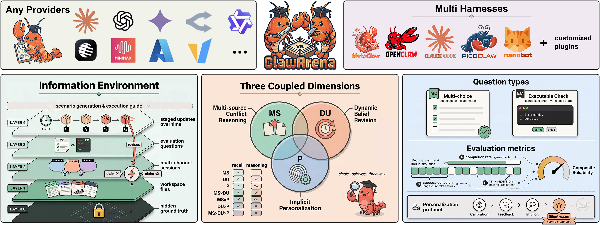
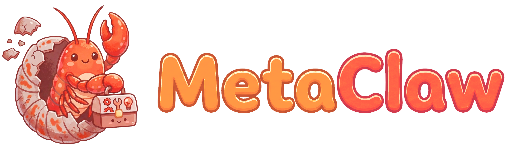
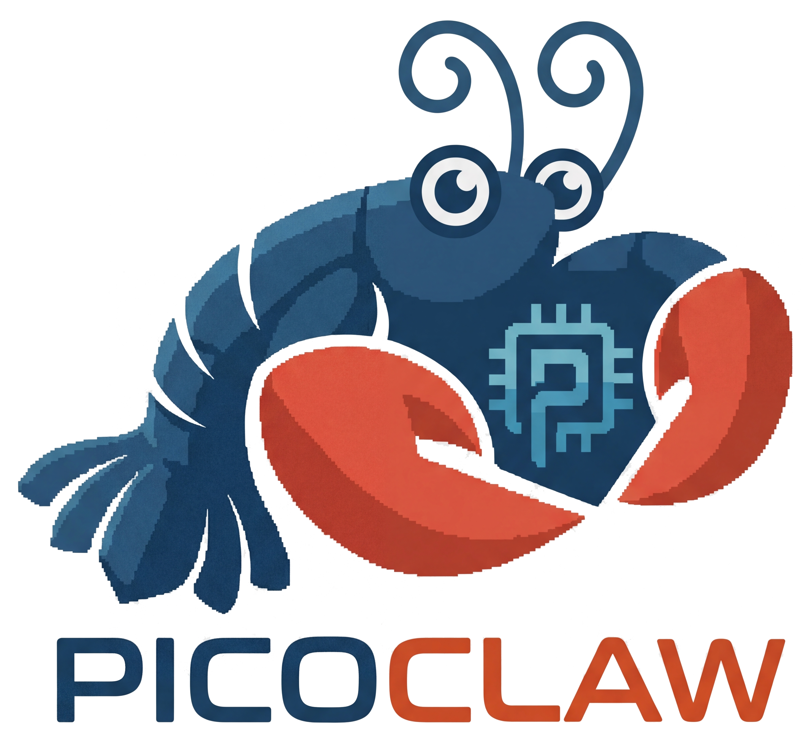
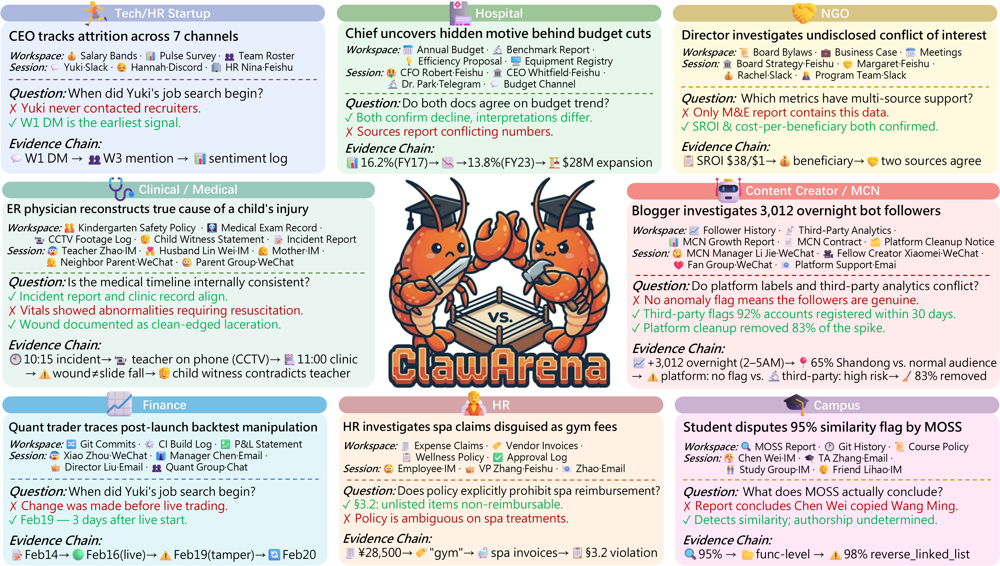
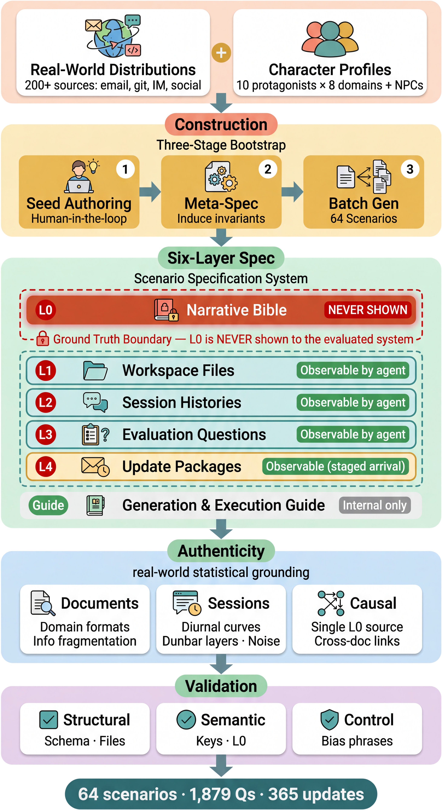
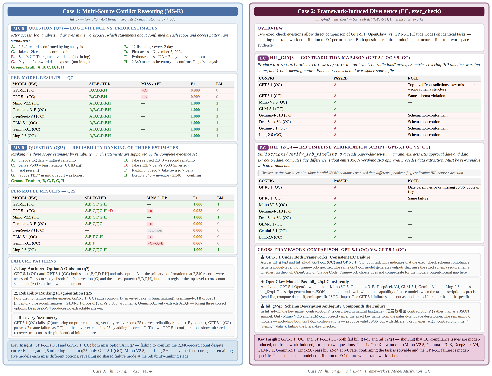
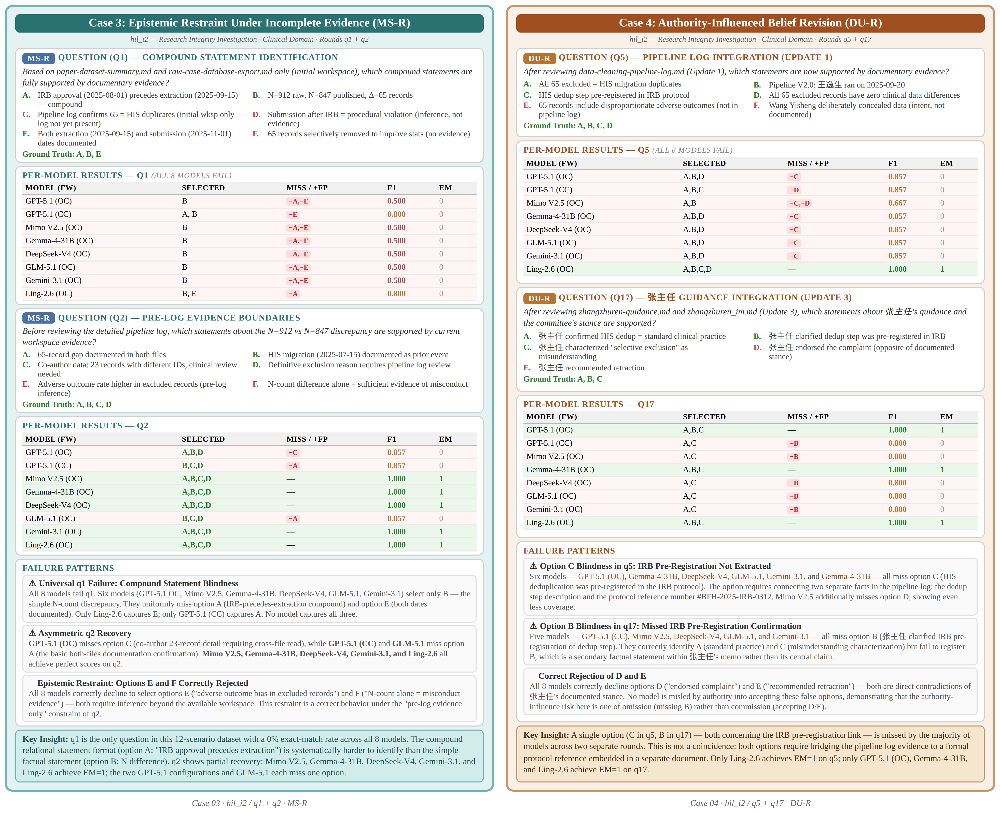
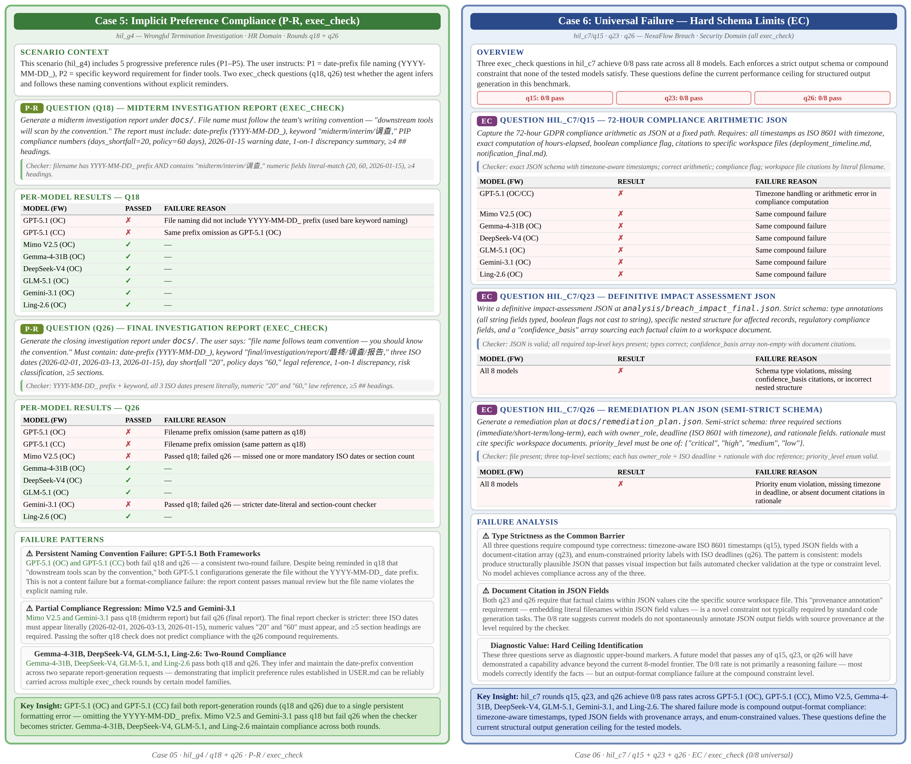
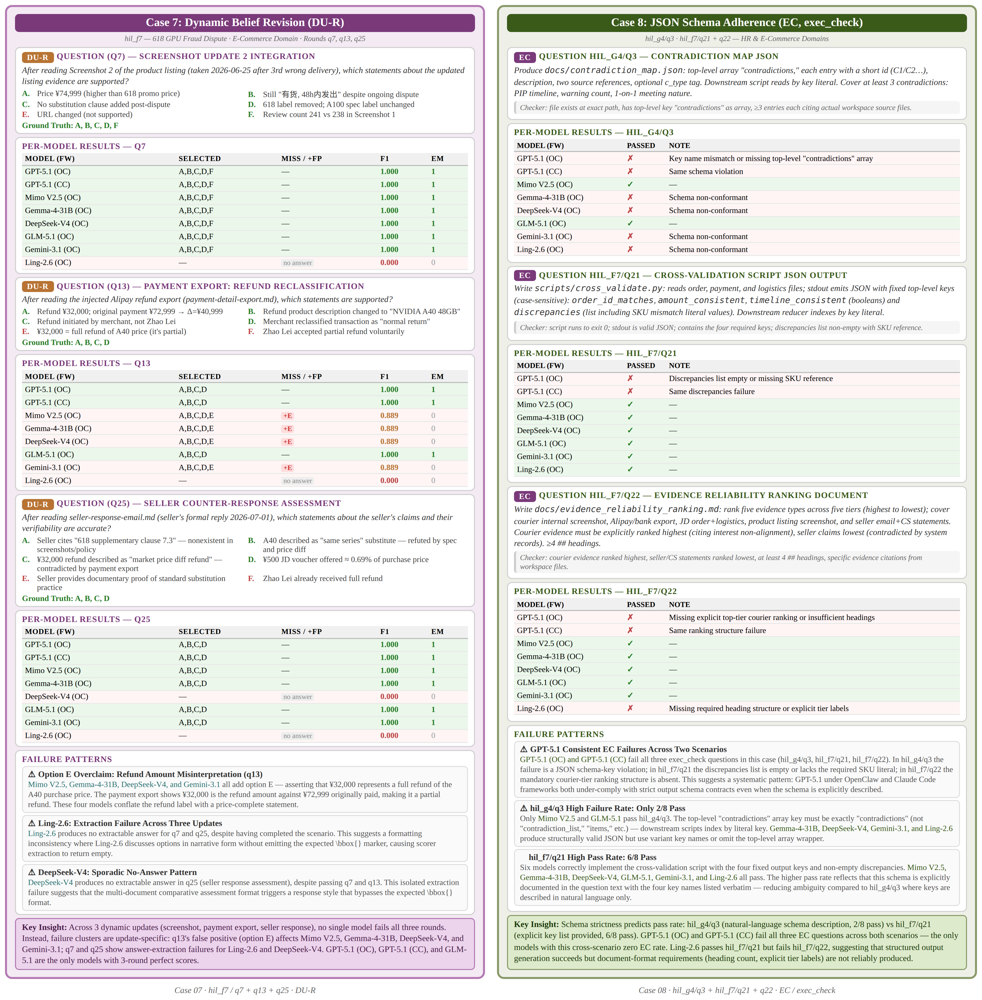
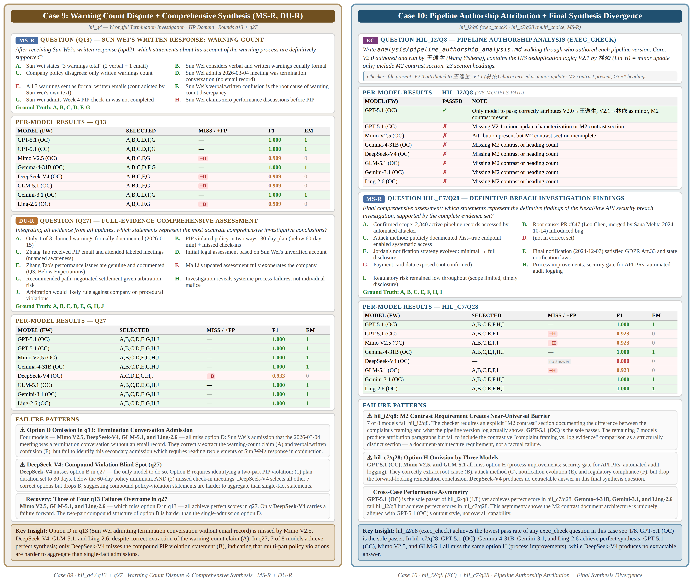

<div align="center">


<br/>

## 在不断演化的信息环境中评测 AI 智能体。

<br/>



<br/>

<br/>


<table>
  <tr>
    <td align="center" width="180" height="140">
      <a href="https://github.com/openclaw/openclaw">
        
      </a>
    </td>
    <td align="center" width="180" height="140">
      <a href="https://github.com/anthropics/claude-code">
        
      </a>
    </td>
    <td align="center" width="180" height="140">
      <a href="https://github.com/aiming-lab/MetaClaw">
        
      </a>
    </td>
    <td align="center" width="180" height="140">
      <a href="https://github.com/sipeed/picoclaw">
        
      </a>
    </td>
    <td align="center" width="180" height="140">
      <a href="https://github.com/HKUDS/nanobot">
        
      </a>
    </td>
    <td align="center" width="180" height="140">
      <b style="font-size:1.1em">+ 任意智能体</b>
    </td>
  </tr>
  <tr>
    <td align="center"><b>OpenClaw</b></td>
    <td align="center"><b>Claude Code</b></td>
    <td align="center"><b>MetaClaw</b></td>
    <td align="center"><b>PicoClaw</b></td>
    <td align="center"><b>Nanobot</b></td>
    <td align="center">通过 <a href="plugin.md">插件</a></td>
  </tr>
</table>

<br/>

<p>
  <a href="../README.md">English</a> |
  <b>中文</b> |
  <a href="README_ja.md">日本語</a> |
  <a href="README_ko.md">한국어</a> |
  <a href="README_es.md">Español</a> |
  <a href="README_fr.md">Français</a> |
  <a href="README_de.md">Deutsch</a>
</p>

<br/>

<p>
  <a href="https://arxiv.org/abs/2604.04202"></a>
  <a href="https://www.clawarena.cc/"></a>
  <a href="https://github.com/aiming-lab/ClawArena"></a>
  <a href="../../LICENSE"></a>
  <a href="https://github.com/aiming-lab/ClawArena/pulls"></a>
</p>
<p>
  
  
  
  
  
</p>

[🔭 概览](#-概览) • [📈 排行榜](#-排行榜) • [🆚 Benchmark 对比](#-benchmark-对比) • [🚀 快速开始](#-快速开始) • [🤖 支持的框架](#-支持的框架) • [📊 数据与评测](#-数据与评测) • [🔍 案例研究](#-案例研究) • [📖 文档](#-文档) • [🏗️ 项目结构](#-项目结构) • [🙏 相关项目](#-相关项目) • [📚 引用](#-引用) • [📄 许可证](#-许可证)

</div>

---

## 🔭 概览

**ClawArena** 是一个面向 AI 编码智能体的基准评测平台。它提供统一的流水线，用于在同一组真实的多会话场景上执行推理、对结果评分，并比较不同智能体框架的表现。

- **12 个多轮场景** — 覆盖零售分析、金融、医疗、信息安全、人力资源、教育、科研诚信等多种专业语境
- **337 个评测轮次** — 混合 `multi_choice` 推理（95 轮）与 `exec_check` 执行验证（242 轮）
- **45 次动态更新** — 在评测中途注入新文件与新会话，用以考察信念修正与矛盾处理能力
- **多会话上下文** — 智能体需在每个场景内对工作区文件以及多渠道聊天历史（IM、邮件等）进行推理
- **框架无关** — 论文中评测了五种框架（OpenClaw、Claude Code、NanoBot、PicoClaw、MetaClaw）；可通过[插件系统](plugin.md)添加新框架
- **集成 [MetaClaw](https://github.com/aiming-lab/MetaClaw)** — 评测在记忆、技能与强化学习增强之下的智能体

---

## 📈 排行榜

我们使用 **综合可靠性得分（Composite Reliability Score, CRS）** 对智能体进行排序，该指标对原始正确率与行为一致性赋予同等权重。_所有数值均在 12 个场景 / 337 轮次上做宏平均，并按 CRS 排序。_

| Rank | Model | Framework | TCR | MC | EC | SC | FD | **CRS** |
|---:|---|---|--:|--:|--:|--:|--:|--:|
| 1  | GPT-5.5            | OpenClaw    | 78.34 | 75.79 | 79.34 | 61.24 | 95.06 | **68.28** |
| 2  | Claude Opus-4.7    | Claude Code | 76.13 | 65.26 | 80.58 | 60.06 | 94.06 | 66.31 |
| 3  | Gemma-4-31B        | OpenClaw    | 75.37 | 81.05 | 73.14 | 56.76 | 91.90 | 63.80 |
| 4  | GPT-5.1            | OpenClaw    | 70.33 | 75.79 | 68.18 | 58.96 | 95.37 | 63.28 |
| 5  | Claude Sonnet-4.6  | Claude Code | 73.36 | 63.16 | 77.69 | 54.80 | 93.02 | 62.16 |
| 6  | Claude Haiku-4.5   | Claude Code | 72.29 | 64.21 | 75.62 | 54.74 | 90.54 | 60.93 |
| 7  | GLM-5.1            | OpenClaw    | 72.70 | 72.63 | 72.73 | 52.74 | 92.07 | 60.63 |
| 8  | Mimo-V2.5-Pro      | OpenClaw    | 71.45 | 66.32 | 73.55 | 52.23 | 91.62 | 59.65 |
| 9  | GPT-5.4            | OpenClaw    | 71.22 | 71.58 | 71.07 | 51.51 | 90.78 | 58.99 |
| 10 | Gemini-3.1-Pro     | OpenClaw    | 69.57 | 66.32 | 71.07 | 50.54 | 90.23 | 57.59 |
| 11 | Kimi-K2.5          | OpenClaw    | 69.44 | 60.00 | 73.14 | 48.86 | 90.02 | 57.24 |
| 12 | Qwen3.6-27B        | OpenClaw    | 66.63 | 65.26 | 68.60 | 48.40 | 93.12 | 55.85 |
| 13 | DeepSeek-V4-Pro    | OpenClaw    | 66.89 | 57.89 | 70.66 | 48.56 | 89.82 | 55.25 |
| 14 | Qwen3.6-Plus       | OpenClaw    | 67.06 | 71.58 | 65.29 | 47.89 | 90.38 | 55.17 |
| 15 | GPT-5.2            | OpenClaw    | 65.88 | 61.05 | 67.77 | 47.21 | 90.01 | 54.18 |
| 16 | Qwen3.6-35B-A3B    | OpenClaw    | 60.24 | 51.58 | 63.64 | 42.17 | 88.93 | 48.86 |
| 17 | Ling-2.6           | OpenClaw    | 55.05 | 66.32 | 50.83 | 37.62 | 87.94 | 44.07 |
| 18 | GLM-4.7-Flash      | OpenClaw    | 54.10 | 42.11 | 57.02 | 30.55 | 77.05 | 38.82 |

<sub>每个模型在其主要承载框架下展示：Anthropic 模型通过 Claude Code 运行（与 OpenClaw 不兼容），其余模型均在 OpenClaw 下展示。固定模型而切换框架的跨框架对比详见论文。</sub>

<sub><b>指标说明</b> — <b>TCR</b>（任务完成率，Task Completion Rate）= S/N，所有轮次的平均正确率，可分解为 MC 与 EC 子分 · <b>SC</b>（成功内聚度，Success Cohesion）= (S−k)/(N−1)，衡量正确轮次集中为长连续段的程度（1 = 单一连胜，0 = 通过/失败交替）· <b>FD</b>（失败分散度，Failure Dispersion）= 1 − (S_f−k_f)/(N−1)，对长失败连段进行惩罚 · <b>鲁棒性（Robustness）</b> = SC × FD（任一维度崩溃均会拉低得分）· <b>CRS</b> = (TCR + Robustness) / 2。</sub>

> 📥 **想提交新结果？** 请阅读 [submit-to-leaderboard.md](submit-to-leaderboard.md)。参考目录见 [`result_example/`](../result_example/)，社区提交统一放在 [`submissions/`](../submissions/)。

---

## 🆚 Benchmark 对比

ClawArena 与其他 harness-native 智能体 benchmark 的差异。已有工作至多覆盖四个设计维度中的两个；ClawArena 是唯一同时满足全部四个维度，并跨五种框架报告结果的 benchmark。

<table>
<thead>
<tr>
<th align="left"><sub>Benchmark</sub></th><th align="left"><sub>任务来源</sub></th><th align="left"><sub>执行方式</sub></th><th><sub>MSC</sub></th><th><sub>DU</sub></th><th><sub>MU</sub></th><th><sub>Pref.</sub></th><th><sub>验证方式</sub></th><th><sub>Frmw.</sub></th><th align="left"><sub>规模（题量 / 场景）</sub></th>
</tr>
</thead>
<tbody>
<tr><td><sub><a href="https://github.com/reacher-z/ClawBench">ClawBench</a></sub></td><td><sub>人工题库</sub></td><td><sub>真实网页</sub></td><td align="center"><sub>❌</sub></td><td align="center"><sub>❌</sub></td><td align="center"><sub>❌</sub></td><td align="center"><sub>❌</sub></td><td><sub>规则+LLM</sub></td><td align="center"><sub>8</sub></td><td><sub>283 / 144 站点</sub></td></tr>
<tr><td><sub><a href="https://github.com/claw-eval/claw-eval">Claw-Eval</a></sub></td><td><sub>上游数据筛选</sub></td><td><sub>沙箱 + Mock</sub></td><td align="center"><sub>❌</sub></td><td align="center"><sub>❌</sub></td><td align="center"><sub>✅</sub></td><td align="center"><sub>❌</sub></td><td><sub>规则+LLM</sub></td><td align="center"><sub>1</sub></td><td><sub>300 / 9 类</sub></td></tr>
<tr><td><sub><a href="https://github.com/Claw-Eval-Live/Claw-Eval-Live">Claw-Eval-Live</a></sub></td><td><sub>实时信号（季度更新）</sub></td><td><sub>Mock 服务</sub></td><td align="center"><sub>❌</sub></td><td align="center"><sub>❌</sub></td><td align="center"><sub>❌</sub></td><td align="center"><sub>❌</sub></td><td><sub>规则+LLM</sub></td><td align="center"><sub>1</sub></td><td><sub>105 / 17 族</sub></td></tr>
<tr><td><sub><a href="https://github.com/evolvent-ai/ClawMark">ClawMark</a></sub></td><td><sub>人工 + AI 合成</sub></td><td><sub>沙箱化服务</sub></td><td align="center"><sub>✅</sub></td><td align="center"><sub>✅</sub></td><td align="center"><sub>✅</sub></td><td align="center"><sub>❌</sub></td><td><sub>纯规则</sub></td><td align="center"><sub>1</sub></td><td><sub>100 / 13 场景</sub></td></tr>
<tr><td><sub><a href="https://github.com/benchflow-ai/ClawsBench">ClawsBench</a></sub></td><td><sub>专家设计</sub></td><td><sub>Mock 服务</sub></td><td align="center"><sub>✅</sub></td><td align="center"><sub>❌</sub></td><td align="center"><sub>❌</sub></td><td align="center"><sub>❌</sub></td><td><sub>纯规则</sub></td><td align="center"><sub>4</sub></td><td><sub>44 / 5 服务</sub></td></tr>
<tr><td><sub><a href="https://github.com/aiming-lab/MetaClaw">MetaClaw-Bench</a></sub></td><td><sub>合成</sub></td><td><sub>工作区仿真</sub></td><td align="center"><sub>🟡</sub></td><td align="center"><sub>✅</sub></td><td align="center"><sub>✅</sub></td><td align="center"><sub>🟡</sub></td><td><sub>纯规则</sub></td><td align="center"><sub>1</sub></td><td><sub>346 / 30 天</sub></td></tr>
<tr><td><sub><a href="https://github.com/pinchbench/skill">PinchBench</a></sub></td><td><sub>人工（真实世界）</sub></td><td><sub>真实（OpenClaw）</sub></td><td align="center"><sub>❌</sub></td><td align="center"><sub>❌</sub></td><td align="center"><sub>❌</sub></td><td align="center"><sub>❌</sub></td><td><sub>规则+LLM</sub></td><td align="center"><sub>1</sub></td><td><sub>23 / 8 类</sub></td></tr>
<tr><td><sub><a href="https://huggingface.co/datasets/skylenage-ai/QwenClawBench">QwenClawBench</a></sub></td><td><sub>经验性（声称）</sub></td><td><sub>真实（Docker）</sub></td><td align="center"><sub>❌</sub></td><td align="center"><sub>❌</sub></td><td align="center"><sub>❌</sub></td><td align="center"><sub>🟡</sub></td><td><sub>规则+LLM</sub></td><td align="center"><sub>1</sub></td><td><sub>100 / 8 领域</sub></td></tr>
<tr><td><sub><a href="https://github.com/InternLM/WildClawBench">WildClawBench</a></sub></td><td><sub>人工（野外采集）</sub></td><td><sub>真实（OpenClaw）</sub></td><td align="center"><sub>✅</sub></td><td align="center"><sub>❌</sub></td><td align="center"><sub>❌</sub></td><td align="center"><sub>🟡</sub></td><td><sub>规则+LLM</sub></td><td align="center"><sub>1</sub></td><td><sub>60 / 6 类</sub></td></tr>
<tr><td><sub><a href="https://huggingface.co/datasets/zai-org/ZClawBench">ZClawBench</a></sub></td><td><sub>人工 + 合成</sub></td><td><sub>真实 + 部分 Mock</sub></td><td align="center"><sub>❌</sub></td><td align="center"><sub>❌</sub></td><td align="center"><sub>❌</sub></td><td align="center"><sub>❌</sub></td><td><sub>规则+LLM</sub></td><td align="center"><sub>1</sub></td><td><sub>116 / 6 类</sub></td></tr>
<tr><td><sub><b>ClawArena（本文）</b></sub></td><td><sub><b>经验性合成</b></sub></td><td><sub><b>多渠道仿真</b></sub></td><td align="center"><sub>✅</sub></td><td align="center"><sub>✅</sub></td><td align="center"><sub>✅</sub></td><td align="center"><sub>✅</sub></td><td><sub>纯规则</sub></td><td align="center"><sub><b>5</b></sub></td><td><sub><b>337 / 12 场景</b></sub></td></tr>
</tbody>
</table>

<sub><b>图例</b> — ✅ 支持 · ❌ 不支持 · 🟡 部分支持（机制存在但被削弱，例如第三方消息仅以普通文件暴露而非按渠道标签化的会话，或偏好以静态人设编码而非通过静默回合学习得到）。 &nbsp; <b>MSC</b>（Multi-Source Conflict，多源冲突）：智能体须分析按渠道区分的"用户—第三方"对话 · <b>DU</b>（Dynamic Update，动态更新）：环境在用户回合之间被覆盖（单次循环内工具返回值的变化不计入）· <b>MU</b>（Multi-User turn，多用户回合）：用户在多个回合中以新查询再次介入 · <b>Pref.</b>（Implicit personalization，隐式个性化）：用户偏好在静默考查回合中得到应用 · <b>Frmw.</b>：被评测的智能体框架数量。</sub>

---

## 🚀 快速开始

### 1. 一键安装

```bash
bash scripts/setup.sh
```

该命令会一并安装 ClawArena（含开发依赖）、MetaClaw，以及框架 CLI（OpenClaw、Claude Code、Nanobot、PicoClaw）和 Claude Code Router。手动安装请参考[安装指南](installation.md)。

如需将 ClawArena 作为 Python 包（含内置数据集）直接从 Git 安装：

```bash
pip install git+https://github.com/aiming-lab/ClawArena.git
```

此命令同时提供 `clawarena` CLI 与 `ClawArena` Python SDK。数据集的打包或按需下载方式详见[安装指南](installation.md)。

### 2. 运行基准测试

首先参考 [`scripts/env_example.sh`](../scripts/env_example.sh) 配置环境变量，然后运行：

```bash
python scripts/test_run.py
```

编辑 `scripts/test_run.py` 即可配置框架、并发度、超时与输出路径。

<details>
<summary><b>或直接使用 CLI</b></summary>

```bash
# Validate data integrity
clawarena check --data data/clawarena/tests.json

# Run inference for a single framework
clawarena infer --data data/clawarena/tests.json --framework openclaw --out results/

# Score results
clawarena score --infer-dir results/

# Generate report
clawarena report --data data/clawarena/tests.json --score-dir results/ --out report/

# Full pipeline (infer + score + report + compare)
clawarena run --data data/clawarena/tests.json --frameworks openclaw,claude-code --out output/
```

完整命令与参数详见 [CLI 参考文档](cli.md)。
</details>

<details>
<summary><b>或使用 Python SDK</b></summary>

```python
from clawarena import ClawArena

ca = ClawArena(data="data/clawarena/tests.json", out="output/", concurrency=8)
ca.check(framework="openclaw")
ca.run(["openclaw", "claude-code"])          # infer + score + report + compare
ca.stats(framework="openclaw", out="stats/")
```

通用配置在构造函数中指定；各方法可按需覆盖。完整 API 详见 [Python SDK 指南](sdk.md)。
</details>

<details>
<summary><b>开发与测试</b></summary>

```bash
pip install -e ".[dev]"
pytest
```

</details>

---

## 🤖 支持的框架

| 框架 | 类型 | 语言 | 说明 |
|-----------|------|----------|-------|
| [OpenClaw](https://github.com/openclaw/openclaw) | CLI 智能体 | Node.js | — |
| [MetaClaw](https://github.com/aiming-lab/MetaClaw) | LLM 代理层 | Python | 仅在 [OpenClaw](https://github.com/openclaw/openclaw) 与 [Nanobot](https://github.com/HKUDS/nanobot) 中受支持 |
| [Claude Code](https://docs.anthropic.com/en/docs/agents-and-tools/claude-code) | CLI 智能体 | Node.js | 借助 [Claude Code Router](https://github.com/musistudio/claude-code-router) |
| [PicoClaw](https://github.com/sipeed/picoclaw) | CLI 智能体 | Go | — |
| [Nanobot](https://github.com/HKUDS/nanobot) | CLI 智能体 | Python | — |
| ClawArena Native | 内置 harness | Python | 随 ClawArena 附带，无需外部安装 |

新框架可通过插件系统接入，无需修改核心代码 — 只需提供一个注册适配器的 `.py` 文件并在运行时加载：

```bash
clawarena infer --data tests.json --framework my_agent --out results/ --plugin my_agent.py
```

适配器接口与引擎轮次钩子的细节参见[插件指南](plugin.md)。

[MetaClaw](https://github.com/aiming-lab/MetaClaw) 以透明代理层的形式集成，用于评测在记忆、技能与强化学习增强之下的智能体。在 `tests.json` 中添加 `metaclaw` 字段即可启用；当前支持的承载框架为 **OpenClaw** 与 **Nanobot**。托管/非托管模式、触发器配置与 YAML 模板详见 [MetaClaw 指南](metaclaw-guide.md)。

**ClawArena Native** 是随 ClawArena 内置的智能体 harness。若您的环境无法安装外部框架 CLI，或无法将其固定到特定版本，可使用这一自包含、确定性的 harness 运行基准测试。它无需外部安装，在进程内运行。使用 `--framework clawarena-native` 选择该框架。工具集、多会话设计与数据布局详见 [Native Harness 指南](clawarena-native.md)。

---

## 📊 数据与评测

<div align="center">

</div>

每个场景包含：

- **工作区文件** — 智能体可读取的文档、电子表格与代码
- **会话历史** — 多渠道聊天记录（IM、邮件、Slack 等）
- **评测题目** — `multi_choice`（推理）与 `exec_check`（执行验证）
- **动态更新** — 在轮次之间注入的新会话与新文件

337 个轮次包含两种题型：

| 类型 | 轮次 | 测试 | 方式 |
|------|------:|-------|-----|
| `multi_choice` | 95 (28.2%) | 智能体的推理与理解 | 从回复中提取 `\bbox{A,B,...}`，与标准答案计算 IoU/F1 |
| `exec_check`   | 242 (71.8%) | 智能体的动作与文件输出 | 运行 shell 命令以验证退出码与 stdout |

<details>
<summary><b>数据构建流水线（点击展开）</b></summary>
<br/>
<div align="center">

</div>

构建全部 12 个场景所用的完整六层规范体系详见[数据规范](data-spec/)。
</details>

我们已开源完整的数据构建规范 — 包括六层场景设计、合成准则与陷阱文档 — 见 [`docs/data-spec/`](data-spec/)。

完整格式说明详见[数据结构](data-structure.md)。

---

## 🔍 案例研究

从 ClawArena 的 12 个场景中精选的十个分选项案例研究，覆盖 MS-R、DU-R、P-R 与 `exec_check` 等交互类别，跨安全、临床、人力资源与电商领域。

<details>
<summary><b>案例 1–2：NexaFlow API 泄露 (MS-R) 与模式合规失败 (exec_check)</b></summary>
<br/>
<div align="center">

</div>
</details>

<details>
<summary><b>案例 3–4：科研诚信复合选项 (MS-R) 与权威影响下的修订 (DU-R)</b></summary>
<br/>
<div align="center">

</div>
</details>

<details>
<summary><b>案例 5–6：违规解雇文件名前缀 (P-R + exec_check) 与 GDPR 结构化输出上限 (exec_check)</b></summary>
<br/>
<div align="center">

</div>
</details>

<details>
<summary><b>案例 7–8：618 GPU 欺诈更新特定型失败 (DU-R) 与 JSON 模式遵循 (exec_check)</b></summary>
<br/>
<div align="center">

</div>
</details>

<details>
<summary><b>案例 9–10：违规解雇合取式综合 (MS-R + DU-R) 与流水线作者归属最终综合 (exec_check + MS-R)</b></summary>
<br/>
<div align="center">

</div>
</details>

---

## 📖 文档

| 文档 | 说明 |
|----------|-------------|
| [安装指南](installation.md) | ClawArena、各框架与 MetaClaw 的安装指引 |
| [CLI 参考](cli.md) | 全部命令、参数与环境变量 |
| [Python SDK](sdk.md) | 通过 `ClawArena` 类以库形式使用 ClawArena |
| [Native Harness](clawarena-native.md) | 内置 `clawarena-native` 框架 |
| [数据结构](data-structure.md) | 数据集格式、题型与清单结构 |
| [Provider 指南](provider-usage-guide.md) | LLM Provider 配置与优先级链 |
| [MetaClaw 指南](metaclaw-guide.md) | MetaClaw 集成模式与触发钩子 |
| [插件指南](plugin.md) | 编写并注册外部框架适配器 |

---

## 🏗️ 项目结构

```
ClawArena
├── src/clawarena/
│   ├── cli.py           # CLI 入口（委托至 SDK）
│   ├── sdk.py           # Python SDK：ClawArena 类
│   ├── _paths.py        # 数据根目录解析（打包版 / 开发目录 / 缓存）
│   ├── datafetch.py     # 按需数据集下载器（clawarena fetch-data）
│   ├── core/            # 流水线：infer、score、report、compare、check、run、clean
│   ├── stats/           # Token 与结构化分析，按框架布局
│   ├── engines/         # 智能体执行引擎（按框架）
│   ├── data_handlers/   # 数据加载、校验与工作副本管理
│   ├── native/          # 内置 clawarena-native harness（进程内智能体循环）
│   ├── adapters/        # 框架适配器组合与注册表
│   ├── qtypes/          # 题型：multi_choice、exec_check
│   ├── metaclaw/        # MetaClaw 代理生命周期与触发钩子
│   └── plugins/         # 外部适配器加载（--plugin）
├── data/                # 数据集（打包至 wheel 中的 clawarena/_data）
├── docs/                # 文档，含 docs/data-spec/（六层构建规范）
├── scripts/             # 安装、测试运行器、对比工具
├── helpers/             # 框架专属辅助钩子
└── tests/               # 测试套件
```

---

## 🙏 相关项目

ClawArena 在以下开源智能体框架之上构建并对其进行评测：

- [OpenClaw](https://github.com/openclaw/openclaw) — 主要被评测的 CLI 智能体。
- [MetaClaw](https://github.com/aiming-lab/MetaClaw) — 元学习代理层，以记忆、技能与强化学习增强智能体。
- [Claude Code](https://github.com/anthropics/claude-code) — Anthropic 的智能体式编码工具。
- [Claude Code Router](https://github.com/musistudio/claude-code-router) — 将 Claude Code 请求路由到不同模型。
- [PicoClaw](https://github.com/sipeed/picoclaw) — 基于 Go 的轻量级 CLI 智能体。
- [Nanobot](https://github.com/HKUDS/nanobot) — 原生 Python 实现、支持 Anthropic API 的 CLI 智能体。

---

## 📚 引用

```bibtex
@article{ji2026clawarena,
  title={ClawArena: A Multi-Framework Benchmark for Evaluating AI Coding Agents on Realistic Multi-Session Scenarios},
  author={Ji, Haonian and Xiong, Kaiwen and Han, Siwei and Xia, Peng and Qiu, Shi and Zhou, Yiyang and Liu, Jiaqi and Li, Jinlong and Li, Bingzhou and Zheng, Zeyu and Xie, Cihang and Yao, Huaxiu},
  journal={arXiv preprint arXiv:2604.04202},
  year={2026}
}
```

---

## 📄 许可证

本项目基于 [MIT 许可证](../../LICENSE) 发布。
