# ClawArena-Real — Stats Report (clawarena-native)

_Tokenizer: `cl100k_base`_

## 1. Overall Summary

- **Scenarios:** 23
- **Total rounds:** 377
- **Rounds with pref:** 257 (68.2%)
- **Rounds with updates:** 52 (13.8%)
- **Total updates:** 93 (230 files)
- **Total tokens:** 7,679,335

## 2. Token Distribution

| Category | Tokens | % |
|----------|-------:|--:|
| Main Session | 10,684 | 0.1% |
| History Sessions | 42,954 | 0.6% |
| Workspace | 4,173,971 | 54.4% |
| Questions | 53,028 | 0.7% |
| Feedback | 35,237 | 0.5% |
| Pref | 15,025 | 0.2% |
| Update (Session) | 13,928 | 0.2% |
| Update (Workspace) | 3,334,508 | 43.4% |
| **Total** | **7,679,335** | **100.0%** |

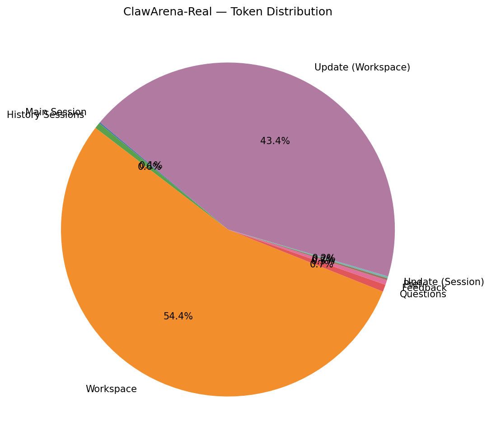

## 3. Question Statistics

### 3.1 Type Distribution

| Type | Count | % |
|------|------:|--:|
| exec_check | 377 | 100.0% |

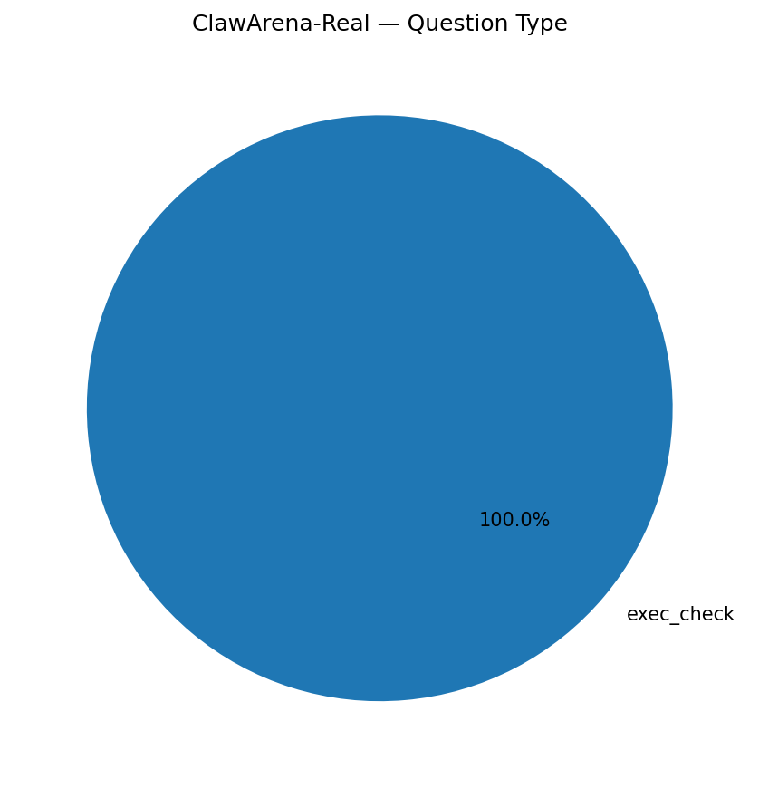

### 3.3 EC Features

| Feature | Rounds | Coverage |
|---------|-------:|---------:|
| expect_exit | 377 | 100.0% |
| expect_stdout | 0 | 0.0% |
| regex matching | 0 | 0.0% |
| timeout | 377 | 100.0% |

_Timeout (s) — mean 30.9, min 30.0, max 60.0._

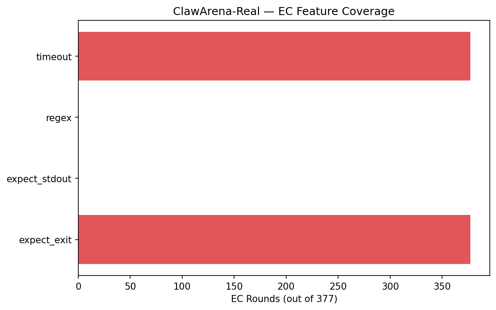

### 3.4 Pref Coverage

- **Rounds with pref:** 257 (68.2%)

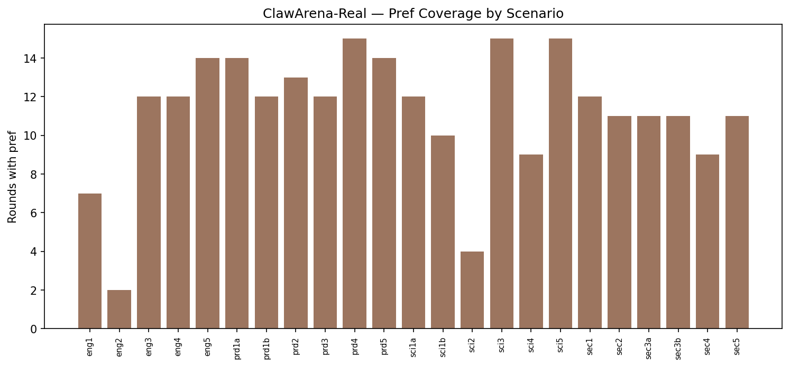

## 4. Update Statistics

### 4.1 Type Distribution

| Type | Count | % |
|------|------:|--:|
| session | 40 | 43.0% |
| workspace | 53 | 57.0% |

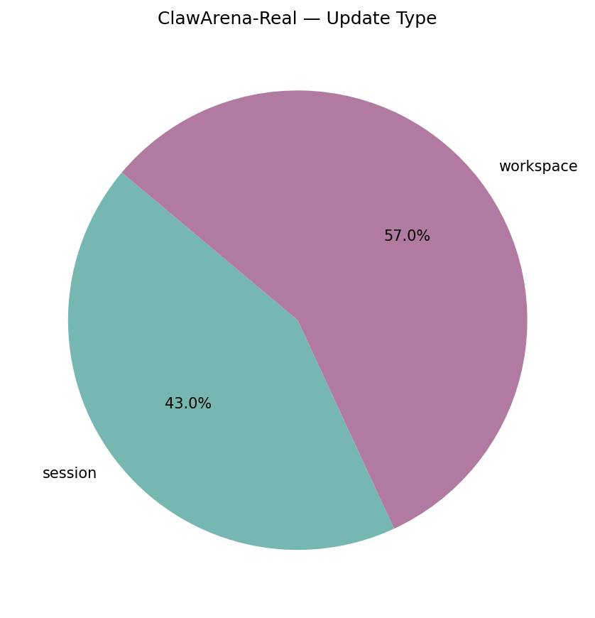

### 4.2 Action Distribution

| Action | Files | % |
|--------|------:|--:|
| append | 37 | 16.1% |
| new | 193 | 83.9% |

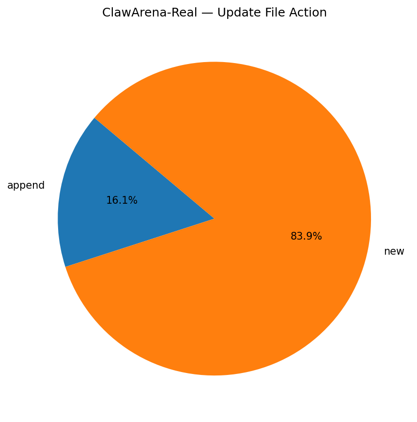

### 4.3 Files per Update

- **Mean:** 2.47, **Min:** 1, **Max:** 10
- **Total update files:** 230

## 5. Per-Scenario Breakdown

| Scenario | Rounds | MC | EC | w/Pref | w/Upd | Updates | UpdFiles | WSFiles | Tokens |
|----------|-------:|---:|---:|-------:|------:|--------:|---------:|--------:|-------:|
| eng1 | 15 | 0 | 15 | 7 | 2 | 3 | 6 | 44 | 310,700 |
| eng2 | 16 | 0 | 16 | 2 | 2 | 4 | 6 | 17 | 344,923 |
| eng3 | 17 | 0 | 17 | 12 | 2 | 4 | 12 | 32 | 292,128 |
| eng4 | 14 | 0 | 14 | 12 | 2 | 4 | 18 | 25 | 298,457 |
| eng5 | 16 | 0 | 16 | 14 | 2 | 4 | 5 | 30 | 261,694 |
| prd1a | 17 | 0 | 17 | 14 | 2 | 4 | 7 | 32 | 252,736 |
| prd1b | 16 | 0 | 16 | 12 | 2 | 3 | 8 | 30 | 529,396 |
| prd2 | 16 | 0 | 16 | 13 | 3 | 6 | 16 | 34 | 265,872 |
| prd3 | 18 | 0 | 18 | 12 | 2 | 2 | 8 | 25 | 164,672 |
| prd4 | 17 | 0 | 17 | 15 | 2 | 4 | 7 | 23 | 277,763 |
| prd5 | 16 | 0 | 16 | 14 | 2 | 4 | 7 | 31 | 364,345 |
| sci1a | 17 | 0 | 17 | 12 | 2 | 4 | 13 | 40 | 454,200 |
| sci1b | 16 | 0 | 16 | 10 | 2 | 4 | 9 | 38 | 533,777 |
| sci2 | 17 | 0 | 17 | 4 | 2 | 4 | 12 | 28 | 257,175 |
| sci3 | 17 | 0 | 17 | 15 | 2 | 4 | 8 | 29 | 442,990 |
| sci4 | 16 | 0 | 16 | 9 | 3 | 6 | 14 | 29 | 436,629 |
| sci5 | 16 | 0 | 16 | 15 | 3 | 6 | 14 | 31 | 205,377 |
| sec1 | 17 | 0 | 17 | 12 | 3 | 6 | 17 | 26 | 324,689 |
| sec2 | 16 | 0 | 16 | 11 | 2 | 4 | 10 | 30 | 465,674 |
| sec3a | 16 | 0 | 16 | 11 | 3 | 3 | 8 | 30 | 491,440 |
| sec3b | 16 | 0 | 16 | 11 | 3 | 3 | 10 | 34 | 284,559 |
| sec4 | 18 | 0 | 18 | 9 | 2 | 4 | 7 | 40 | 183,541 |
| sec5 | 17 | 0 | 17 | 11 | 2 | 3 | 8 | 33 | 236,598 |

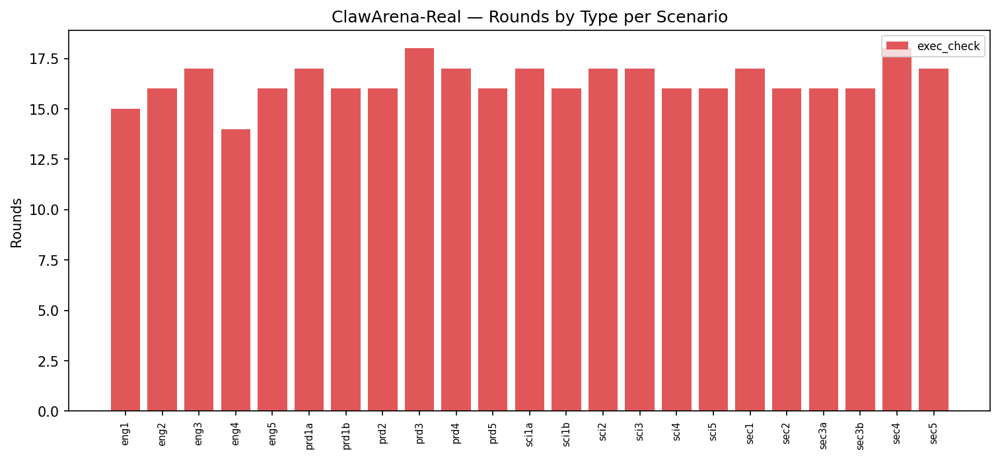

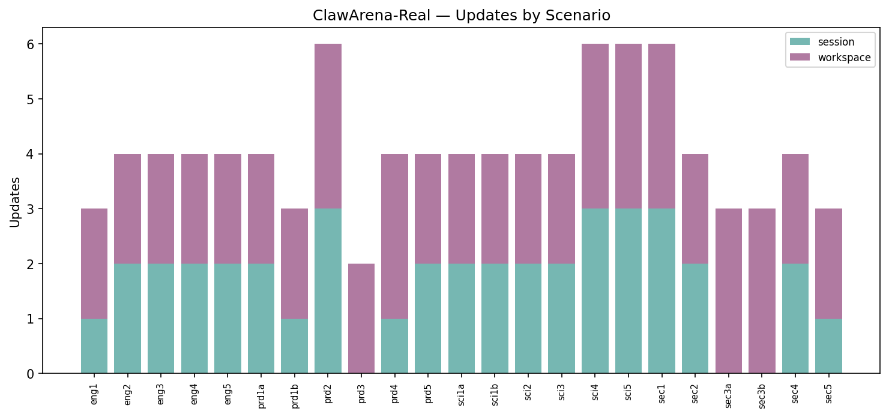

## 6. Per-Scenario Token Detail

| Scenario | Main Session | History Sessions | Workspace | Questions | Feedback | Pref | Update (Session) | Update (Workspace) | Total |
|----------|------:|------:|------:|------:|------:|------:|------:|------:|------:|
| eng1 | 542 | 2,298 | 206,080 | 1,712 | 1,228 | 395 | 288 | 98,157 | 310,700 |
| eng2 | 388 | 1,272 | 252,618 | 1,741 | 1,083 | 169 | 348 | 87,304 | 344,923 |
| eng3 | 406 | 1,753 | 120,910 | 2,273 | 1,593 | 665 | 1,838 | 162,690 | 292,128 |
| eng4 | 371 | 1,842 | 169,267 | 1,911 | 1,080 | 607 | 871 | 122,508 | 298,457 |
| eng5 | 356 | 1,759 | 178,124 | 2,088 | 1,218 | 813 | 453 | 76,883 | 261,694 |
| prd1a | 477 | 2,318 | 140,365 | 2,545 | 1,707 | 868 | 1,150 | 103,306 | 252,736 |
| prd1b | 513 | 2,076 | 197,318 | 2,742 | 1,782 | 786 | 538 | 323,641 | 529,396 |
| prd2 | 477 | 1,721 | 111,478 | 2,708 | 1,479 | 790 | 775 | 146,444 | 265,872 |
| prd3 | 449 | 2,064 | 103,705 | 2,950 | 1,938 | 833 | 0 | 52,733 | 164,672 |
| prd4 | 460 | 2,627 | 130,483 | 2,271 | 1,655 | 868 | 289 | 139,110 | 277,763 |
| prd5 | 284 | 1,414 | 241,006 | 2,145 | 1,563 | 788 | 432 | 116,713 | 364,345 |
| sci1a | 493 | 1,517 | 299,404 | 2,431 | 1,625 | 692 | 489 | 147,549 | 454,200 |
| sci1b | 412 | 1,114 | 251,422 | 2,083 | 1,425 | 565 | 694 | 276,062 | 533,777 |
| sci2 | 485 | 2,217 | 150,246 | 1,566 | 1,475 | 246 | 843 | 100,097 | 257,175 |
| sci3 | 760 | 1,627 | 348,999 | 2,919 | 1,646 | 799 | 758 | 85,482 | 442,990 |
| sci4 | 488 | 2,010 | 279,857 | 2,118 | 1,493 | 532 | 870 | 149,261 | 436,629 |
| sci5 | 490 | 2,343 | 100,443 | 2,193 | 1,890 | 847 | 981 | 96,190 | 205,377 |
| sec1 | 534 | 2,124 | 149,396 | 2,496 | 1,453 | 588 | 737 | 167,361 | 324,689 |
| sec2 | 501 | 1,590 | 133,830 | 2,005 | 1,510 | 655 | 804 | 324,779 | 465,674 |
| sec3a | 513 | 1,637 | 219,646 | 2,128 | 1,500 | 734 | 0 | 265,282 | 491,440 |
| sec3b | 546 | 1,826 | 127,444 | 1,945 | 1,493 | 625 | 0 | 150,680 | 284,559 |
| sec4 | 373 | 1,981 | 111,587 | 3,014 | 1,514 | 464 | 598 | 64,010 | 183,541 |
| sec5 | 366 | 1,824 | 150,343 | 3,044 | 1,887 | 696 | 172 | 78,266 | 236,598 |

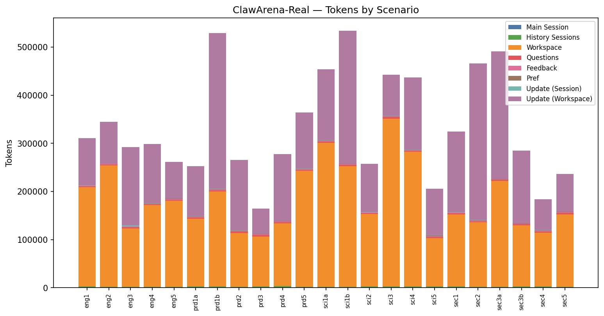

## 7. Top-N Rankings

### Top 10 by Tokens

| Rank | Scenario | Tokens |
|-----:|----------|------:|
| 1 | sci1b | 533,777 |
| 2 | prd1b | 529,396 |
| 3 | sec3a | 491,440 |
| 4 | sec2 | 465,674 |
| 5 | sci1a | 454,200 |
| 6 | sci3 | 442,990 |
| 7 | sci4 | 436,629 |
| 8 | prd5 | 364,345 |
| 9 | eng2 | 344,923 |
| 10 | sec1 | 324,689 |

### Top 10 by Rounds

| Rank | Scenario | Rounds |
|-----:|----------|------:|
| 1 | prd3 | 18 |
| 2 | sec4 | 18 |
| 3 | eng3 | 17 |
| 4 | prd1a | 17 |
| 5 | prd4 | 17 |
| 6 | sci1a | 17 |
| 7 | sci2 | 17 |
| 8 | sci3 | 17 |
| 9 | sec1 | 17 |
| 10 | sec5 | 17 |

### Top 10 by Updates

| Rank | Scenario | Updates |
|-----:|----------|------:|
| 1 | prd2 | 6 |
| 2 | sci4 | 6 |
| 3 | sci5 | 6 |
| 4 | sec1 | 6 |
| 5 | eng2 | 4 |
| 6 | eng3 | 4 |
| 7 | eng4 | 4 |
| 8 | eng5 | 4 |
| 9 | prd1a | 4 |
| 10 | prd4 | 4 |

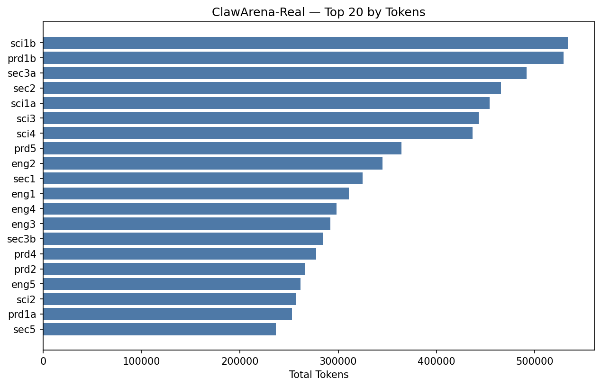

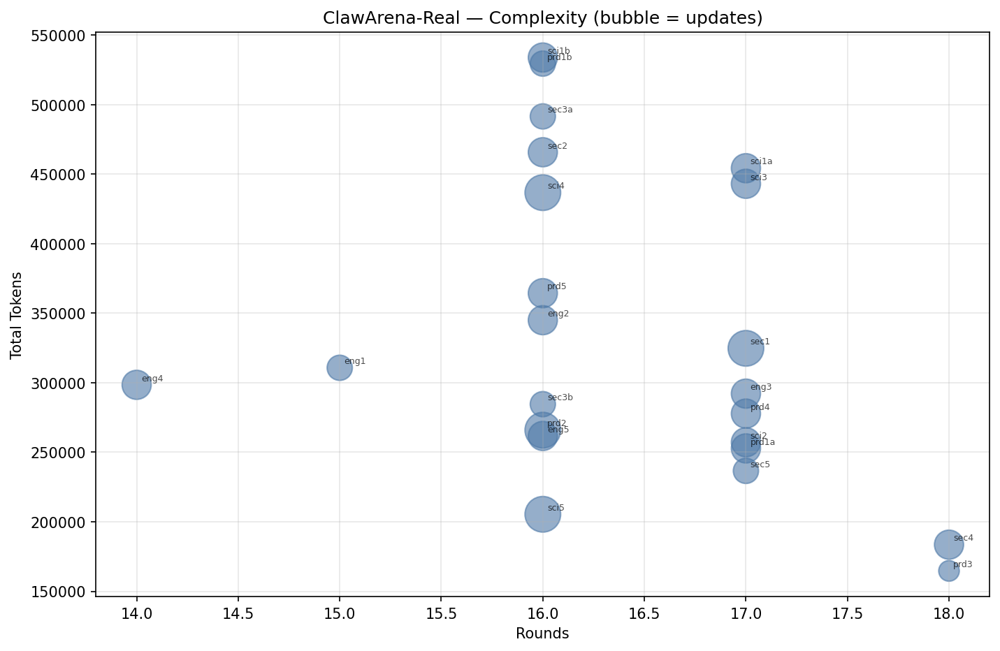

