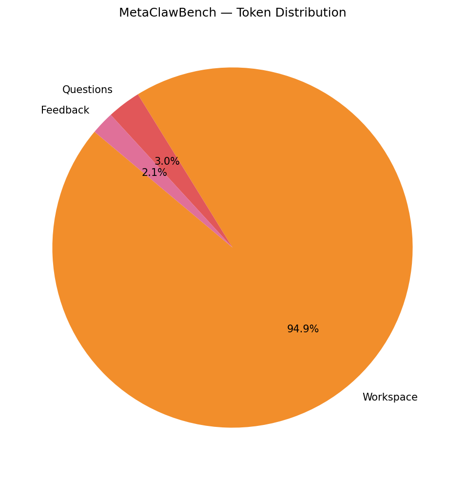
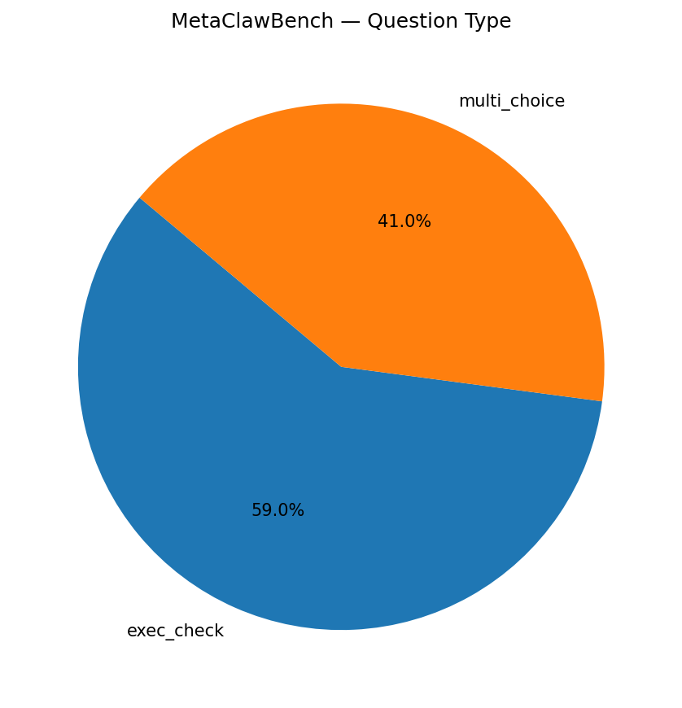
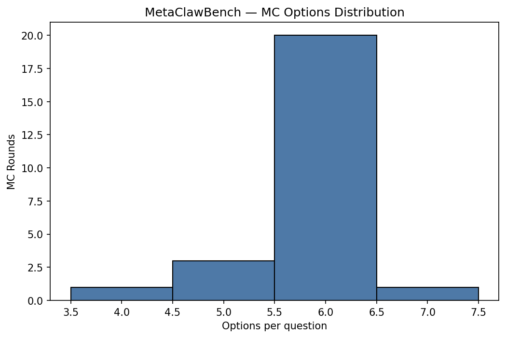
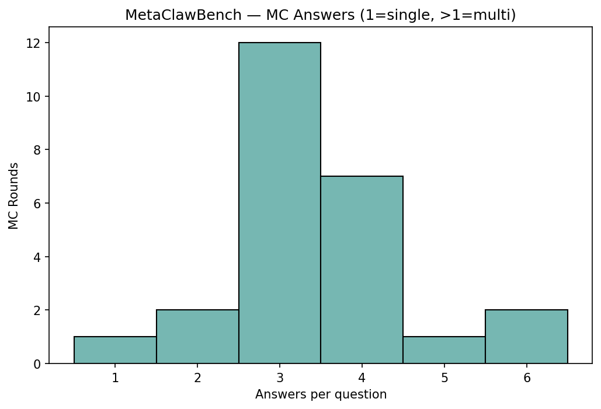
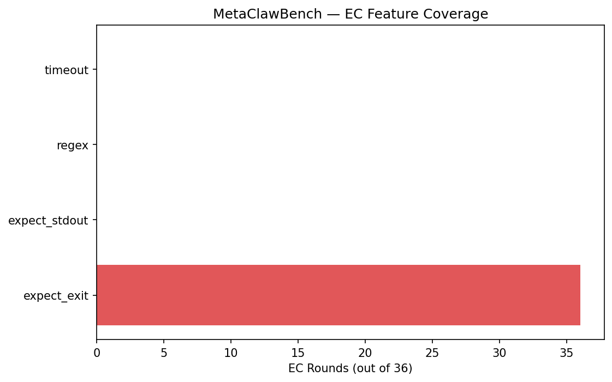
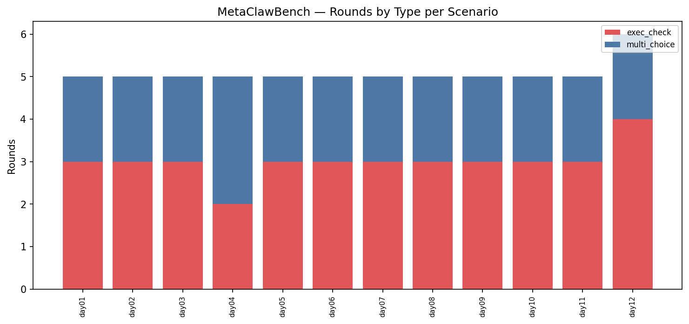
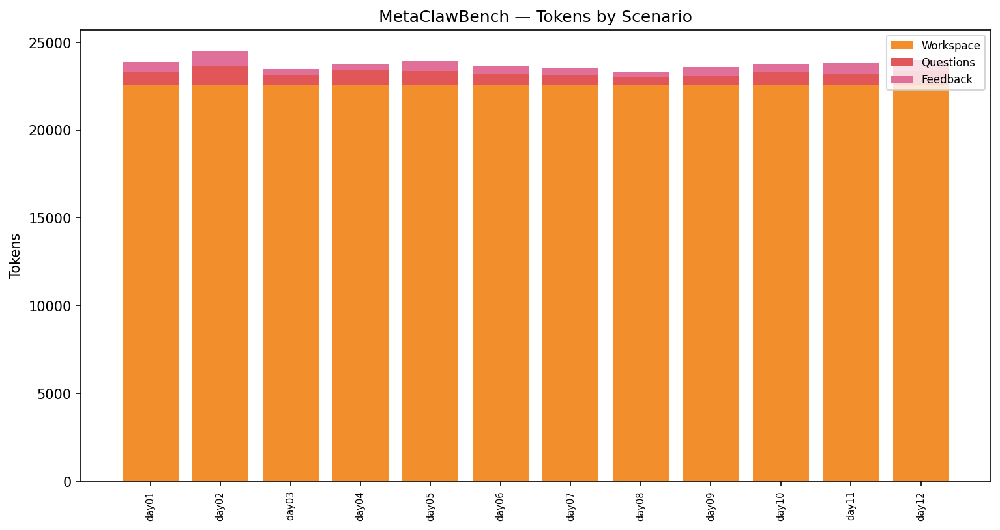
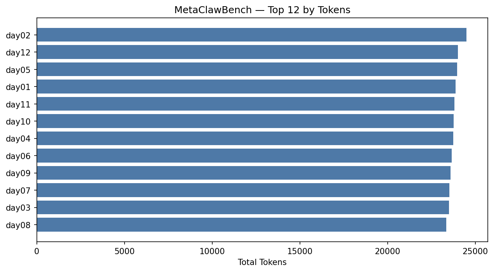
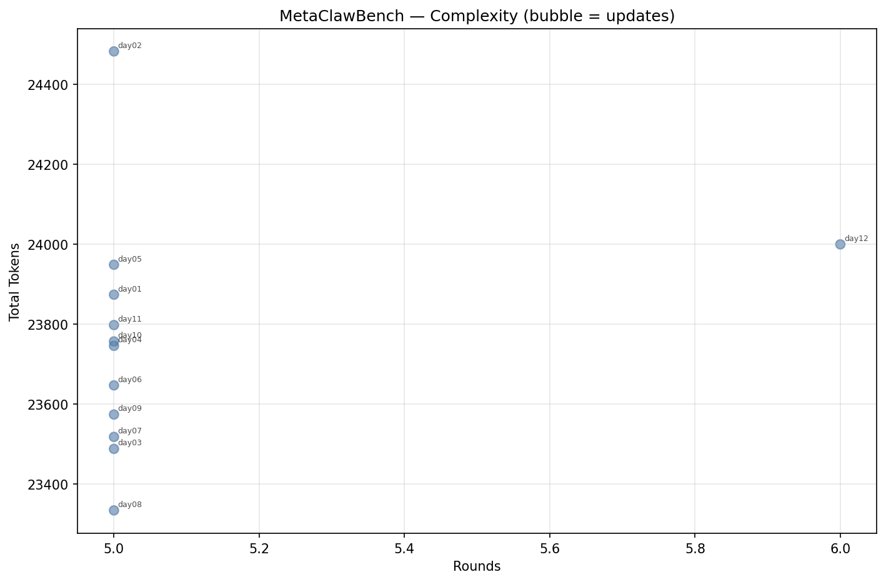

# MetaClawBench — Stats Report (openclaw)

_Tokenizer: `cl100k_base`_

## 1. Overall Summary

- **Scenarios:** 12
- **Total rounds:** 61
- **Rounds with pref:** 0 (0.0%)
- **Rounds with updates:** 0 (0.0%)
- **Total updates:** 0 (0 files)
- **Total tokens:** 285,168

## 2. Token Distribution

| Category | Tokens | % |
|----------|-------:|--:|
| Main Session | 0 | 0.0% |
| History Sessions | 0 | 0.0% |
| Workspace | 270,672 | 94.9% |
| Questions | 8,581 | 3.0% |
| Feedback | 5,915 | 2.1% |
| Pref | 0 | 0.0% |
| Update (Session) | 0 | 0.0% |
| Update (Workspace) | 0 | 0.0% |
| **Total** | **285,168** | **100.0%** |

## 3. Question Statistics

### 3.1 Type Distribution

| Type | Count | % |
|------|------:|--:|
| exec_check | 36 | 59.0% |
| multi_choice | 25 | 41.0% |

### 3.2 MC Shape

| Metric | Mean | Min | Max |
|--------|-----:|----:|----:|
| Options per question | 5.84 | 4 | 7 |
| Answers per question | 3.44 | 1 | 6 |

- **Single-answer rounds:** 1 (4.0%)
- **Multi-answer rounds:** 24 (96.0%)

### 3.3 EC Features

| Feature | Rounds | Coverage |
|---------|-------:|---------:|
| expect_exit | 36 | 100.0% |
| expect_stdout | 0 | 0.0% |
| regex matching | 0 | 0.0% |
| timeout | 0 | 0.0% |

### 3.4 Pref Coverage

- **Rounds with pref:** 0 (0.0%)

## 4. Update Statistics

## 5. Per-Scenario Breakdown

| Scenario | Rounds | MC | EC | w/Pref | w/Upd | Updates | UpdFiles | WSFiles | Tokens |
|----------|-------:|---:|---:|-------:|------:|--------:|---------:|--------:|-------:|
| day01 | 5 | 2 | 3 | 0 | 0 | 0 | 0 | 80 | 23,874 |
| day02 | 5 | 2 | 3 | 0 | 0 | 0 | 0 | 80 | 24,483 |
| day03 | 5 | 2 | 3 | 0 | 0 | 0 | 0 | 80 | 23,488 |
| day04 | 5 | 3 | 2 | 0 | 0 | 0 | 0 | 80 | 23,746 |
| day05 | 5 | 2 | 3 | 0 | 0 | 0 | 0 | 80 | 23,949 |
| day06 | 5 | 2 | 3 | 0 | 0 | 0 | 0 | 80 | 23,647 |
| day07 | 5 | 2 | 3 | 0 | 0 | 0 | 0 | 80 | 23,518 |
| day08 | 5 | 2 | 3 | 0 | 0 | 0 | 0 | 80 | 23,334 |
| day09 | 5 | 2 | 3 | 0 | 0 | 0 | 0 | 80 | 23,574 |
| day10 | 5 | 2 | 3 | 0 | 0 | 0 | 0 | 80 | 23,757 |
| day11 | 5 | 2 | 3 | 0 | 0 | 0 | 0 | 80 | 23,798 |
| day12 | 6 | 2 | 4 | 0 | 0 | 0 | 0 | 80 | 24,000 |

## 6. Per-Scenario Token Detail

| Scenario | Main Session | History Sessions | Workspace | Questions | Feedback | Pref | Update (Session) | Update (Workspace) | Total |
|----------|------:|------:|------:|------:|------:|------:|------:|------:|------:|
| day01 | 0 | 0 | 22,556 | 776 | 542 | 0 | 0 | 0 | 23,874 |
| day02 | 0 | 0 | 22,556 | 1,065 | 862 | 0 | 0 | 0 | 24,483 |
| day03 | 0 | 0 | 22,556 | 566 | 366 | 0 | 0 | 0 | 23,488 |
| day04 | 0 | 0 | 22,556 | 860 | 330 | 0 | 0 | 0 | 23,746 |
| day05 | 0 | 0 | 22,556 | 820 | 573 | 0 | 0 | 0 | 23,949 |
| day06 | 0 | 0 | 22,556 | 666 | 425 | 0 | 0 | 0 | 23,647 |
| day07 | 0 | 0 | 22,556 | 586 | 376 | 0 | 0 | 0 | 23,518 |
| day08 | 0 | 0 | 22,556 | 450 | 328 | 0 | 0 | 0 | 23,334 |
| day09 | 0 | 0 | 22,556 | 561 | 457 | 0 | 0 | 0 | 23,574 |
| day10 | 0 | 0 | 22,556 | 774 | 427 | 0 | 0 | 0 | 23,757 |
| day11 | 0 | 0 | 22,556 | 642 | 600 | 0 | 0 | 0 | 23,798 |
| day12 | 0 | 0 | 22,556 | 815 | 629 | 0 | 0 | 0 | 24,000 |

## 7. Top-N Rankings

### Top 10 by Tokens

| Rank | Scenario | Tokens |
|-----:|----------|------:|
| 1 | day02 | 24,483 |
| 2 | day12 | 24,000 |
| 3 | day05 | 23,949 |
| 4 | day01 | 23,874 |
| 5 | day11 | 23,798 |
| 6 | day10 | 23,757 |
| 7 | day04 | 23,746 |
| 8 | day06 | 23,647 |
| 9 | day09 | 23,574 |
| 10 | day07 | 23,518 |

### Top 10 by Rounds

| Rank | Scenario | Rounds |
|-----:|----------|------:|
| 1 | day12 | 6 |
| 2 | day01 | 5 |
| 3 | day02 | 5 |
| 4 | day03 | 5 |
| 5 | day04 | 5 |
| 6 | day05 | 5 |
| 7 | day06 | 5 |
| 8 | day07 | 5 |
| 9 | day08 | 5 |
| 10 | day09 | 5 |

### Top 10 by Updates

| Rank | Scenario | Updates |
|-----:|----------|------:|
| 1 | day01 | 0 |
| 2 | day02 | 0 |
| 3 | day03 | 0 |
| 4 | day04 | 0 |
| 5 | day05 | 0 |
| 6 | day06 | 0 |
| 7 | day07 | 0 |
| 8 | day08 | 0 |
| 9 | day09 | 0 |
| 10 | day10 | 0 |

