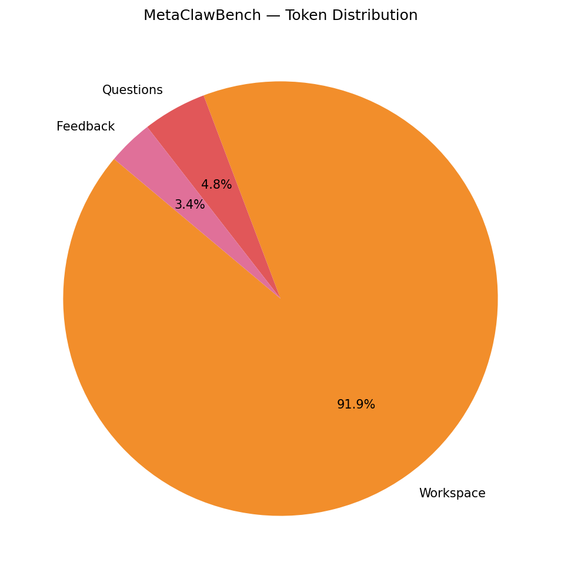
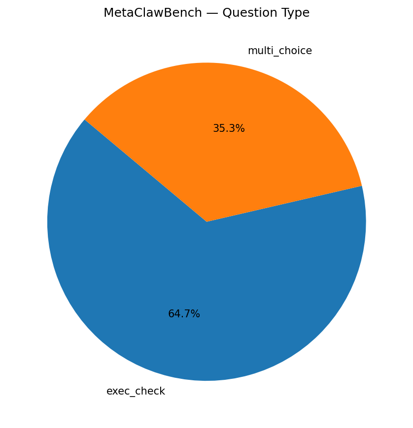
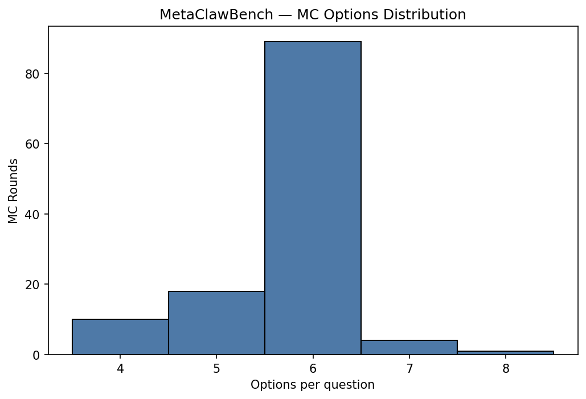
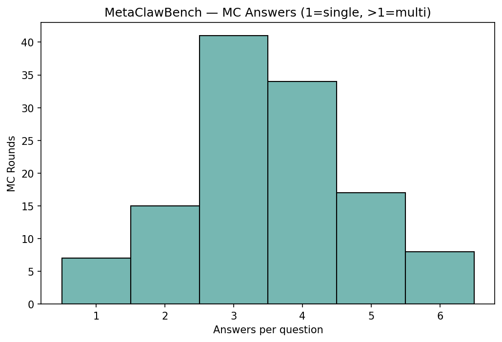
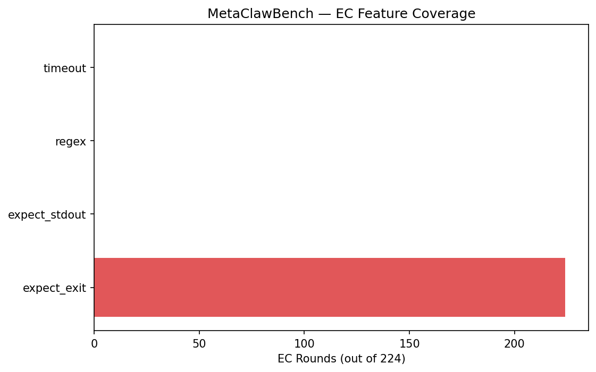
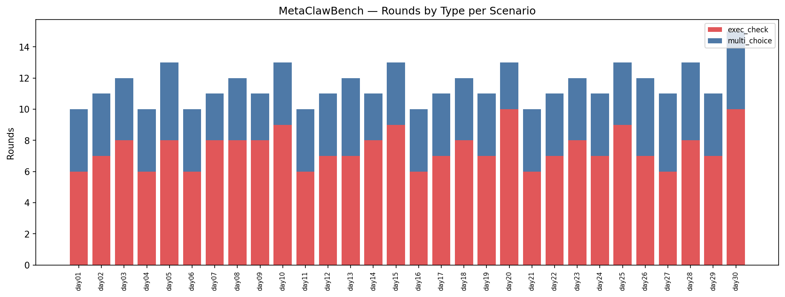
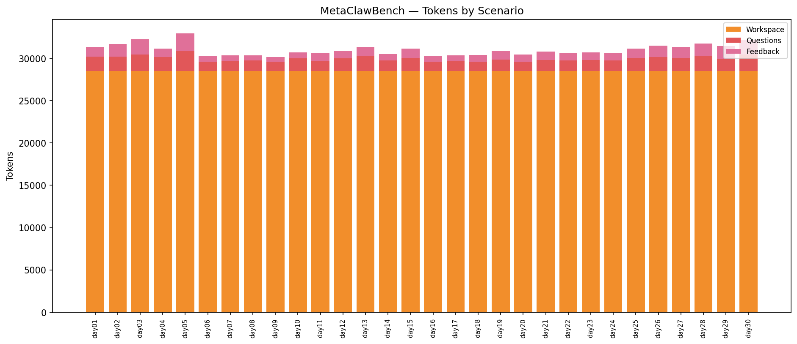
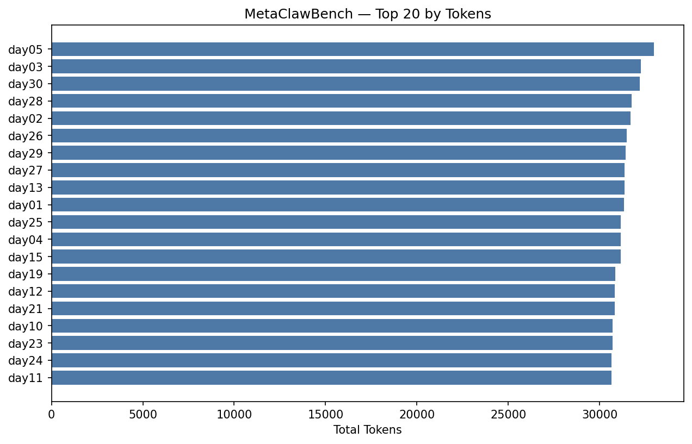
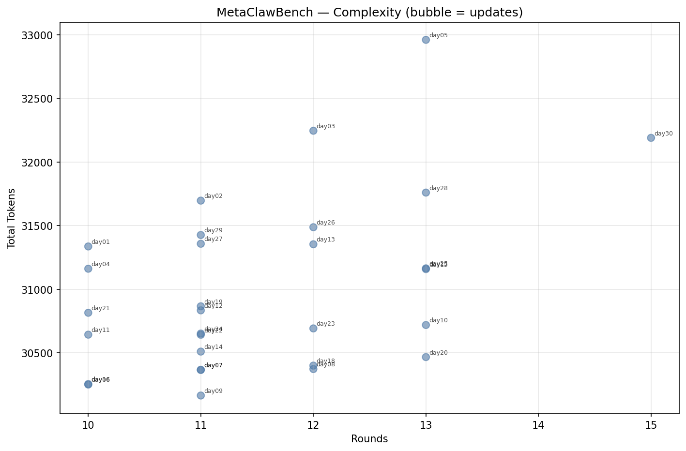

# MetaClawBench — Stats Report (openclaw)

_Tokenizer: `cl100k_base`_

## 1. Overall Summary

- **Scenarios:** 30
- **Total rounds:** 346
- **Rounds with pref:** 0 (0.0%)
- **Rounds with updates:** 0 (0.0%)
- **Total updates:** 0 (0 files)
- **Total tokens:** 930,337

## 2. Token Distribution

| Category | Tokens | % |
|----------|-------:|--:|
| Main Session | 0 | 0.0% |
| History Sessions | 0 | 0.0% |
| Workspace | 854,670 | 91.9% |
| Questions | 44,214 | 4.8% |
| Feedback | 31,453 | 3.4% |
| Pref | 0 | 0.0% |
| Update (Session) | 0 | 0.0% |
| Update (Workspace) | 0 | 0.0% |
| **Total** | **930,337** | **100.0%** |

## 3. Question Statistics

### 3.1 Type Distribution

| Type | Count | % |
|------|------:|--:|
| exec_check | 224 | 64.7% |
| multi_choice | 122 | 35.3% |

### 3.2 MC Shape

| Metric | Mean | Min | Max |
|--------|-----:|----:|----:|
| Options per question | 5.74 | 4 | 8 |
| Answers per question | 3.52 | 1 | 6 |

- **Single-answer rounds:** 7 (5.7%)
- **Multi-answer rounds:** 115 (94.3%)

### 3.3 EC Features

| Feature | Rounds | Coverage |
|---------|-------:|---------:|
| expect_exit | 224 | 100.0% |
| expect_stdout | 0 | 0.0% |
| regex matching | 0 | 0.0% |
| timeout | 0 | 0.0% |

### 3.4 Pref Coverage

- **Rounds with pref:** 0 (0.0%)

## 4. Update Statistics

## 5. Per-Scenario Breakdown

| Scenario | Rounds | MC | EC | w/Pref | w/Upd | Updates | UpdFiles | WSFiles | Tokens |
|----------|-------:|---:|---:|-------:|------:|--------:|---------:|--------:|-------:|
| day01 | 10 | 4 | 6 | 0 | 0 | 0 | 0 | 109 | 31,337 |
| day02 | 11 | 4 | 7 | 0 | 0 | 0 | 0 | 109 | 31,697 |
| day03 | 12 | 4 | 8 | 0 | 0 | 0 | 0 | 109 | 32,246 |
| day04 | 10 | 4 | 6 | 0 | 0 | 0 | 0 | 109 | 31,162 |
| day05 | 13 | 5 | 8 | 0 | 0 | 0 | 0 | 109 | 32,960 |
| day06 | 10 | 4 | 6 | 0 | 0 | 0 | 0 | 109 | 30,252 |
| day07 | 11 | 3 | 8 | 0 | 0 | 0 | 0 | 109 | 30,368 |
| day08 | 12 | 4 | 8 | 0 | 0 | 0 | 0 | 109 | 30,374 |
| day09 | 11 | 3 | 8 | 0 | 0 | 0 | 0 | 109 | 30,166 |
| day10 | 13 | 4 | 9 | 0 | 0 | 0 | 0 | 109 | 30,720 |
| day11 | 10 | 4 | 6 | 0 | 0 | 0 | 0 | 109 | 30,644 |
| day12 | 11 | 4 | 7 | 0 | 0 | 0 | 0 | 109 | 30,835 |
| day13 | 12 | 5 | 7 | 0 | 0 | 0 | 0 | 109 | 31,354 |
| day14 | 11 | 3 | 8 | 0 | 0 | 0 | 0 | 109 | 30,511 |
| day15 | 13 | 4 | 9 | 0 | 0 | 0 | 0 | 109 | 31,159 |
| day16 | 10 | 4 | 6 | 0 | 0 | 0 | 0 | 109 | 30,256 |
| day17 | 11 | 4 | 7 | 0 | 0 | 0 | 0 | 109 | 30,367 |
| day18 | 12 | 4 | 8 | 0 | 0 | 0 | 0 | 109 | 30,401 |
| day19 | 11 | 4 | 7 | 0 | 0 | 0 | 0 | 109 | 30,867 |
| day20 | 13 | 3 | 10 | 0 | 0 | 0 | 0 | 109 | 30,468 |
| day21 | 10 | 4 | 6 | 0 | 0 | 0 | 0 | 109 | 30,816 |
| day22 | 11 | 4 | 7 | 0 | 0 | 0 | 0 | 109 | 30,643 |
| day23 | 12 | 4 | 8 | 0 | 0 | 0 | 0 | 109 | 30,693 |
| day24 | 11 | 4 | 7 | 0 | 0 | 0 | 0 | 109 | 30,653 |
| day25 | 13 | 4 | 9 | 0 | 0 | 0 | 0 | 109 | 31,165 |
| day26 | 12 | 5 | 7 | 0 | 0 | 0 | 0 | 109 | 31,488 |
| day27 | 11 | 5 | 6 | 0 | 0 | 0 | 0 | 109 | 31,358 |
| day28 | 13 | 5 | 8 | 0 | 0 | 0 | 0 | 109 | 31,760 |
| day29 | 11 | 4 | 7 | 0 | 0 | 0 | 0 | 109 | 31,427 |
| day30 | 15 | 5 | 10 | 0 | 0 | 0 | 0 | 109 | 32,190 |

## 6. Per-Scenario Token Detail

| Scenario | Main Session | History Sessions | Workspace | Questions | Feedback | Pref | Update (Session) | Update (Workspace) | Total |
|----------|------:|------:|------:|------:|------:|------:|------:|------:|------:|
| day01 | 0 | 0 | 28,489 | 1,731 | 1,117 | 0 | 0 | 0 | 31,337 |
| day02 | 0 | 0 | 28,489 | 1,719 | 1,489 | 0 | 0 | 0 | 31,697 |
| day03 | 0 | 0 | 28,489 | 1,954 | 1,803 | 0 | 0 | 0 | 32,246 |
| day04 | 0 | 0 | 28,489 | 1,688 | 985 | 0 | 0 | 0 | 31,162 |
| day05 | 0 | 0 | 28,489 | 2,411 | 2,060 | 0 | 0 | 0 | 32,960 |
| day06 | 0 | 0 | 28,489 | 1,098 | 665 | 0 | 0 | 0 | 30,252 |
| day07 | 0 | 0 | 28,489 | 1,187 | 692 | 0 | 0 | 0 | 30,368 |
| day08 | 0 | 0 | 28,489 | 1,270 | 615 | 0 | 0 | 0 | 30,374 |
| day09 | 0 | 0 | 28,489 | 1,133 | 544 | 0 | 0 | 0 | 30,166 |
| day10 | 0 | 0 | 28,489 | 1,507 | 724 | 0 | 0 | 0 | 30,720 |
| day11 | 0 | 0 | 28,489 | 1,233 | 922 | 0 | 0 | 0 | 30,644 |
| day12 | 0 | 0 | 28,489 | 1,513 | 833 | 0 | 0 | 0 | 30,835 |
| day13 | 0 | 0 | 28,489 | 1,825 | 1,040 | 0 | 0 | 0 | 31,354 |
| day14 | 0 | 0 | 28,489 | 1,263 | 759 | 0 | 0 | 0 | 30,511 |
| day15 | 0 | 0 | 28,489 | 1,563 | 1,107 | 0 | 0 | 0 | 31,159 |
| day16 | 0 | 0 | 28,489 | 1,120 | 647 | 0 | 0 | 0 | 30,256 |
| day17 | 0 | 0 | 28,489 | 1,183 | 695 | 0 | 0 | 0 | 30,367 |
| day18 | 0 | 0 | 28,489 | 1,132 | 780 | 0 | 0 | 0 | 30,401 |
| day19 | 0 | 0 | 28,489 | 1,368 | 1,010 | 0 | 0 | 0 | 30,867 |
| day20 | 0 | 0 | 28,489 | 1,126 | 853 | 0 | 0 | 0 | 30,468 |
| day21 | 0 | 0 | 28,489 | 1,304 | 1,023 | 0 | 0 | 0 | 30,816 |
| day22 | 0 | 0 | 28,489 | 1,284 | 870 | 0 | 0 | 0 | 30,643 |
| day23 | 0 | 0 | 28,489 | 1,302 | 902 | 0 | 0 | 0 | 30,693 |
| day24 | 0 | 0 | 28,489 | 1,246 | 918 | 0 | 0 | 0 | 30,653 |
| day25 | 0 | 0 | 28,489 | 1,574 | 1,102 | 0 | 0 | 0 | 31,165 |
| day26 | 0 | 0 | 28,489 | 1,651 | 1,348 | 0 | 0 | 0 | 31,488 |
| day27 | 0 | 0 | 28,489 | 1,576 | 1,293 | 0 | 0 | 0 | 31,358 |
| day28 | 0 | 0 | 28,489 | 1,786 | 1,485 | 0 | 0 | 0 | 31,760 |
| day29 | 0 | 0 | 28,489 | 1,483 | 1,455 | 0 | 0 | 0 | 31,427 |
| day30 | 0 | 0 | 28,489 | 1,984 | 1,717 | 0 | 0 | 0 | 32,190 |

## 7. Top-N Rankings

### Top 10 by Tokens

| Rank | Scenario | Tokens |
|-----:|----------|------:|
| 1 | day05 | 32,960 |
| 2 | day03 | 32,246 |
| 3 | day30 | 32,190 |
| 4 | day28 | 31,760 |
| 5 | day02 | 31,697 |
| 6 | day26 | 31,488 |
| 7 | day29 | 31,427 |
| 8 | day27 | 31,358 |
| 9 | day13 | 31,354 |
| 10 | day01 | 31,337 |

### Top 10 by Rounds

| Rank | Scenario | Rounds |
|-----:|----------|------:|
| 1 | day30 | 15 |
| 2 | day05 | 13 |
| 3 | day10 | 13 |
| 4 | day15 | 13 |
| 5 | day20 | 13 |
| 6 | day25 | 13 |
| 7 | day28 | 13 |
| 8 | day03 | 12 |
| 9 | day08 | 12 |
| 10 | day13 | 12 |

### Top 10 by Updates

| Rank | Scenario | Updates |
|-----:|----------|------:|
| 1 | day01 | 0 |
| 2 | day02 | 0 |
| 3 | day03 | 0 |
| 4 | day04 | 0 |
| 5 | day05 | 0 |
| 6 | day06 | 0 |
| 7 | day07 | 0 |
| 8 | day08 | 0 |
| 9 | day09 | 0 |
| 10 | day10 | 0 |

