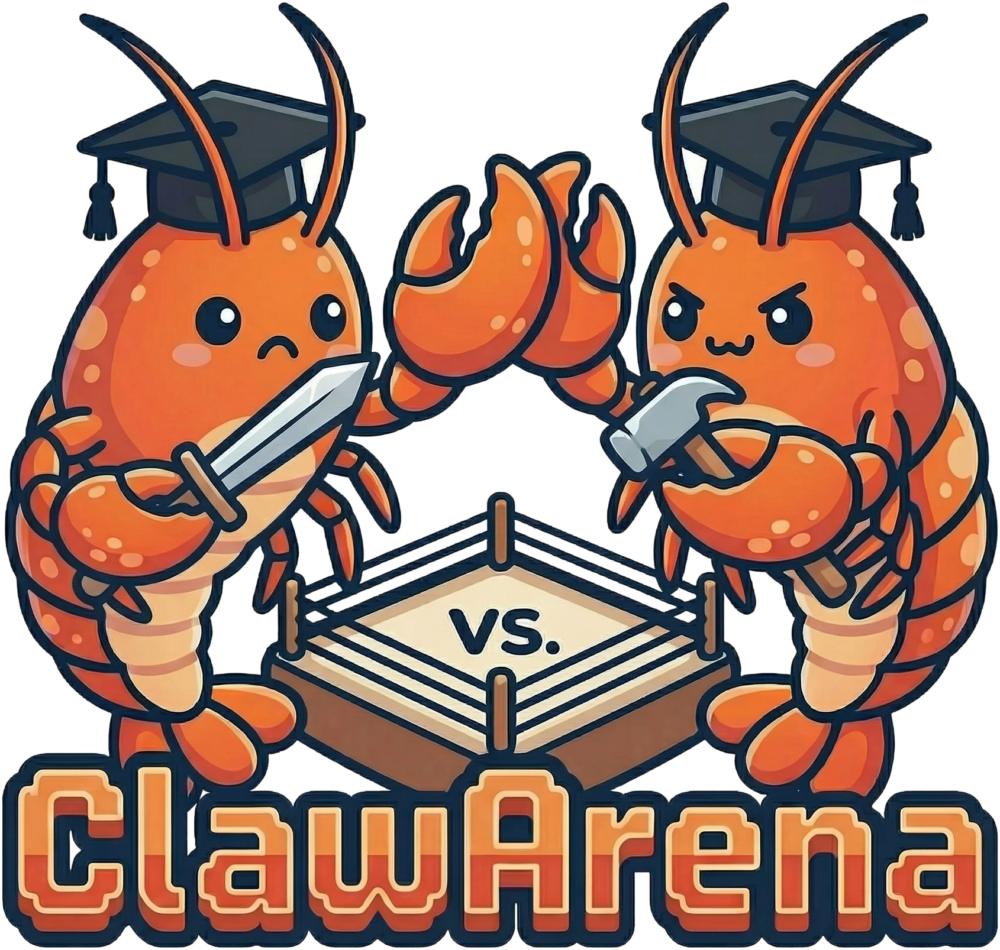
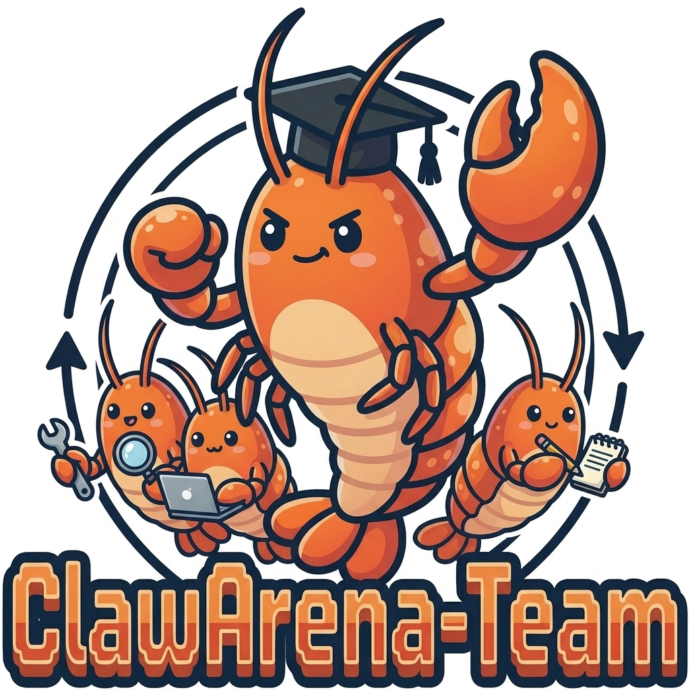

<div align="center">

# ClawArena Series: Benchmarking Language-Model Agents in Realistic, Evolving Environments

**From single-agent reliability under evolving information, to a single model's ability to lead and manage a team of subagents.**

[UNC-Chapel Hill](https://www.unc.edu/) · [UC Santa Cruz](https://www.ucsc.edu/) · [UC Berkeley](https://www.berkeley.edu/)

<p align="center">
  <a href="./ClawArena"></a>
  &nbsp;&nbsp;&nbsp;&nbsp;
  <a href="./ClawArena-Team"></a>
</p>

<p>
  <a href="https://arxiv.org/abs/2604.04202"></a>
  <a href="https://arxiv.org/abs/2606.31174"></a>
  <a href="https://www.clawarena.cc/"></a>
  <a href="LICENSE"></a>
  <a href="https://github.com/aiming-lab/ClawArena/pulls"></a>
</p>

[🔥 News](#-news) • [📖 Overview](#-overview) • [🎯 Key Features](#-key-features) • [📈 Leaderboard](#-leaderboard) • [📚 Citation](#-citation) • [📄 License](#-license)

</div>

---

## 🔥 News

- **[Jul 1, 2026]** 📄 **ClawArena-Team** released on arXiv ([2606.31174](https://arxiv.org/abs/2606.31174)) — benchmarking subagent orchestration and dynamic workflows in language-model agents.
- **[Jul 1, 2026]** **ClawArena v1.1** — adds a **real-source-grounded dataset**, the built-in **ClawArena Native** harness, and a **Python SDK**.
- **[Apr 8, 2026]** **ClawArena** released — paper ([2604.04202](https://arxiv.org/abs/2604.04202)), repository, and website ([clawarena.cc](https://www.clawarena.cc/)) — a benchmark emphasizing agent reliability in evolving, multi-session information environments, with a fixed **12-scenario / 337-round** test set and a comprehensive evaluation of SOTA models.

---

## 📖 Overview

The **ClawArena Series** studies a question most agent benchmarks sidestep: how do language-model agents behave when the environment is **realistic, multi-session, and constantly changing** — rather than a single static task? This repository brings together two **complementary and equally-weighted** benchmarks, each self-contained in its own subdirectory with its own data, code, documentation, and install path. Together they trace one axis of agent competence from *solving* to *leading*.

### 🏟️ [ClawArena](./ClawArena): Benchmarking AI Agents in Evolving Information Environments

**Can an agent stay correct as information evolves and contradicts across sessions?**

A benchmark for AI coding agents that reason over workspace files and multi-channel chat histories, then must stay correct as new files and sessions are **injected mid-evaluation**. A unified pipeline runs inference, scores results, and compares agents on the same realistic, multi-session scenarios.

- ✅ **12 multi-turn scenarios** across retail, finance, healthcare, security, HR, education, and research integrity
- ✅ **337 evaluation rounds** — `multi_choice` reasoning (95) + `exec_check` execution verification (242)
- ✅ **45 dynamic updates** probing belief revision and contradiction handling
- ✅ **Framework-agnostic** — five frameworks in the paper (OpenClaw, Claude Code, NanoBot, PicoClaw, MetaClaw), plus a plugin system for new ones

[📄 Paper](https://arxiv.org/abs/2604.04202) | [📁 Code](./ClawArena) | [🔗 Details](./ClawArena/README.md) | [🌐 Website](https://www.clawarena.cc/)

---

### 🧑‍✈️ [ClawArena-Team](./ClawArena-Team): Benchmarking Subagent Orchestration and Dynamic Workflows

**Can a single model manage a team of subagents it must delegate to?**

The team-management variant. A **text-only main agent** must complete multi-turn, multimodal, multi-directory tasks it *cannot do alone*, by creating, empowering, scheduling, and integrating subagents from a **fixed, locally-served pool**. Every manager commands the same workers, so score differences reflect **management skill, not raw capability**.

- ✅ **41 scenarios · 258 rounds · 72 staged updates**, spanning law, medicine, engineering, business, and science
- ✅ **Fixed subagent pool** (`llm`/`vlm`/`omni`) served locally, held identical across every evaluated manager
- ✅ **Execution-based scoring, no LLM judge** — every round ships a shell command whose exit code decides pass/fail
- ✅ Newly released **`glm-5.2`** is the strongest open-weight manager (SMS 50.4, 4th overall)

[📄 Paper](https://arxiv.org/abs/2606.31174) | [📁 Code](./ClawArena-Team) | [🔗 Details](./ClawArena-Team/README.md)

---

## 🎯 Key Features

Both benchmarks share one design philosophy, applied to two different axes of agent competence:

- **Empirically synthesized scenarios** — procedurally built, version-controlled workspaces rather than hand-written toy tasks.
- **Evolving, multi-session environments** — new files and chat sessions are injected *between* rounds, so an agent must revise beliefs, not answer once.
- **Machine-checkable, execution-based scoring** — pass/fail is decided by rules and shell commands, with no LLM judge in the loop.
- **Framework- and model-agnostic evaluation** — the same pipeline compares many agents on identical scenarios.

| | 🏟️ **ClawArena** | 🧑‍✈️ **ClawArena-Team** |
|---|---|---|
| **Question isolated** | Reliability as information evolves | Management of a subagent team |
| **Agent under test** | A framework + model, acting alone | A single main model as *leader* |
| **What varies** | The agent framework and model | Only the main agent (pool is fixed) |
| **Headline metric** | Composite Reliability Score (CRS) | Subagent-Management Score (SMS) |
| **Scale** | 12 scenarios · 337 rounds · 5 frameworks | 41 scenarios · 258 rounds · 12 models |

---

## 📈 Leaderboard

For a benchmark, the leaderboard *is* the main result. Compact top rankings are shown below; each subproject hosts the full table and an open submission channel.

### 🏟️ ClawArena — Composite Reliability Score (CRS)

Agents ranked by **CRS**, which weighs raw correctness equally against behavioral consistency, macro-averaged across the 12 scenarios / 337 rounds.

| Rank | Model | Framework | TCR | MC | EC | SC | FD | **CRS** |
|---:|---|---|--:|--:|--:|--:|--:|--:|
| 1 | GPT-5.5 | OpenClaw | 78.34 | 75.79 | 79.34 | 61.24 | 95.06 | **68.28** |
| 2 | Claude Opus-4.7 | Claude Code | 76.13 | 65.26 | 80.58 | 60.06 | 94.06 | 66.31 |
| 3 | Gemma-4-31B | OpenClaw | 75.37 | 81.05 | 73.14 | 56.76 | 91.90 | 63.80 |
| 4 | GPT-5.1 | OpenClaw | 70.33 | 75.79 | 68.18 | 58.96 | 95.37 | 63.28 |
| 5 | Claude Sonnet-4.6 | Claude Code | 73.36 | 63.16 | 77.69 | 54.80 | 93.02 | 62.16 |
| 6 | Claude Haiku-4.5 | Claude Code | 72.29 | 64.21 | 75.62 | 54.74 | 90.54 | 60.93 |
| 7 | GLM-5.1 | OpenClaw | 72.70 | 72.63 | 72.73 | 52.74 | 92.07 | 60.63 |
| 8 | Mimo-V2.5-Pro | OpenClaw | 71.45 | 66.32 | 73.55 | 52.23 | 91.62 | 59.65 |
| 9 | GPT-5.4 | OpenClaw | 71.22 | 71.58 | 71.07 | 51.51 | 90.78 | 58.99 |
| 10 | Gemini-3.1-Pro | OpenClaw | 69.57 | 66.32 | 71.07 | 50.54 | 90.23 | 57.59 |

<sub>Top 10 of 18. See the [full leaderboard](./ClawArena/README.md#-leaderboard) for all models and the cross-framework comparison.</sub>

> 📥 **Submit a result:** see [`ClawArena/docs/submit-to-leaderboard.md`](./ClawArena/docs/submit-to-leaderboard.md). Reference layouts live under [`ClawArena/result_example/`](./ClawArena/result_example/); contributed runs land in [`ClawArena/submissions/`](./ClawArena/submissions/).

### 🧑‍✈️ ClawArena-Team — Subagent-Management Score (SMS)

Main-agent models ranked by **SMS** = TCR × (TPP + ROC + WPP + MCA) / 4 — task correctness discounted by a least-privilege and modality-routing factor (SMS ≤ TCR always).

| Model | TCR | TPP | ROC | WPP | MCA | **SMS** | Cost ($) | Rounds |
|---|--:|--:|--:|--:|--:|--:|--:|--:|
| claude-fable-5 | **74.4** | 76.4 | 98.8 | **49.2** | **97.9** | **60.0** | 92.8 | **192/258** |
| gemini-3.5-flash | 69.8 | 69.8 | 95.9 | 45.7 | 96.7 | 53.8 | 23.7 | 180/258 |
| gpt-5.5 | 63.6 | **79.9** | 98.7 | 47.5 | 95.2 | 51.0 | 43.3 | 164/258 |
| glm-5.2 | 66.3 | 67.4 | 95.4 | 44.4 | 96.7 | 50.4 | 22.9 | 171/258 |
| gpt-5.4 | 63.2 | 77.3 | 98.8 | 40.8 | 97.6 | 49.7 | 19.5 | 163/258 |
| gemini-3.1-pro | 65.5 | 76.4 | 97.3 | 36.6 | 92.9 | 49.6 | 20.5 | 169/258 |
| kimi-k2.6 | 64.3 | 76.8 | 92.0 | 41.9 | 93.9 | 49.0 | 28.7 | 166/258 |
| claude-sonnet-4-6 | 61.6 | 77.3 | **99.4** | 43.2 | 95.2 | 48.5 | 39.7 | 159/258 |
| deepseek-v4-pro | 58.9 | 73.9 | 98.5 | 46.3 | 96.5 | 46.4 | **1.7** | 152/258 |
| qwen3.6-27b | 60.9 | 72.5 | 95.7 | 40.7 | 96.2 | 46.4 | 15.0 | 157/258 |

<sub>Top 10 of 12, values in %, sorted by SMS. `glm-5.2` (via the official z.ai API) is the strongest open-weight manager. See the [full 12-model leaderboard](./ClawArena-Team/README.md#-leaderboard).</sub>

> 📥 **Submit a result:** see [`ClawArena-Team/docs/submit-to-leaderboard.md`](./ClawArena-Team/docs/submit-to-leaderboard.md). Example runs and contributed results live in [`ClawArena-Team/submissions/`](./ClawArena-Team/submissions/).

---

## 📚 Citation

If you use the ClawArena Series, please cite the relevant benchmark(s).

**ClawArena:**

```bibtex
@article{ji2026clawarena,
  title={ClawArena: A Multi-Framework Benchmark for Evaluating AI Coding Agents on Realistic Multi-Session Scenarios},
  author={Ji, Haonian and Xiong, Kaiwen and Han, Siwei and Xia, Peng and Qiu, Shi and Zhou, Yiyang and Liu, Jiaqi and Li, Jinlong and Li, Bingzhou and Zheng, Zeyu and Xie, Cihang and Yao, Huaxiu},
  journal={arXiv preprint arXiv:2604.04202},
  year={2026}
}
```

**ClawArena-Team:**

```bibtex
@article{xiong2026clawarenateam,
  title={ClawArena-Team: Benchmarking Subagent Orchestration and Dynamic Workflows in Language-Model Agents},
  author={Xiong, Kaiwen and Ji, Haonian and Qiu, Shi and Zheng, Zeyu and Xie, Cihang and Ye, Xinyu and Yao, Huaxiu},
  journal={arXiv preprint arXiv:2606.31174},
  year={2026}
}
```

---

## 📄 License

This repository is licensed under the [MIT License](LICENSE), covering both the `ClawArena/` and `ClawArena-Team/` subprojects.
