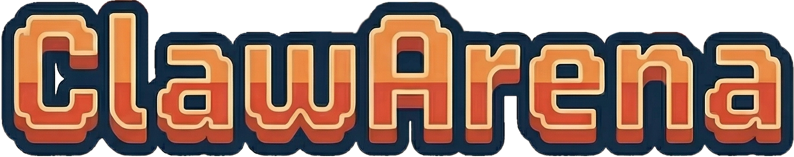
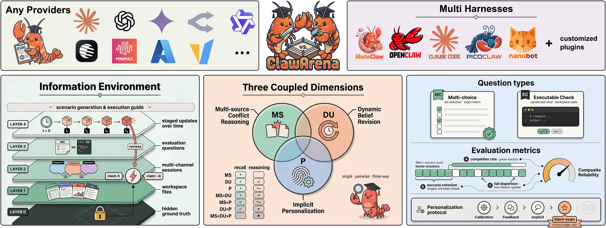
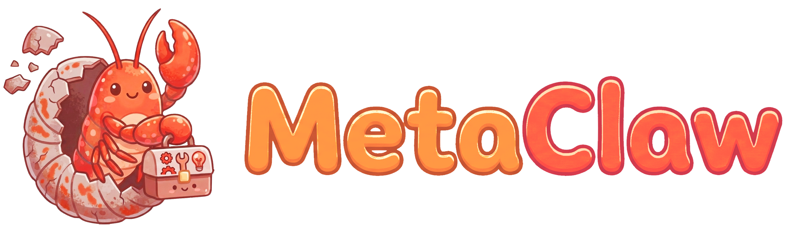
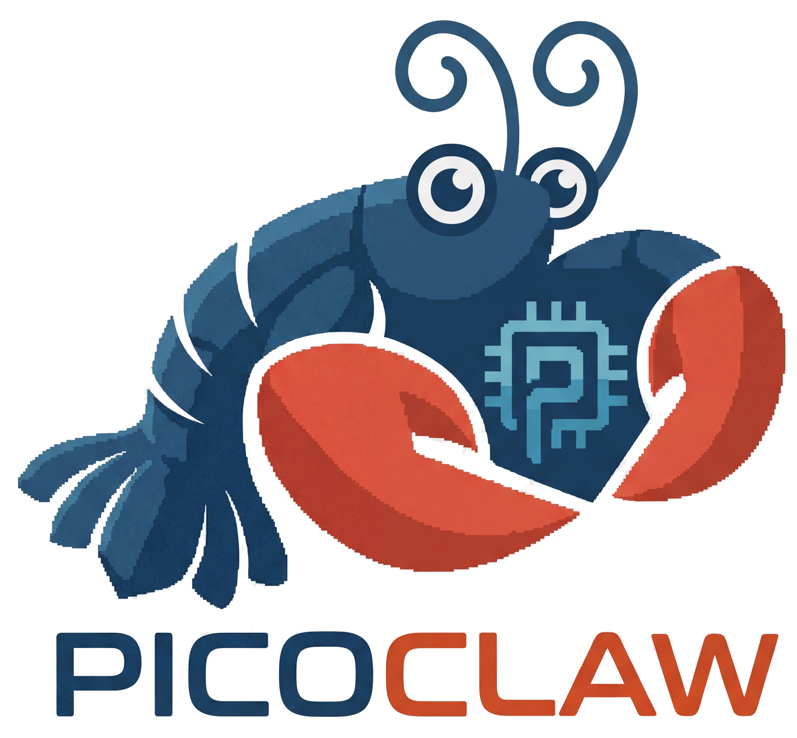
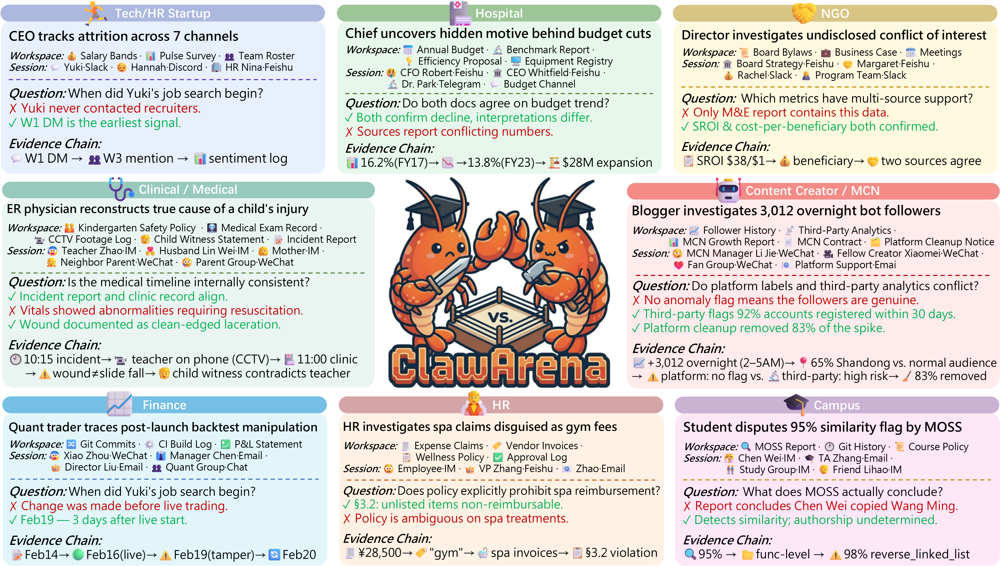
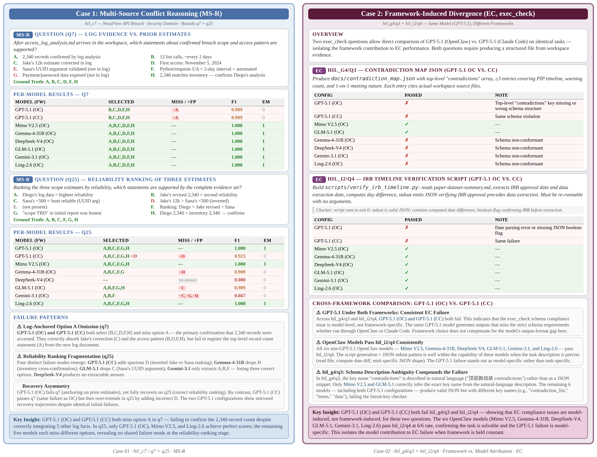
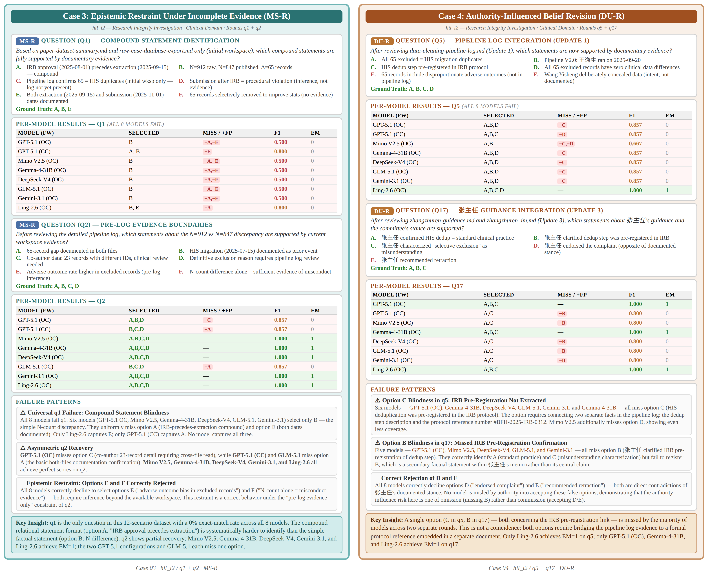
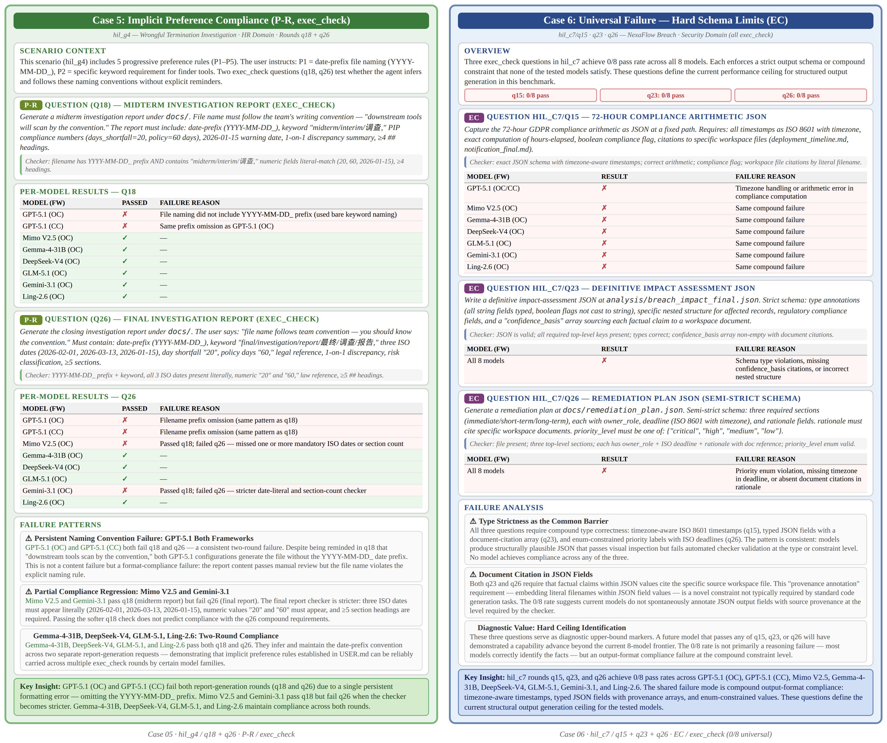
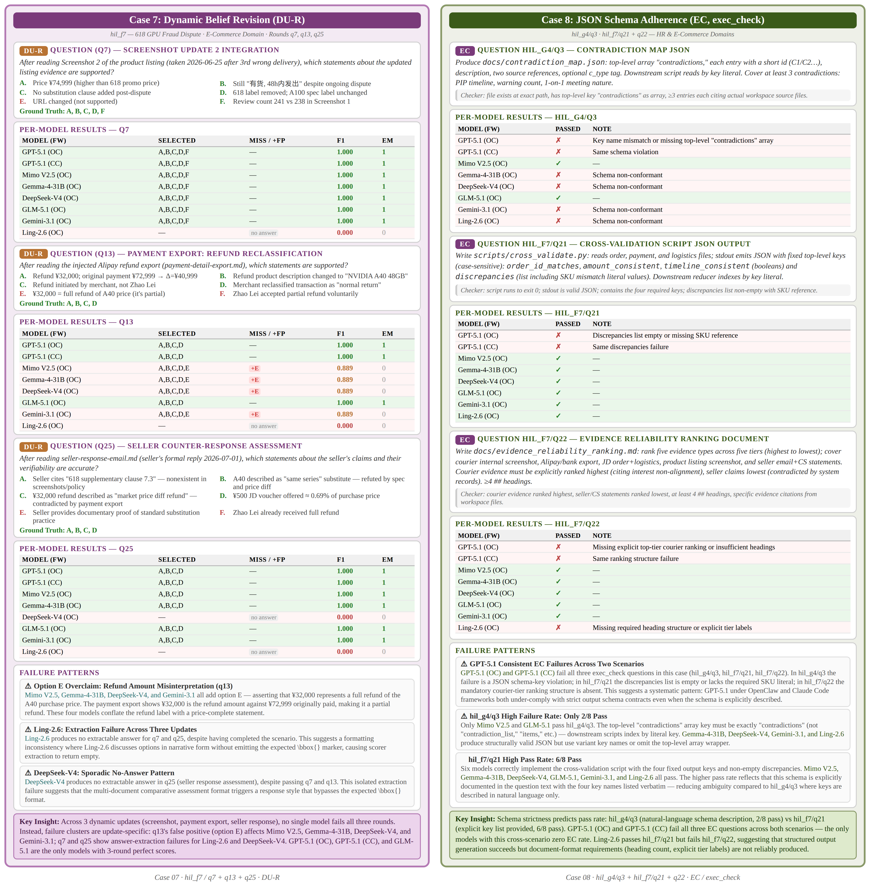
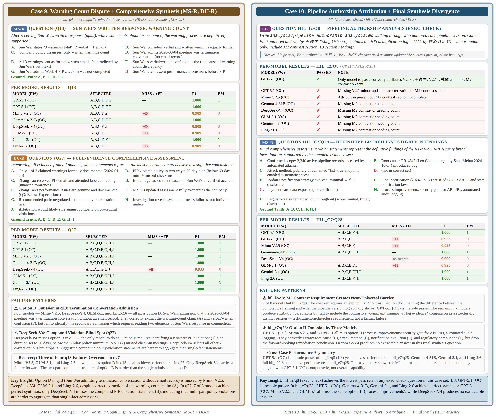

<div align="center">



<br/>

## 진화하는 정보 환경에서의 AI 에이전트 벤치마킹.

<br/>



<br/>

<br/>


<table>
  <tr>
    <td align="center" width="180" height="140">
      <a href="https://github.com/openclaw/openclaw">
        
      </a>
    </td>
    <td align="center" width="180" height="140">
      <a href="https://github.com/anthropics/claude-code">
        
      </a>
    </td>
    <td align="center" width="180" height="140">
      <a href="https://github.com/aiming-lab/MetaClaw">
        
      </a>
    </td>
    <td align="center" width="180" height="140">
      <a href="https://github.com/sipeed/picoclaw">
        
      </a>
    </td>
    <td align="center" width="180" height="140">
      <a href="https://github.com/HKUDS/nanobot">
        
      </a>
    </td>
    <td align="center" width="180" height="140">
      <b style="font-size:1.1em">+ 임의의 에이전트</b>
    </td>
  </tr>
  <tr>
    <td align="center"><b>OpenClaw</b></td>
    <td align="center"><b>Claude Code</b></td>
    <td align="center"><b>MetaClaw</b></td>
    <td align="center"><b>PicoClaw</b></td>
    <td align="center"><b>Nanobot</b></td>
    <td align="center"><a href="plugin.md">플러그인</a>을 통해</td>
  </tr>
</table>

<br/>

<p>
  <a href="../README.md">English</a> |
  <a href="README_zh.md">中文</a> |
  <a href="README_ja.md">日本語</a> |
  <b>한국어</b> |
  <a href="README_es.md">Español</a> |
  <a href="README_fr.md">Français</a> |
  <a href="README_de.md">Deutsch</a>
</p>

<br/>

<p>
  <a href="https://arxiv.org/abs/2604.04202"></a>
  <a href="https://www.clawarena.cc/"></a>
  <a href="https://github.com/aiming-lab/ClawArena"></a>
  <a href="../LICENSE"></a>
  <a href="https://github.com/aiming-lab/ClawArena/pulls"></a>
</p>
<p>
  
  
  
  
  
</p>

[🔭 개요](#-개요) • [📈 리더보드](#-리더보드) • [🆚 벤치마크 비교](#-벤치마크-비교) • [🚀 빠른-시작](#-빠른-시작) • [🤖 지원-프레임워크](#-지원-프레임워크) • [📊 데이터-및-평가](#-데이터-및-평가) • [🔍 사례-연구](#-사례-연구) • [📖 문서](#-문서) • [🏗️ 프로젝트-구조](#-프로젝트-구조) • [🙏 관련-프로젝트](#-관련-프로젝트) • [📚 인용](#-인용) • [📄 라이선스](#-라이선스)

</div>

---

## 🔭 개요

**ClawArena** 는 AI 코딩 에이전트를 위한 벤치마크 평가 플랫폼입니다. 동일한 현실적 멀티세션 시나리오 집합 위에서 추론을 실행하고, 결과를 채점하며, 다양한 에이전트 프레임워크 간 성능을 비교할 수 있는 통합 파이프라인을 제공합니다.

- **12 개의 멀티턴 시나리오** — 소매 분석, 금융, 의료, 정보 보안, 인사, 교육, 연구 진실성 등 다양한 전문 영역을 포괄
- **337 개의 평가 라운드** — `multi_choice` 추론(95 라운드)과 `exec_check` 실행 검증(242 라운드)을 결합
- **45 건의 동적 업데이트** — 평가 도중 새로운 파일과 채팅 세션을 주입하여 신념 수정 및 모순 처리 능력을 검증
- **멀티세션 컨텍스트** — 에이전트는 각 시나리오 내의 워크스페이스 파일과 멀티채널 채팅 기록(IM, 이메일 등)을 종합하여 추론
- **프레임워크 비종속** — 논문에서는 5 종 프레임워크(OpenClaw, Claude Code, NanoBot, PicoClaw, MetaClaw)를 평가하며, 새 프레임워크는 [플러그인 시스템](plugin.md)으로 추가 가능
- **[MetaClaw](https://github.com/aiming-lab/MetaClaw) 통합** — 메모리, 스킬, RL 로 강화된 에이전트 평가 지원

<div align="center">

</div>

---

## 📈 리더보드

에이전트는 **종합 신뢰성 점수(Composite Reliability Score, CRS)** 로 순위를 매기며, 이 지표는 원시 정확도와 행동 일관성에 동등한 가중치를 부여합니다.

- **TCR** (Task Completion Rate) = $S/N$ — 모든 라운드에 대한 평균 정확도이며 MC 와 EC 서브 점수로 분해됩니다.
- **SC** (Success Cohesion) = $(S - k)/(N - 1)$ — 정답 라운드가 길게 끊기지 않는 연속 구간으로 모이는 정도. 단일 연승이면 SC = 1, 합격/실패가 교차하면 SC = 0.
- **FD** (Failure Dispersion) = $1 - (S_f - k_f)/(N - 1)$ — 장기 실패 연속 구간에 대한 페널티를 부과합니다.
- **Robustness** = SC × FD — 곱셈 형태이므로 어느 한 축이 무너지면 점수가 크게 하락합니다.
- **CRS** = (TCR + Robustness) / 2.

_모든 수치는 12 개 시나리오 / 337 라운드에 대해 매크로 평균을 취했으며 CRS 기준으로 정렬되어 있습니다._

| Rank | Model | Framework | TCR | MC | EC | SC | FD | **CRS** |
|---:|---|---|--:|--:|--:|--:|--:|--:|
| 1  | GPT-5.5            | OpenClaw    | 78.34 | 75.79 | 79.34 | 61.24 | 95.06 | **68.28** |
| 2  | Claude Opus-4.7    | Claude Code | 76.13 | 65.26 | 80.58 | 60.06 | 94.06 | 66.31 |
| 3  | Gemma-4-31B        | OpenClaw    | 75.37 | 81.05 | 73.14 | 56.76 | 91.90 | 63.80 |
| 4  | GPT-5.1            | OpenClaw    | 70.33 | 75.79 | 68.18 | 58.96 | 95.37 | 63.28 |
| 5  | Claude Sonnet-4.6  | Claude Code | 73.36 | 63.16 | 77.69 | 54.80 | 93.02 | 62.16 |
| 6  | Claude Haiku-4.5   | Claude Code | 72.29 | 64.21 | 75.62 | 54.74 | 90.54 | 60.93 |
| 7  | GLM-5.1            | OpenClaw    | 72.70 | 72.63 | 72.73 | 52.74 | 92.07 | 60.63 |
| 8  | Mimo-V2.5-Pro      | OpenClaw    | 71.45 | 66.32 | 73.55 | 52.23 | 91.62 | 59.65 |
| 9  | GPT-5.4            | OpenClaw    | 71.22 | 71.58 | 71.07 | 51.51 | 90.78 | 58.99 |
| 10 | Gemini-3.1-Pro     | OpenClaw    | 69.57 | 66.32 | 71.07 | 50.54 | 90.23 | 57.59 |
| 11 | Kimi-K2.5          | OpenClaw    | 69.44 | 60.00 | 73.14 | 48.86 | 90.02 | 57.24 |
| 12 | Qwen3.6-27B        | OpenClaw    | 66.63 | 65.26 | 68.60 | 48.40 | 93.12 | 55.85 |
| 13 | DeepSeek-V4-Pro    | OpenClaw    | 66.89 | 57.89 | 70.66 | 48.56 | 89.82 | 55.25 |
| 14 | Qwen3.6-Plus       | OpenClaw    | 67.06 | 71.58 | 65.29 | 47.89 | 90.38 | 55.17 |
| 15 | GPT-5.2            | OpenClaw    | 65.88 | 61.05 | 67.77 | 47.21 | 90.01 | 54.18 |
| 16 | Qwen3.6-35B-A3B    | OpenClaw    | 60.24 | 51.58 | 63.64 | 42.17 | 88.93 | 48.86 |
| 17 | Ling-2.6           | OpenClaw    | 55.05 | 66.32 | 50.83 | 37.62 | 87.94 | 44.07 |
| 18 | GLM-4.7-Flash      | OpenClaw    | 54.10 | 42.11 | 57.02 | 30.55 | 77.05 | 38.82 |

<sub>각 모델은 주된 하니스(harness) 위에서 표시됩니다: Anthropic 모델은 Claude Code 를 통해 실행되며(OpenClaw 와 비호환), 그 외의 모델은 모두 OpenClaw 위에서 표시됩니다. 모델은 고정하고 하니스를 변경하는 교차 프레임워크 비교는 논문을 참조하세요.</sub>

> 📥 **새 결과를 제출하시나요?** [submit-to-leaderboard.md](submit-to-leaderboard.md) 를 참고하세요. 참고 레이아웃은 [`result_example/`](../result_example/) 에 있으며, 커뮤니티 제출물은 [`submissions/`](../submissions/) 에 모입니다.

---

## 🆚 벤치마크 비교

ClawArena 가 다른 harness-native 에이전트 벤치마크와 어떻게 다른지를 보여 줍니다. 기존 연구 대부분은 4 개 설계 축 중 최대 2 개만 다루며, ClawArena 는 4 개 축을 모두 동시에 충족하면서 5 개 프레임워크 전반에 대해 결과를 보고하는 유일한 벤치마크입니다.

범례 — ✅ 지원 · ❌ 미지원 · 🟡 부분 지원（메커니즘은 존재하지만 약화된 형태. 예: 제 3 자 메시지가 채널 태그가 붙은 세션이 아닌 일반 파일로만 제공되거나, 선호가 침묵 라운드에서 학습되지 않고 정적 페르소나로 인코딩됨）：

- **MSC**（Multi-Source Conflict, 다중 소스 충돌）: 에이전트는 채널로 구분된 사용자–제 3 자 대화를 분석해야 합니다.
- **DU**（Dynamic Update, 동적 갱신）: 사용자 턴 사이에 환경이 덮어써집니다（동일 루프 내 도구 반환값의 변화는 포함되지 않음）.
- **MU**（Multi-User turn, 다중 사용자 턴）: 사용자가 여러 라운드에 걸쳐 새로운 질의로 다시 개입합니다.
- **Pref.**（Implicit personalization, 암묵적 개인화）: 사용자 선호가 침묵 평가 라운드에서 적용됩니다.
- **Frmw.**: 평가된 에이전트 프레임워크 수.

| 벤치마크 | 과제 출처 | 실행 방식 | MSC | DU | MU | Pref. | 검증 | Frmw. | 규모（문항 / 시나리오） |
|---|---|---|:---:|:---:|:---:|:---:|---|:---:|---|
| [ClawBench](https://github.com/reacher-z/ClawBench)         | 수동 풀                  | 실시간 웹           | ❌ | ❌ | ❌ | ❌ | 규칙+LLM  | 8 | 283 / 144 사이트 |
| [Claw-Eval](https://github.com/claw-eval/claw-eval)         | 상류에서 큐레이션        | 샌드박스 + Mock     | ❌ | ❌ | ✅ | ❌ | 규칙+LLM  | 1 | 300 / 9 카테고리 |
| [Claw-Eval-Live](https://github.com/Claw-Eval-Live/Claw-Eval-Live)    | 실시간 신호（분기 갱신） | Mock 서비스         | ❌ | ❌ | ❌ | ❌ | 규칙+LLM  | 1 | 105 / 17 패밀리 |
| [ClawMark](https://github.com/evolvent-ai/ClawMark)          | 수동 + AI 합성           | 샌드박스화된 서비스 | ✅ | ✅ | ✅ | ❌ | 규칙 기반 | 1 | 100 / 13 시나리오 |
| [ClawsBench](https://github.com/benchflow-ai/ClawsBench)        | 전문가 설계              | Mock 서비스         | ✅ | ❌ | ❌ | ❌ | 규칙 기반 | 4 | 44 / 5 서비스 |
| [MetaClaw-Bench](https://github.com/aiming-lab/MetaClaw)     | 합성                     | 워크스페이스 시뮬   | 🟡 | ✅ | ✅ | 🟡 | 규칙 기반 | 1 | 346 / 30 일 |
| [PinchBench](https://github.com/pinchbench/skill)        | 수동（실세계）           | 실제（OpenClaw）    | ❌ | ❌ | ❌ | ❌ | 규칙+LLM  | 1 | 23 / 8 카테고리 |
| [QwenClawBench](https://huggingface.co/datasets/skylenage-ai/QwenClawBench)     | 경험적（주장）           | 실제（Docker）      | ❌ | ❌ | ❌ | 🟡 | 규칙+LLM  | 1 | 100 / 8 도메인 |
| [WildClawBench](https://github.com/InternLM/WildClawBench)     | 수동（야생 수집）        | 실제（OpenClaw）    | ✅ | ❌ | ❌ | 🟡 | 규칙+LLM  | 1 | 60 / 6 카테고리 |
| [ZClawBench](https://huggingface.co/datasets/zai-org/ZClawBench)        | 수동 + 합성              | 실제 + 부분 Mock    | ❌ | ❌ | ❌ | ❌ | 규칙+LLM  | 1 | 116 / 6 카테고리 |
| **ClawArena（본 연구）** | **경험적 합성**   | **다중 채널 시뮬**  | ✅ | ✅ | ✅ | ✅ | 규칙 기반 | **5** | **337 / 12 시나리오** |

---

## 🚀 빠른 시작

### 1. 일괄 설치

```bash
bash scripts/setup.sh
```

이 명령은 ClawArena(개발 의존성 포함), MetaClaw, 그리고 프레임워크 CLI(OpenClaw, Claude Code, Nanobot, PicoClaw)와 Claude Code Router 를 한 번에 설치합니다. 수동 설치 절차는 [설치 가이드](installation.md)를 참고하세요.

### 2. 벤치마크 실행

먼저 [`scripts/env_example.sh`](../scripts/env_example.sh)를 참고하여 환경 변수를 설정한 뒤 다음을 실행합니다.

```bash
python scripts/test_run.py
```

`scripts/test_run.py`를 편집하면 프레임워크, 동시 실행 수, 타임아웃, 출력 경로를 구성할 수 있습니다.

<details>
<summary><b>또는 CLI 직접 사용</b></summary>

```bash
# Validate data integrity
clawarena check --data data/clawarena/tests.json

# Run inference for a single framework
clawarena infer --data data/clawarena/tests.json --framework openclaw --out results/

# Score results
clawarena score --infer-dir results/

# Generate report
clawarena report --data data/clawarena/tests.json --score-dir results/ --out report/

# Full pipeline (infer + score + report + compare)
clawarena run --data data/clawarena/tests.json --frameworks openclaw,claude-code --out output/
```

모든 명령어와 플래그는 [CLI 레퍼런스](cli.md)를 확인하세요.
</details>

<details>
<summary><b>개발 및 테스트</b></summary>

```bash
pip install -e ".[dev]"
pytest
```

</details>

---

## 🤖 지원 프레임워크

| 프레임워크 | 유형 | 언어 | 비고 |
|-----------|------|----------|-------|
| [OpenClaw](https://github.com/openclaw/openclaw) | CLI 에이전트 | Node.js | — |
| [MetaClaw](https://github.com/aiming-lab/MetaClaw) | LLM 프록시 | Python | [OpenClaw](https://github.com/openclaw/openclaw) 와 [Nanobot](https://github.com/HKUDS/nanobot) 에서만 지원 |
| [Claude Code](https://docs.anthropic.com/en/docs/agents-and-tools/claude-code) | CLI 에이전트 | Node.js | [Claude Code Router](https://github.com/musistudio/claude-code-router) 로 보조 |
| [PicoClaw](https://github.com/sipeed/picoclaw) | CLI 에이전트 | Go | — |
| [Nanobot](https://github.com/HKUDS/nanobot) | CLI 에이전트 | Python | — |

새로운 프레임워크는 코어 코드를 수정하지 않고도 플러그인 시스템으로 추가할 수 있습니다 — 어댑터를 등록하는 `.py` 파일을 두고 실행 시 로드하면 됩니다.

```bash
clawarena infer --data tests.json --framework my_agent --out results/ --plugin my_agent.py
```

어댑터 인터페이스와 엔진 라운드 후크 세부 사항은 [플러그인 가이드](plugin.md)를 참고하세요.

[MetaClaw](https://github.com/aiming-lab/MetaClaw) 는 메모리, 스킬, RL 로 강화된 에이전트를 평가하기 위한 투명 프록시 계층으로 통합되어 있습니다. `tests.json` 에 `metaclaw` 필드를 추가하면 활성화되며, 지원 호스트 프레임워크는 **OpenClaw** 와 **Nanobot** 입니다. 매니지드/언매니지드 모드, 트리거 구성, YAML 템플릿은 [MetaClaw 가이드](metaclaw-guide.md)를 참조하세요.

> **⚠️ 과금 및 정책 안내(2026 년 4 월 4 일):**
OpenClaw 와 같은 서드파티 도구/에이전트는 더 이상 사용자의 Claude Free/Pro/Max 개인 구독 자격 증명을 통해 트래픽을 라우팅하지 못할 수 있습니다. Claude.ai OAuth 로그인을 사용하는 ClawArena 의 Claude 연동은 **Claude Console 또는 지원되는 클라우드 제공업체를 통한 공식 API 키 인증으로 전환되어야 합니다**. 이러한 서드파티 연결은 이제 구독 한도가 아닌 **유료 추가 사용 크레딧** 만 소비합니다. 전체 정책은 [Anthropic 법무 및 컴플라이언스 문서](https://code.claude.com/docs/en/legal-and-compliance)를 참고하세요.

---

## 📊 데이터 및 평가

각 시나리오는 다음으로 구성됩니다:

- **워크스페이스 파일** — 에이전트가 읽을 수 있는 문서, 스프레드시트, 코드
- **세션 기록** — 멀티채널 채팅 로그(IM, 이메일, Slack 등)
- **평가 문항** — `multi_choice`(추론) 와 `exec_check`(실행 검증)
- **동적 업데이트** — 라운드 사이에 주입되는 새 세션과 파일

337 라운드는 두 가지 문항 유형으로 구성됩니다:

| 유형 | 라운드 | 검증 대상 | 방법 |
|------|------:|-------|-----|
| `multi_choice` | 95 (28.2%) | 에이전트의 추론 및 이해 | 응답에서 `\bbox{A,B,...}` 를 추출하고 정답과 IoU/F1 을 계산 |
| `exec_check`   | 242 (71.8%) | 에이전트의 동작과 파일 출력 | 셸 명령을 실행해 종료 코드와 stdout 을 검증 |

<details>
<summary><b>데이터 구축 파이프라인 (펼치기)</b></summary>
<br/>
<div align="center">

</div>

12 개 시나리오 전체를 구성하는 데 사용된 6 계층 사양 체계는 [데이터 사양](data-spec/)을 확인하세요.
</details>

데이터 구축 사양 일체 — 6 계층 시나리오 설계, 합성 가이드라인, 함정 사례 문서를 포함 — 는 [`docs/data-spec/`](data-spec/) 에 공개되어 있습니다.

전체 형식 명세는 [데이터 구조](data-structure.md)를 참고하세요.

---

## 🔍 사례 연구

ClawArena 의 12 개 시나리오에서 추출한 옵션별 사례 연구 10 건으로, MS-R, DU-R, P-R 및 `exec_check` 등 상호작용 카테고리를 보안, 임상, 인사, 전자상거래 영역에 걸쳐 다룹니다.

<details>
<summary><b>사례 1–2: NexaFlow API 침해(MS-R) 및 스키마 준수 실패(exec_check)</b></summary>
<br/>
<div align="center">

</div>
</details>

<details>
<summary><b>사례 3–4: 연구 진실성 복합 옵션(MS-R) 및 권위 영향에 의한 수정(DU-R)</b></summary>
<br/>
<div align="center">

</div>
</details>

<details>
<summary><b>사례 5–6: 부당해고 파일명 접두사(P-R + exec_check) 및 GDPR 구조화 출력 한계(exec_check)</b></summary>
<br/>
<div align="center">

</div>
</details>

<details>
<summary><b>사례 7–8: 618 GPU 사기 업데이트 특이적 실패(DU-R) 및 JSON 스키마 준수(exec_check)</b></summary>
<br/>
<div align="center">

</div>
</details>

<details>
<summary><b>사례 9–10: 부당해고 연언적 종합(MS-R + DU-R) 및 파이프라인 저자 귀속 최종 종합(exec_check + MS-R)</b></summary>
<br/>
<div align="center">

</div>
</details>

---

## 📖 문서

| 문서 | 설명 |
|----------|-------------|
| [설치 가이드](installation.md) | ClawArena, 프레임워크, MetaClaw 설정 가이드 |
| [CLI 레퍼런스](cli.md) | 모든 명령, 플래그, 환경 변수 |
| [데이터 구조](data-structure.md) | 데이터셋 형식, 문항 유형, 매니페스트 스키마 |
| [프로바이더 가이드](provider-usage-guide.md) | LLM 프로바이더 구성 및 우선순위 체인 |
| [MetaClaw 가이드](metaclaw-guide.md) | MetaClaw 통합 모드와 트리거 후크 |
| [플러그인 가이드](plugin.md) | 외부 프레임워크 어댑터 작성 및 등록 |

---

## 🏗️ 프로젝트 구조

```
ClawArena
├── src/clawarena/
│   ├── cli.py           # CLI 진입점
│   ├── core/            # 파이프라인: infer, score, report, compare, check, run, clean
│   ├── stats/           # 토큰 + 구조 분석 (프레임워크별 레이아웃)
│   ├── engines/         # 에이전트 실행 엔진 (프레임워크별)
│   ├── data_handlers/   # 데이터 로딩, 검증, 작업 사본 관리
│   ├── adapters/        # 프레임워크 어댑터 구성 + 레지스트리
│   ├── qtypes/          # 문항 유형: multi_choice, exec_check
│   ├── metaclaw/        # MetaClaw 프록시 라이프사이클과 트리거 후크
│   └── plugins/         # 외부 어댑터 로딩 (--plugin)
├── data/clawarena/      # 데이터셋 (12 시나리오, 337 라운드)
├── docs/                # 문서, docs/data-spec/(6 계층 구축 사양) 포함
├── scripts/             # 설치, 테스트 러너, 비교 유틸리티
├── helpers/             # 프레임워크별 헬퍼 후크
└── tests/               # 테스트 스위트 (356 테스트)
```

---

## 🙏 관련 프로젝트

ClawArena 는 다음의 오픈소스 에이전트 프레임워크 위에 구축되어 이를 평가합니다:

- [OpenClaw](https://github.com/openclaw/openclaw) — 주요 평가 대상 CLI 에이전트.
- [MetaClaw](https://github.com/aiming-lab/MetaClaw) — 메모리, 스킬, RL 로 에이전트를 강화하는 메타학습 프록시.
- [Claude Code](https://github.com/anthropics/claude-code) — Anthropic 의 에이전트형 코딩 도구.
- [Claude Code Router](https://github.com/musistudio/claude-code-router) — Claude Code 요청을 다른 모델로 라우팅.
- [PicoClaw](https://github.com/sipeed/picoclaw) — Go 기반 경량 CLI 에이전트.
- [Nanobot](https://github.com/HKUDS/nanobot) — Anthropic API 를 지원하는 Python 네이티브 CLI 에이전트.

---

## 📚 인용

```bibtex
@article{ji2026clawarena,
  title={ClawArena: A Multi-Framework Benchmark for Evaluating AI Coding Agents on Realistic Multi-Session Scenarios},
  author={Ji, Haonian and Xiong, Kaiwen and Han, Siwei and Xia, Peng and Qiu, Shi and Zhou, Yiyang and Liu, Jiaqi and Li, Jinlong and Li, Bingzhou and Zheng, Zeyu and Xie, Cihang and Yao, Huaxiu},
  journal={arXiv preprint arXiv:2604.04202},
  year={2026}
}
```

---

## 📄 라이선스

본 프로젝트는 [MIT 라이선스](../LICENSE) 하에 배포됩니다.
