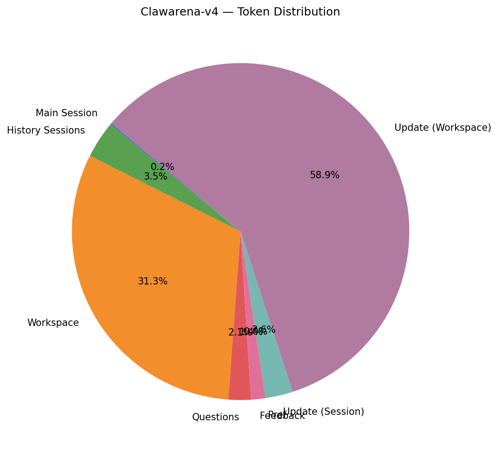
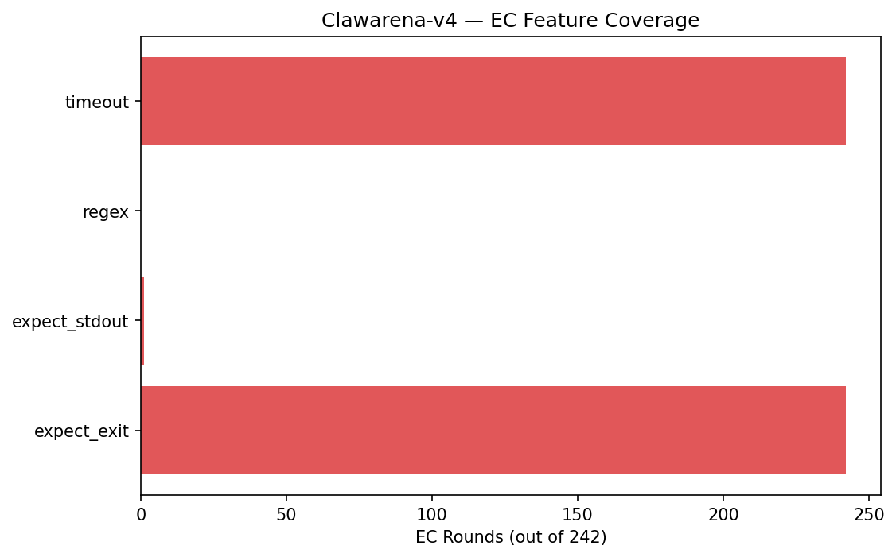
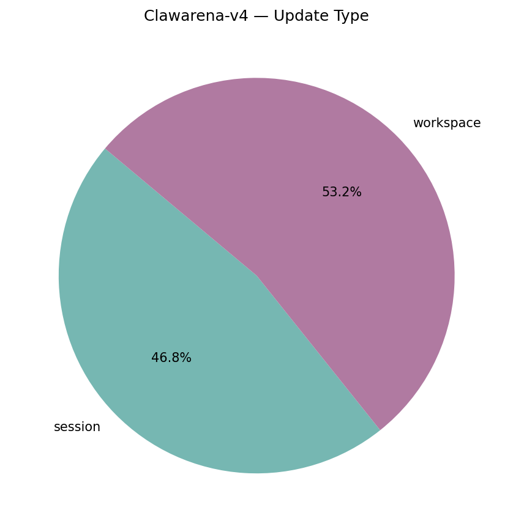
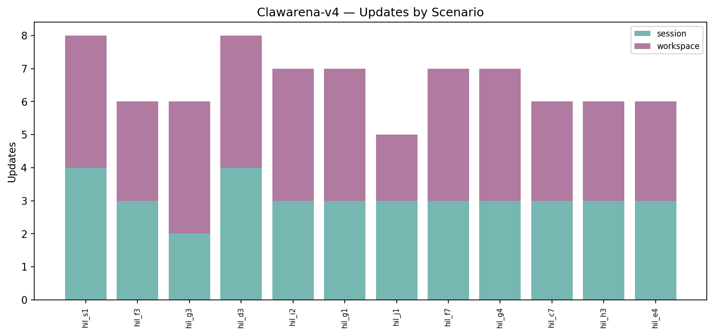
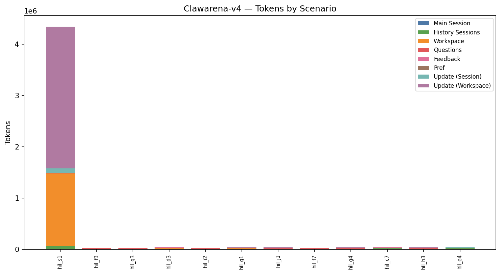
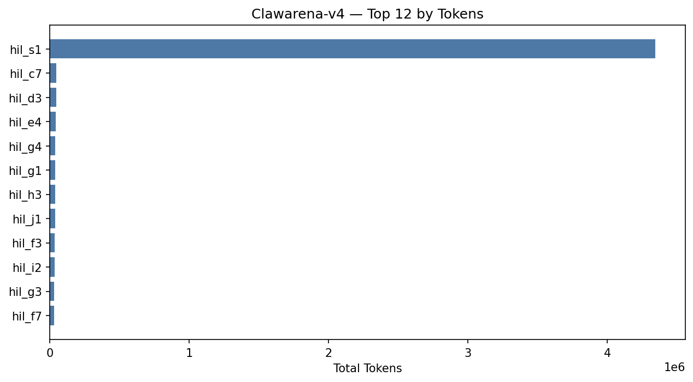
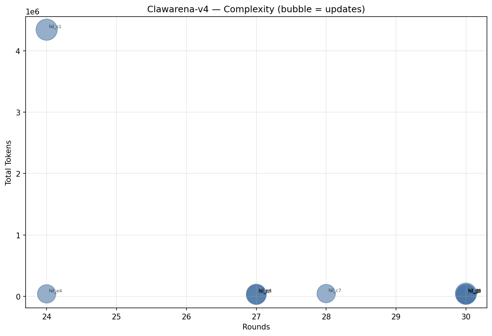

# Clawarena-v4 — Stats Report (nanobot)

_Tokenizer: `cl100k_base`_

## 1. Overall Summary

- **Scenarios:** 12
- **Total rounds:** 337
- **Rounds with pref:** 24 (7.1%)
- **Rounds with updates:** 45 (13.4%)
- **Total updates:** 79 (107 files)
- **Total tokens:** 4,749,499

## 2. Token Distribution

| Category | Tokens | % |
|----------|-------:|--:|
| Main Session | 7,976 | 0.2% |
| History Sessions | 167,139 | 3.5% |
| Workspace | 1,484,686 | 31.3% |
| Questions | 101,881 | 2.1% |
| Feedback | 64,271 | 1.4% |
| Pref | 1,709 | 0.0% |
| Update (Session) | 124,800 | 2.6% |
| Update (Workspace) | 2,797,037 | 58.9% |
| **Total** | **4,749,499** | **100.0%** |

## 3. Question Statistics

### 3.1 Type Distribution

| Type | Count | % |
|------|------:|--:|
| exec_check | 242 | 71.8% |
| multi_choice | 95 | 28.2% |

### 3.2 MC Shape

| Metric | Mean | Min | Max |
|--------|-----:|----:|----:|
| Options per question | 6.38 | 5 | 10 |
| Answers per question | 4.46 | 2 | 8 |

- **Single-answer rounds:** 0 (0.0%)
- **Multi-answer rounds:** 95 (100.0%)

### 3.3 EC Features

| Feature | Rounds | Coverage |
|---------|-------:|---------:|
| expect_exit | 242 | 100.0% |
| expect_stdout | 1 | 0.4% |
| regex matching | 0 | 0.0% |
| timeout | 242 | 100.0% |

_Timeout (s) — mean 40.2, min 30.0, max 60.0._

### 3.4 Pref Coverage

- **Rounds with pref:** 24 (7.1%)

## 4. Update Statistics

### 4.1 Type Distribution

| Type | Count | % |
|------|------:|--:|
| session | 37 | 46.8% |
| workspace | 42 | 53.2% |

### 4.3 Files per Update

- **Mean:** 1.35, **Min:** 1, **Max:** 4
- **Total update files:** 107

## 5. Per-Scenario Breakdown

| Scenario | Rounds | MC | EC | w/Pref | w/Upd | Updates | UpdFiles | WSFiles | Tokens |
|----------|-------:|---:|---:|-------:|------:|--------:|---------:|--------:|-------:|
| hil_s1 | 24 | 8 | 16 | 3 | 4 | 8 | 25 | 24 | 4,341,912 |
| hil_f3 | 30 | 8 | 22 | 2 | 4 | 6 | 7 | 11 | 35,112 |
| hil_g3 | 30 | 8 | 22 | 0 | 4 | 6 | 7 | 7 | 31,038 |
| hil_d3 | 30 | 8 | 22 | 2 | 4 | 8 | 10 | 12 | 45,758 |
| hil_i2 | 30 | 8 | 22 | 2 | 4 | 7 | 7 | 10 | 31,625 |
| hil_g1 | 30 | 8 | 22 | 3 | 4 | 7 | 8 | 10 | 36,963 |
| hil_j1 | 30 | 8 | 22 | 2 | 4 | 5 | 6 | 8 | 35,702 |
| hil_f7 | 27 | 8 | 19 | 2 | 4 | 7 | 7 | 10 | 28,572 |
| hil_g4 | 27 | 8 | 19 | 2 | 3 | 7 | 8 | 10 | 38,235 |
| hil_c7 | 28 | 8 | 20 | 2 | 3 | 6 | 9 | 12 | 46,196 |
| hil_h3 | 27 | 8 | 19 | 2 | 4 | 6 | 7 | 10 | 36,682 |
| hil_e4 | 24 | 7 | 17 | 2 | 3 | 6 | 6 | 11 | 41,704 |

## 6. Per-Scenario Token Detail

| Scenario | Main Session | History Sessions | Workspace | Questions | Feedback | Pref | Update (Session) | Update (Workspace) | Total |
|----------|------:|------:|------:|------:|------:|------:|------:|------:|------:|
| hil_s1 | 286 | 58,861 | 1,422,387 | 4,200 | 3,327 | 326 | 86,003 | 2,766,522 | 4,341,912 |
| hil_f3 | 645 | 6,514 | 8,168 | 9,855 | 4,678 | 97 | 2,951 | 2,204 | 35,112 |
| hil_g3 | 2,170 | 4,564 | 3,257 | 10,846 | 6,551 | 0 | 1,515 | 2,135 | 31,038 |
| hil_d3 | 514 | 12,552 | 6,999 | 9,692 | 6,186 | 191 | 5,103 | 4,521 | 45,758 |
| hil_i2 | 847 | 5,667 | 6,318 | 7,124 | 5,228 | 194 | 3,024 | 3,223 | 31,625 |
| hil_g1 | 407 | 11,485 | 5,245 | 6,105 | 4,933 | 196 | 5,275 | 3,317 | 36,963 |
| hil_j1 | 444 | 6,523 | 4,293 | 10,912 | 8,510 | 179 | 3,187 | 1,654 | 35,702 |
| hil_f7 | 554 | 5,540 | 5,195 | 8,622 | 5,675 | 111 | 1,211 | 1,664 | 28,572 |
| hil_g4 | 565 | 7,531 | 6,327 | 10,349 | 4,940 | 121 | 5,318 | 3,084 | 38,235 |
| hil_c7 | 433 | 20,277 | 6,001 | 7,220 | 4,870 | 92 | 4,008 | 3,295 | 46,196 |
| hil_h3 | 603 | 9,894 | 4,195 | 11,206 | 4,866 | 102 | 3,750 | 2,066 | 36,682 |
| hil_e4 | 508 | 17,731 | 6,301 | 5,750 | 4,507 | 100 | 3,455 | 3,352 | 41,704 |

## 7. Top-N Rankings

### Top 10 by Tokens

| Rank | Scenario | Tokens |
|-----:|----------|------:|
| 1 | hil_s1 | 4,341,912 |
| 2 | hil_c7 | 46,196 |
| 3 | hil_d3 | 45,758 |
| 4 | hil_e4 | 41,704 |
| 5 | hil_g4 | 38,235 |
| 6 | hil_g1 | 36,963 |
| 7 | hil_h3 | 36,682 |
| 8 | hil_j1 | 35,702 |
| 9 | hil_f3 | 35,112 |
| 10 | hil_i2 | 31,625 |

### Top 10 by Rounds

| Rank | Scenario | Rounds |
|-----:|----------|------:|
| 1 | hil_f3 | 30 |
| 2 | hil_g3 | 30 |
| 3 | hil_d3 | 30 |
| 4 | hil_i2 | 30 |
| 5 | hil_g1 | 30 |
| 6 | hil_j1 | 30 |
| 7 | hil_c7 | 28 |
| 8 | hil_f7 | 27 |
| 9 | hil_g4 | 27 |
| 10 | hil_h3 | 27 |

### Top 10 by Updates

| Rank | Scenario | Updates |
|-----:|----------|------:|
| 1 | hil_s1 | 8 |
| 2 | hil_d3 | 8 |
| 3 | hil_i2 | 7 |
| 4 | hil_g1 | 7 |
| 5 | hil_f7 | 7 |
| 6 | hil_g4 | 7 |
| 7 | hil_f3 | 6 |
| 8 | hil_g3 | 6 |
| 9 | hil_c7 | 6 |
| 10 | hil_h3 | 6 |

