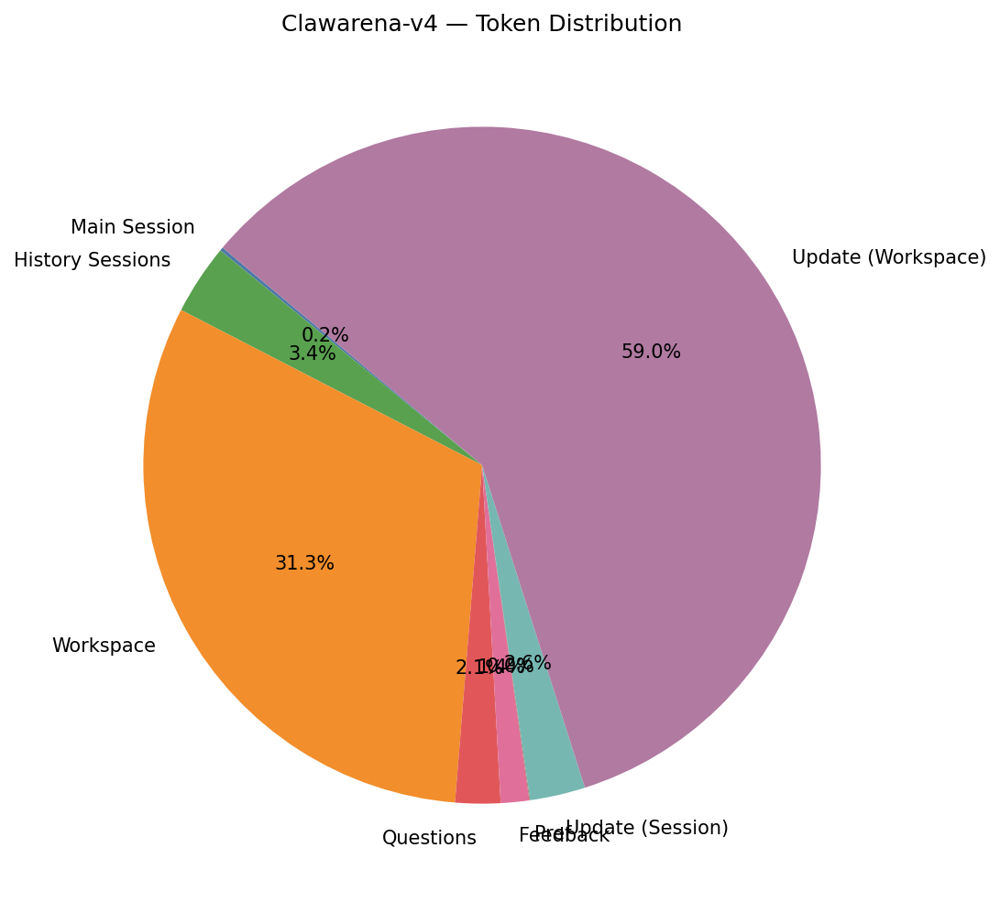
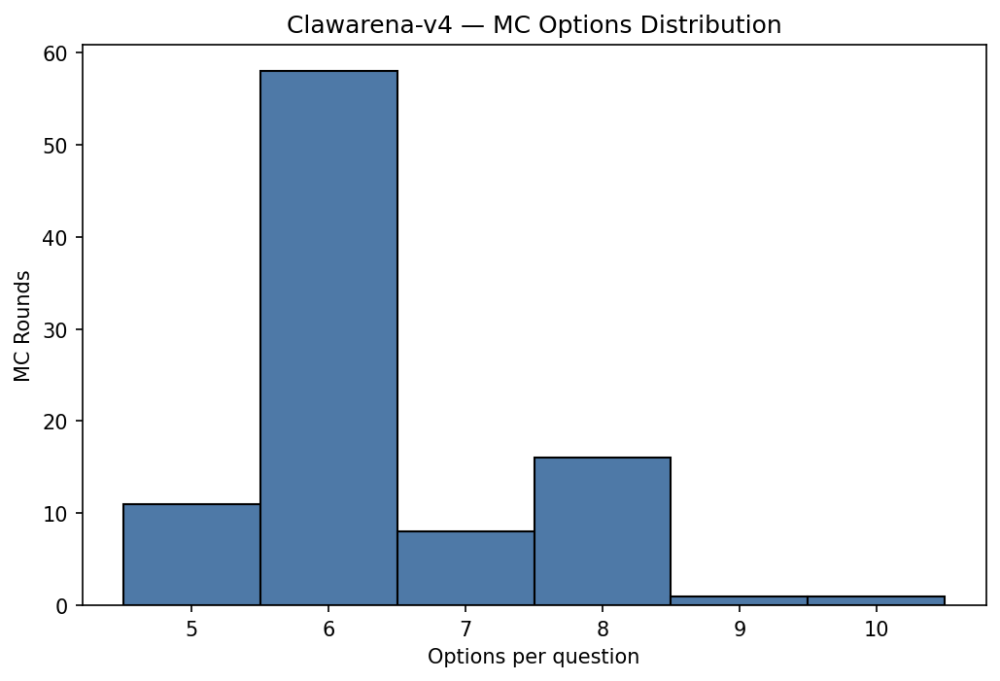
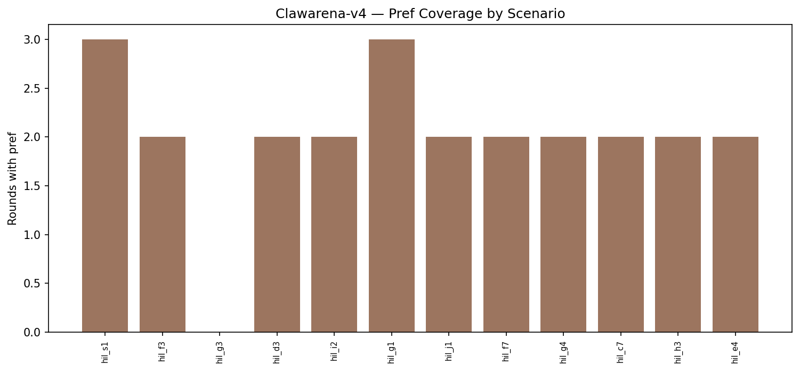
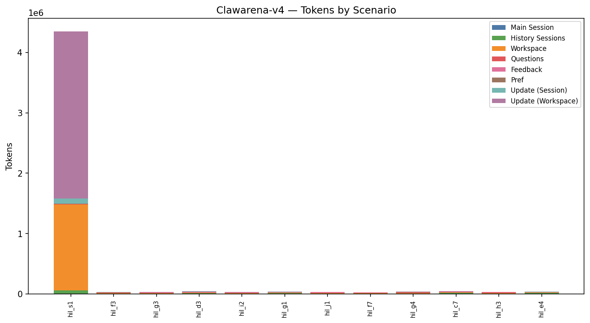
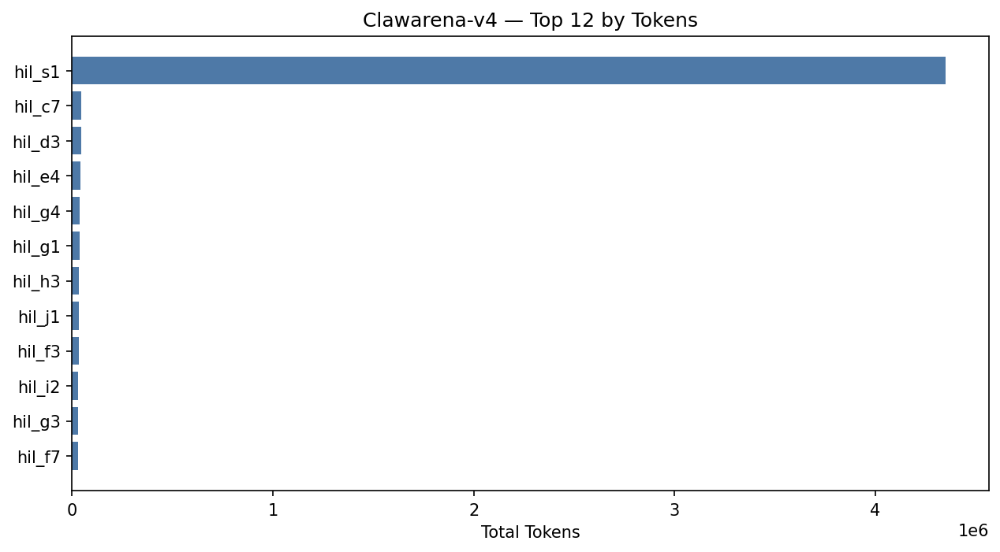
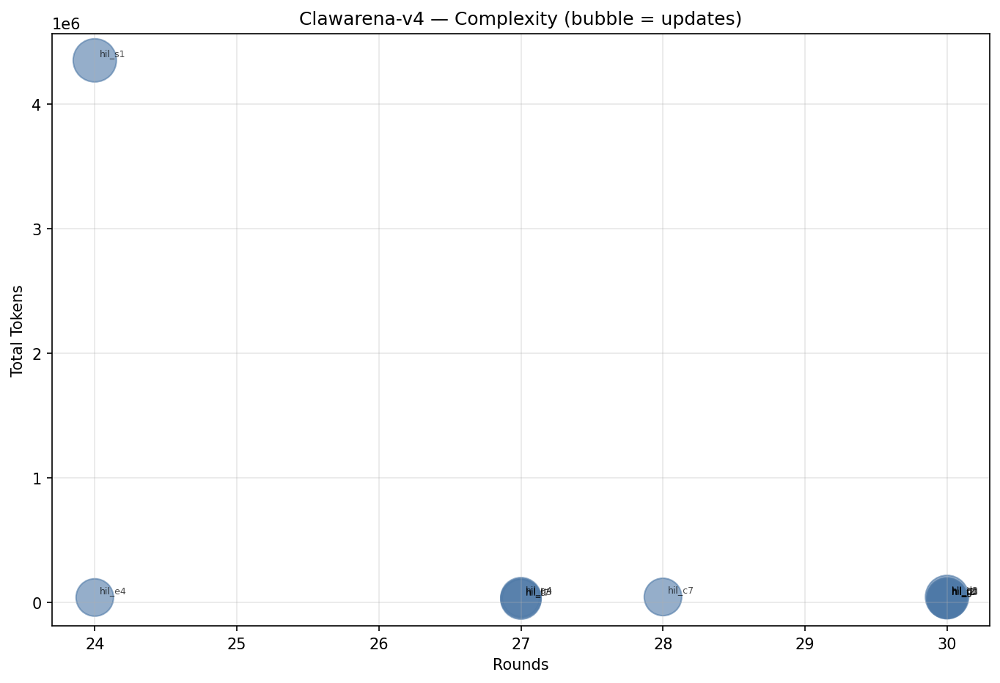

# Clawarena-v4 — Stats Report (picoclaw)

_Tokenizer: `cl100k_base`_

## 1. Overall Summary

- **Scenarios:** 12
- **Total rounds:** 337
- **Rounds with pref:** 24 (7.1%)
- **Rounds with updates:** 45 (13.4%)
- **Total updates:** 79 (107 files)
- **Total tokens:** 4,742,155

## 2. Token Distribution

| Category | Tokens | % |
|----------|-------:|--:|
| Main Session | 7,989 | 0.2% |
| History Sessions | 159,359 | 3.4% |
| Workspace | 1,484,566 | 31.3% |
| Questions | 101,881 | 2.1% |
| Feedback | 64,271 | 1.4% |
| Pref | 1,709 | 0.0% |
| Update (Session) | 125,343 | 2.6% |
| Update (Workspace) | 2,797,037 | 59.0% |
| **Total** | **4,742,155** | **100.0%** |

## 3. Question Statistics

### 3.1 Type Distribution

| Type | Count | % |
|------|------:|--:|
| exec_check | 242 | 71.8% |
| multi_choice | 95 | 28.2% |

### 3.2 MC Shape

| Metric | Mean | Min | Max |
|--------|-----:|----:|----:|
| Options per question | 6.38 | 5 | 10 |
| Answers per question | 4.46 | 2 | 8 |

- **Single-answer rounds:** 0 (0.0%)
- **Multi-answer rounds:** 95 (100.0%)

### 3.3 EC Features

| Feature | Rounds | Coverage |
|---------|-------:|---------:|
| expect_exit | 242 | 100.0% |
| expect_stdout | 1 | 0.4% |
| regex matching | 0 | 0.0% |
| timeout | 242 | 100.0% |

_Timeout (s) — mean 40.2, min 30.0, max 60.0._

### 3.4 Pref Coverage

- **Rounds with pref:** 24 (7.1%)

## 4. Update Statistics

### 4.1 Type Distribution

| Type | Count | % |
|------|------:|--:|
| session | 37 | 46.8% |
| workspace | 42 | 53.2% |

### 4.3 Files per Update

- **Mean:** 1.35, **Min:** 1, **Max:** 4
- **Total update files:** 107

## 5. Per-Scenario Breakdown

| Scenario | Rounds | MC | EC | w/Pref | w/Upd | Updates | UpdFiles | WSFiles | Tokens |
|----------|-------:|---:|---:|-------:|------:|--------:|---------:|--------:|-------:|
| hil_s1 | 24 | 8 | 16 | 3 | 4 | 8 | 25 | 24 | 4,348,429 |
| hil_f3 | 30 | 8 | 22 | 2 | 4 | 6 | 7 | 11 | 33,853 |
| hil_g3 | 30 | 8 | 22 | 0 | 4 | 6 | 7 | 7 | 30,351 |
| hil_d3 | 30 | 8 | 22 | 2 | 4 | 8 | 10 | 12 | 43,976 |
| hil_i2 | 30 | 8 | 22 | 2 | 4 | 7 | 7 | 10 | 30,827 |
| hil_g1 | 30 | 8 | 22 | 3 | 4 | 7 | 8 | 10 | 35,953 |
| hil_j1 | 30 | 8 | 22 | 2 | 4 | 5 | 6 | 8 | 34,660 |
| hil_f7 | 27 | 8 | 19 | 2 | 4 | 7 | 7 | 10 | 27,883 |
| hil_g4 | 27 | 8 | 19 | 2 | 3 | 7 | 8 | 10 | 37,314 |
| hil_c7 | 28 | 8 | 20 | 2 | 3 | 6 | 9 | 12 | 44,065 |
| hil_h3 | 27 | 8 | 19 | 2 | 4 | 6 | 7 | 10 | 34,867 |
| hil_e4 | 24 | 7 | 17 | 2 | 3 | 6 | 6 | 11 | 39,977 |

## 6. Per-Scenario Token Detail

| Scenario | Main Session | History Sessions | Workspace | Questions | Feedback | Pref | Update (Session) | Update (Workspace) | Total |
|----------|------:|------:|------:|------:|------:|------:|------:|------:|------:|
| hil_s1 | 294 | 61,505 | 1,422,377 | 4,200 | 3,327 | 326 | 89,878 | 2,766,522 | 4,348,429 |
| hil_f3 | 645 | 5,616 | 8,158 | 9,855 | 4,678 | 97 | 2,600 | 2,204 | 33,853 |
| hil_g3 | 2,170 | 4,014 | 3,247 | 10,846 | 6,551 | 0 | 1,388 | 2,135 | 30,351 |
| hil_d3 | 515 | 11,305 | 6,989 | 9,692 | 6,186 | 191 | 4,577 | 4,521 | 43,976 |
| hil_i2 | 847 | 5,133 | 6,308 | 7,124 | 5,228 | 194 | 2,770 | 3,223 | 30,827 |
| hil_g1 | 408 | 10,768 | 5,235 | 6,105 | 4,933 | 196 | 4,991 | 3,317 | 35,953 |
| hil_j1 | 444 | 5,777 | 4,283 | 10,912 | 8,510 | 179 | 2,901 | 1,654 | 34,660 |
| hil_f7 | 554 | 4,937 | 5,185 | 8,622 | 5,675 | 111 | 1,135 | 1,664 | 27,883 |
| hil_g4 | 566 | 6,900 | 6,317 | 10,349 | 4,940 | 121 | 5,037 | 3,084 | 37,314 |
| hil_c7 | 434 | 18,625 | 5,991 | 7,220 | 4,870 | 92 | 3,538 | 3,295 | 44,065 |
| hil_h3 | 603 | 8,568 | 4,185 | 11,206 | 4,866 | 102 | 3,271 | 2,066 | 34,867 |
| hil_e4 | 509 | 16,211 | 6,291 | 5,750 | 4,507 | 100 | 3,257 | 3,352 | 39,977 |

## 7. Top-N Rankings

### Top 10 by Tokens

| Rank | Scenario | Tokens |
|-----:|----------|------:|
| 1 | hil_s1 | 4,348,429 |
| 2 | hil_c7 | 44,065 |
| 3 | hil_d3 | 43,976 |
| 4 | hil_e4 | 39,977 |
| 5 | hil_g4 | 37,314 |
| 6 | hil_g1 | 35,953 |
| 7 | hil_h3 | 34,867 |
| 8 | hil_j1 | 34,660 |
| 9 | hil_f3 | 33,853 |
| 10 | hil_i2 | 30,827 |

### Top 10 by Rounds

| Rank | Scenario | Rounds |
|-----:|----------|------:|
| 1 | hil_f3 | 30 |
| 2 | hil_g3 | 30 |
| 3 | hil_d3 | 30 |
| 4 | hil_i2 | 30 |
| 5 | hil_g1 | 30 |
| 6 | hil_j1 | 30 |
| 7 | hil_c7 | 28 |
| 8 | hil_f7 | 27 |
| 9 | hil_g4 | 27 |
| 10 | hil_h3 | 27 |

### Top 10 by Updates

| Rank | Scenario | Updates |
|-----:|----------|------:|
| 1 | hil_s1 | 8 |
| 2 | hil_d3 | 8 |
| 3 | hil_i2 | 7 |
| 4 | hil_g1 | 7 |
| 5 | hil_f7 | 7 |
| 6 | hil_g4 | 7 |
| 7 | hil_f3 | 6 |
| 8 | hil_g3 | 6 |
| 9 | hil_c7 | 6 |
| 10 | hil_h3 | 6 |

